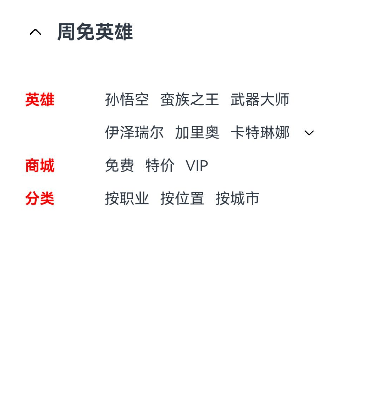

# 折叠展开动效
## 场景介绍
由于目前移动端需要展示的内容越来越多，但是移动端的空间弥足珍贵，在有限的空间内不可能罗列展示全部种类内容，因此折叠/展开功能就可以解决当前问题，本文就介绍下如何使用ArkTS来实现折叠展开动效。

## 效果呈现
折叠展开动效定义：点击展开按钮，下拉动画展示内容，点击折叠按钮，折叠动画折叠内容。
本例最终效果如下：


## 运行环境
本例基于以下环境开发，开发者也可以基于其它适配的版本进行开发：
- IDE: DevEco Studio 3.1 Release
- SDK: Ohos_sdk_public 3.2.12.5(API Version 9 Release)
## 实现思路
创建折叠时的文本组件，根据List组件中的groupcollapse和groupexpand事件自定义一个CollapseAndExpand组件，父组件通过维护flag和onFlagChange来控制折叠/展开的动效，设置动效所需的参数，添加逻辑来展示展开后的文本。

## 开发步骤
1. 创建自定义接口IRowItem。
  具体代码如下：

    ```ts
    interface IRowItem {
        id?: number;
        title?: string;
        name1?: string;
        name2?: string;
        name3?: string;
        flag?: boolean;
        type?: string;
        onFlagChange?: () => void;
    }
    ```
  
2. 创建自定义组件CollapseAndExpandDemo，根据自定义接口IRowItem添加内容，创建UI展示文本。
具体代码如下：

    ```ts
    @Entry
    @Component{
        ...
        build() {
            Column() {
                Row() {
                    Image($r("app.media.ic_public_back"))
                    .width(20)
                    .height(20)
                    Text('周免英雄')
                    .fontSize(18)
                    .fontWeight(FontWeight.Bold)
                    .margin({ left: 10 })
                }
                .width('100%')
                .margin({ bottom: 30 })
        
                Column() {
                    RowItem({ props: { title: 'AAAAA', name1: 'BBBBB', name2: 'CCCCC', name3: '武器大师' } })
                    // 文本折叠时，type为DOWN
                    RowItem({ props: { name1: 'DDDDD', name2: 'EEEEE', name3: 'FFFFF', type: 'DOWN', onFlagChange: this.onFlagChange } })  

                    //被折叠的文本内容
                    ...  

                    RowItem({ props: { title: '商城', name1: '免费', name2: '特价', name3: 'VIP' } })
                    RowItem({ props: { title: '分类', name1: '按职业', name2: '按位置', name3: '按城市' } })
                }
                .width('100%')
    }
    ```
  
    被折叠文本信息。
  具体代码如下：
  
    ```ts
    CollapseAndExpand({
        items: [
            { id: 0, name1: 'GGGGG', name2: 'HHHHH', name3: 'JJJJJ' },
            { id: 1, name1: 'KKKKK', name2: 'LLLLL', name3: 'MMMMM' },
            { id: 2, name1: 'NNNNN', name2: 'OOOOO', name3: 'PPPPP' },
            // 文本展开时，type为UP
            { id: 3, name1: 'QQQQQ', name2: 'RRRRR', name3: 'SSSSS', type: 'UP', onFlagChange: this.onFlagChange }
        ],
    })
    ```


3. 将步骤2创建的文本进行渲染。
具体如下：

    ```ts   
    build() {
        Flex() {
          Text(this.props.title)
            .fontSize(14)
            .fontWeight(FontWeight.Bold)
            .layoutWeight(1)
            .fontColor(Color.Red)
            .margin({ right: 10 })
          Flex({ alignItems: ItemAlign.Center }) {
            Text(this.props.name1).fontSize(14).margin({ right: 10 })
            Text(this.props.name2).fontSize(14).margin({ right: 10 })
            Text(this.props.name3).fontSize(14).margin({ right: 10 })
            ...
          }
        }
      }
    ```
4. 创建自定义组件CollapseAndExpand。
根据自定义组件说明动效,@Provide负责数据更新，并且触发渲染;@Consume在感知数据更新后，重新渲染。
具体代码如下：

    ```ts
    @Entry
    @Component
    struct CollapseAndExpandDemo {
      @Provide("flag") flag: boolean = false
      private onFlagChange = () => {
        animateTo({   
            duration: 650,
            curve: Curve.Smooth
        }, () => {
            this.flag = !this.flag;
        })
      } 
    
      ...
    
    @Component
    struct CollapseAndExpand {
        private items: IRowItem[] = [];
        @Consume("flag") flag: boolean;
        
        build() {
            Column() {
                ForEach(this.items, (item: IRowItem) => {
                    RowItem({ props: item })
                }, (item: IRowItem) => item.id.toString())
            }
            .width('100%')
            .clip(true)
            .height(this.flag ? 130 : 0)
        }
    }
    ```
5. 根据步骤4最终的flag以及props的type值，判断折叠展开的效果实现。
    具体代码如下：
    
    ```ts
    build() {
        ...
        // 当文本折叠（flag为false且type为down）时，展示展开按钮
        // 当文本展开（flag为true且type为up）时，展示折叠按钮
        if (!this.flag && this.props.type === 'DOWN' || this.flag && this.props.type === 'UP') {
        Image($r("app.media.icon"))
            .width(16)
            .height(16)
            .objectFit(ImageFit.Contain)
            .rotate({ angle: !this.flag && this.props.type === 'DOWN' ? 0 : 180 })
            // 点击按钮后旋转180°，展示折叠按钮
            .onClick(() =>
            this.props.onFlagChange()
            )
            .transition({ type: TransitionType.All, opacity: 0 })
        }
    }   
    ```


## 完整代码
示例代码如下:
```ts
interface IRowItem {
    id?: number;
    title?: string;
    name1?: string;
    name2?: string;
    name3?: string;
    flag?: boolean;
    type?: string;
    onFlagChange?: () => void;
}

@Entry
@Component
struct CollapseAndExpandDemo {
    @Provide("flag") flag: boolean = false
    private onFlagChange = () => {
        animateTo({  
            duration: 650,
            curve: Curve.Smooth
            }, () => {
                this.flag = !this.flag;
                })
    }

    build() {
        Column() {
            Row() {
                Image($r("app.media.ic_public_back")).width(20).height(20)
                Text('周免英雄')
                .fontSize(18)
                .fontWeight(FontWeight.Bold)
                .margin({ left: 10 })
            }
            .width('100%')
            .margin({ bottom: 30 })

            Column() {
                RowItem({ 
                    props: { title: '英雄', name1: 'AAAAA', name2: 'BBBBB', name3: 'CCCCC' } })
                RowItem({ 
                    props: { 
                        name1: 'DDDDD', 
                        name2: 'EEEEE', 
                        name3: 'FFFFF', 
                        // 文本折叠时，type为DOWN
                        type: 'DOWN', 
                        onFlagChange: this.onFlagChange  
                    }
                })
                // 直接调用折叠展开组件
                CollapseAndExpand({
                    items: [
                        { id: 0, name1: 'GGGGG', name2: 'HHHHH', name3: 'JJJJJ' },
                        { id: 1, name1: 'KKKKK', name2: 'LLLLL', name3: 'MMMMM' },
                        { id: 2, name1: 'NNNNN', name2: 'OOOOO', name3: 'PPPPP' },
                        { id: 3, 
                        name1: 'QQQQQ', 
                        name2: 'RRRRR', 
                        name3: 'SSSSS', 
                        // 文本折叠时，type为UP
                        type: 'UP', 
                        onFlagChange: this.onFlagChange }  
                    ],
                })

                RowItem({ props: { title: '商城', name1: '免费', name2: '特价', name3: 'VIP' } })
                RowItem({ props: { title: '分类', name1: '按职业', name2: '按位置', name3: '按城市' } })
            }
            .width('100%')

        }
        .height('100%')
        .padding({ top: 30, right: 30, left: 30 })
  }
}

@Component
struct RowItem {
    private props: IRowItem;
    @Consume("flag") flag: boolean

    build() {
        Flex() {
            Text(this.props.title)
            .fontSize(14)
            .fontWeight(FontWeight.Bold)
            .layoutWeight(1)
            .fontColor(Color.Red)
            .margin({ right: 10 })
            Flex({ alignItems: ItemAlign.Center }) {
                Text(this.props.name1).fontSize(14).margin({ right: 10 })
                Text(this.props.name2).fontSize(14).margin({ right: 10 })
                Text(this.props.name3).fontSize(14).margin({ right: 10 })

                // 当文本折叠（flag为false且type为down）时，展示展开按钮
                // 当文本展开（flag为true且type为up）时，展示折叠按钮
                if (!this.flag && this.props.type === 'DOWN' || this.flag && this.props.type === 'UP') {
                    Image($r("app.media.ic_public_arrow_down_0"))
                    .width(16)
                    .height(16)
                    .objectFit(ImageFit.Contain)
                    .rotate({ angle: !this.flag && this.props.type === 'DOWN' ? 0 : 180 }) 
                    // 点击展开按钮后旋转180°，展示折叠按钮
                    .onClick(() => this.props.onFlagChange())
                    .transition({ type: TransitionType.All, opacity: 0 })
                }
            }
            .layoutWeight(3)
        }
        .width('100%')
        .height(16)
        .margin({ top: 15 })
    }
}

@Component
struct CollapseAndExpand {
    private items: IRowItem[] = [];
    @Consume("flag") flag: boolean;

    build() {
        Column() {
            ForEach(this.items, (item: IRowItem) => {
                RowItem({ props: item })
            }, (item: IRowItem) => item.id.toString())
        }
        .width('100%')
        .clip(true)
        .height(this.flag ? 130 : 0)
    }
}
```
## 参考
[显示动画](../application-dev/reference/apis-arkui/arkui-ts/ts-explicit-animation.md)

[@Provide和@Consume：与后代组件双向同步](../application-dev/ui/state-management/arkts-provide-and-consume.md)

[list开发指导](../application-dev/ui/ui-js-components-list.md)


