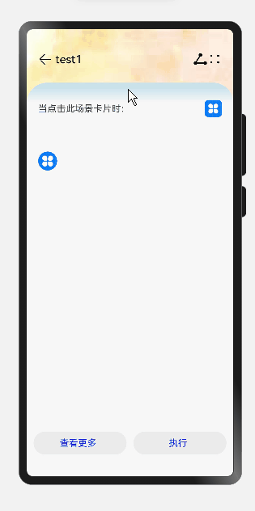

# 如何实现内容下拉变化
## 场景介绍
组件开发过程中经常遇到组件堆叠，上层组件下拉，下层组件随之变化的场景。常见的如朋友圈背景的下拉放大，内容的下拉刷新等。本例将为大家介绍如何实现上述下拉变化的场景。
## 效果呈现
效果图如下：



## 运行环境
本例基于以下环境开发，开发者也可以基于其他适配的版本进行开发：
- IDE: DevEco Studio 3.1 Beta2
- SDK: Ohos_sdk_public 3.2.11.9(API Version 9 Release)
## 实现思路
本例的3个关键特性及实现方案如下：
- 界面不同背景的展示：通过Stack堆叠容器实现界面之间的覆盖
- 中间子组件的下拉和回弹：通过ontouch事件判断heightValue的大小去设置可滑动的中层组件的动画效果
- 底层子组件的文本变化：判断heightValuede来决定文本的变化
## 开发步骤
1. 通过Stack堆叠容器创建各层子组件和文本
    具体代码块如下：
    ```ts
    // 底层子组件
    ...
    Stack({ alignContent: Alignment.Bottom }) {
      build() {
        Stack({ alignContent: Alignment.Bottom }) { //底部对齐
          Column() {
            Row() {
              Image($r('app.media.back')).width(25).height(25)
                .onClick(() => {
                  router.back();
                })
            ...
            Image($r("app.media.sharew")) //分享
                .width(25)
                .height(25)
            Image($r('app.media.more')) //更多
                .width(25)
                .height(25)
            }.width('100%').padding(20).margin({ top: 20 })
            ...
          }
          .height(this.ImHeight)
          .width(this.ImWidth)
          .backgroundImage($r('app.media.images')) //底层背景图
          .backgroundImageSize(ImageSize.Cover)
        ...
        }
      }
    }
    ...
    //中层子组件
    ...
      Column() {
        Row() {
          Text('当点击此场景卡片时：').fontSize(16)
          Blank()
          Image($r('app.media.bl_harm')).width(30).height(30)
        }.width('100%').margin({ top: 10, left: 10, right: 10, bottom: 20 })
      }.borderRadius(35)
    ...
    //颜色渲染，线性渐变
        .linearGradient( 
          {
            direction: GradientDirection.Top,
            angle: 180,
            colors: [['#c7e2eb', 0.01], ["#F7F7F7", 0.05], ["#F7F7F7", 1]]
          })
    //底层子组件  
    ...
    Column() {
      Flex({ alignItems: ItemAlign.Center, justifyContent: FlexAlign.SpaceEvenly }) {
        Button({ type: ButtonType.Capsule, stateEffect: true }) {
          Row() {
            Text('查看更多').fontSize(16).fontColor(Color.Blue).margin({ left: 5, right: 12 })
          }.alignItems(VerticalAlign.Center)
        }.height(40).borderRadius(25).backgroundColor('#EBEBEB').width('45%')
        Button({ type: ButtonType.Capsule, stateEffect: true }) {
          Row() {
            Text('执行').fontSize(16).fontColor(Color.Blue).margin({ left: 5, right: 12 })
          }.alignItems(VerticalAlign.Center)
        }.height(40).borderRadius(25).backgroundColor('#EBEBEB').width('45%')
      }
    }.height('10%').width('100%').align(Alignment.Top).backgroundColor('#F7F7F7')
    ...    
    ```
2.  通过ontouch事件判断heightValue的大小去设置可滑动的中层组件的动画效果
    具体代码块如下：
    ```ts
    ...
    .onTouch((event: TouchEvent) => { //触摸事件
      if (event.type === TouchType.Down) {
        this.duration = 1000;
      }
      if (event.type === TouchType.Up) { // 结束，回弹,回弹动画更快
        this.heightValue = '88%'
        this.duration = 500;
        this.ImHeight = "100%"
        this.ImWidth = "100%"
      }
      if (event.type === TouchType.Move) {
      // 根据滑动距离确定组件高度，最多拖动140的，此时组件最小高度为68%
        if (event.touches[0].y <= 140) {
          this.heightValue = 88 - event.touches[0].y / 7 + '%'
          this.ImHeight = "200%"
          this.ImWidth = "200%"
        } else {
          this.heightValue = '68%'
        }
      }
      console.info('垂直方向滑动距离' + event.touches[0].y)
    })
    .height(this.heightValue)
    .animation({
      duration: this.duration, // 动画时长
      curve: Curve.FastOutSlowIn, // 动画曲线
      delay: 0, // 动画延迟
      iterations: 1, // 播放次数
      playMode: PlayMode.Normal // 动画模式
    })
    
    ```
3. 判断可滑动的中层组件的高度变化来体现标题栏的变化
    具体代码块如下：
    ```ts
    ...
    Row(){
      //可滑动的组件高度大于整体界面的70%，显示test1
      Text(this.heightValue >= '70%' ? 'test1' : '') 
        .fontColor(Color.Black)
        .fontSize(20)
        .margin({ left: 5 })
    }    
    ...
    Row() {
      Text(this.heightValue < '70%' ? 'test2' : '') //可滑动的组件高度小于于整体界面的70%，显示test2
        .fontColor(Color.Red)
        .fontSize(30)
        .margin({ left: 5 })
    }
    ...
    ```
## 完整代码
示例完整代码如下：
```ts
import router from '@ohos.router'

@Entry
@Component
struct DetailExample {
  @State heightValue: string = '88%'
  @State duration: number = 1000
  @State ImHeight: string = '100%'
  @State ImWidth: string = '100%'

  build() {
    Stack({ alignContent: Alignment.Bottom }) {
      // 底层子组件
      Column() {
        Row() {
          Image($r('app.media.back')).width(25).height(25)
            .onClick(() => {
              router.back();
            })
          Text(this.heightValue >= '70%' ? 'test1' : '')          
            .fontColor(Color.Black)
            .fontSize(20)
            .margin({ left: 5 })
          Blank()
          Image($r("app.media.sharew"))
            .width(25)
            .height(25)
          Image($r('app.media.more'))
            .width(25)
            .height(25)
        }.width('100%').padding(20).margin({ top: 20 })

        Row() {
          Text(this.heightValue < '70%' ? 'test2' : '')
            .fontColor(Color.Red)
            .fontSize(30)
            .margin({ left: 5 })
        }
        .width("100%")
        .height(35)
        .alignItems(VerticalAlign.Center)
        .justifyContent(FlexAlign.Start)
      }
      .height(this.ImHeight)
      .width(this.ImWidth)
      .backgroundImage($r('app.media.images'))
      .backgroundImageSize(ImageSize.Cover)

      // 可拖动中层子组件，动画，圆弧
      Column() {
        Row() {
          Text('当点击此场景卡片时：').fontSize(16)
          Blank()
          Image($r('app.media.bl_harm')).width(30).height(30)
        }.width('100%').margin({ top: 10, left: 10, right: 10, bottom: 20 })
      }.borderRadius(35)
      .padding(20)
      .onTouch((event: TouchEvent) => {
        if (event.type === TouchType.Down) {
          this.duration = 1000;
        }
        if (event.type === TouchType.Up) { 
          this.heightValue = '88%'
          this.duration = 500;
          this.ImHeight = "100%"
          this.ImWidth = "100%"
        }
        if (event.type === TouchType.Move) { 
          if (event.touches[0].y <= 140) {
            this.heightValue = 88 - event.touches[0].y / 7 + '%'
            this.ImHeight = "200%"
            this.ImWidth = "200%"
          } else {
            this.heightValue = '68%'
          }
        }
        console.info('垂直方向滑动距离' + event.touches[0].y)
      })
      .height(this.heightValue)
      .animation({
        duration: this.duration, 
        curve: Curve.FastOutSlowIn, 
        delay: 0, 
        iterations: 1, 
        playMode: PlayMode.Normal 
      })
      .linearGradient( 
        {
          direction: GradientDirection.Top, 
          angle: 180,
          colors: [['#c7e2eb', 0.01], ["#F7F7F7", 0.05], ["#F7F7F7", 1]]
        })

      // 最上层子组件
      Column() {
        Flex({ alignItems: ItemAlign.Center, justifyContent: FlexAlign.SpaceEvenly }) {
          Button({ type: ButtonType.Capsule, stateEffect: true }) {
            Row() {
              Text('查看更多').fontSize(16).fontColor(Color.Blue).margin({ left: 5, right: 12 })
            }.alignItems(VerticalAlign.Center)
          }
          .height(40).borderRadius(25).backgroundColor('#EBEBEB').width('45%')
          Button({ type: ButtonType.Capsule, stateEffect: true }) {
            Row() {
              Text('执行').fontSize(16).fontColor(Color.Blue).margin({ left: 5, right: 12 })
            }.alignItems(VerticalAlign.Center)
          }
          .height(40).borderRadius(25).backgroundColor('#EBEBEB').width('45%')
        }
      }.height('10%').width('100%').align(Alignment.Top).backgroundColor('#F7F7F7')
    }
  }
}
```
## 参考
[Stack堆叠容器](../application-dev/reference/apis-arkui/arkui-ts/ts-container-stack.md) 

[Toggle](../application-dev/reference/apis-arkui/arkui-ts/ts-basic-components-toggle.md)

[Flex](../application-dev/reference/apis-arkui/arkui-ts/ts-container-flex.md)
