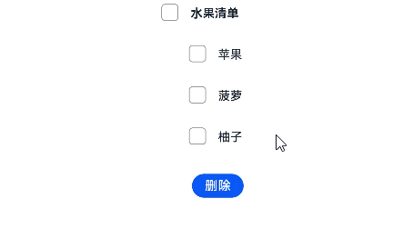
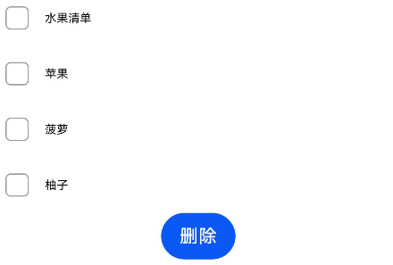
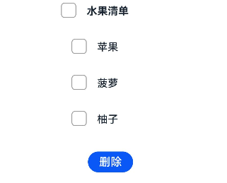

# 如何删除多选框选项
## 场景说明
通常情况下，我们使用多选框都会伴随对选项的操作，比较常见的操作是选中后删除，比如删除购物车的商品、删除账单、删除图片等等。但是，当前OpenHarmony针对多选框组件并没有提供直接的删除其选项的方法，需要开发者自己来实现。本例提供了一种实现方案，供开发者参考。

## 效果呈现
本例最终效果如下：




## 运行环境
本例基于以下环境开发，开发者也可以基于其他适配的版本进行开发：

- IDE: DevEco Studio 4.0 Beta1
- SDK: Ohos_sdk_public 4.0.7.5 (API Version 10 Beta1)


## 实现思路
本例中涉及的关键特性及实现方案如下：
- 多选框：使用CheckboxGroup组件构建多选框标题，使用Checkbox组件构建多选框选项。
- 删除多选框选项：通过CheckboxGroup的onChange回调获取到各个选项的选中状态，在删除操作中，将选中的选项从选项列表中删除。
- 删除时弹出确认框：使用promptAction模块调用showDialog方法弹出对话框，通过回调获取到用户点击的是取消按钮还是确定按钮，如果是确定按钮则执行删除操作。

## 开发步骤
1. 搭建UI布局。
    整体纵向布局，那就采用Column组件；全选框用CheckboxGroup组件，然后每个选项都包括一个选择框（Checkbox组件）和一个文本（Text组件），且为横向布局，那我们可以把它们放在Flex组件中；最后是一个Button组件。这样整体布局就有了，具体代码如下：
    ```ts
    @Component
    struct CheckboxDemo{
      build(){
        Column(){
          Flex({}){
            CheckboxGroup({})
            Text('水果清单')
          }
          Flex({}){
            Checkbox({})
            Text('苹果')
          }
          Flex({}){
            Checkbox({})
            Text('菠萝')
          }
          Flex({}){
            Checkbox({})
            Text('柚子')
          }
          Button('删除')
        }
      }
    }
    ```
    框架搭好了，看下效果：

    

    可以看到主选框和选项对齐了，接下来我们来调整下样式。
    先给CheckboxGroup取个名字：fruit_list，然后为各个Checkbox添加相同的group名称，这样就可以将Checkbox挂靠到CheckboxGroup下，剩下的就是给各个组件添加margin、fontSize等通用属性了，不清楚各个组件有哪些属性的请自行查阅组件参考，具体代码如下：
    ```ts
    @Component
    struct CheckboxDemo{
      build(){
        Column(){
          Flex({justifyContent: FlexAlign.Center, alignItems: ItemAlign.Center}){
            // 将CheckboxGroup命名为'fruit_list'
            CheckboxGroup({group: 'fruit_list'})
              .selectedColor('#007DFF')
            Text('水果清单')
              .margin({right:20})
              .fontSize(14)
              .lineHeight(20)
              .fontColor('#182431')
              .fontWeight(FontWeight.Bold)
          }
          Flex({ justifyContent: FlexAlign.Center, alignItems: ItemAlign.Center}){
            // 通过group参数将Checkbox挂到CheckboxGroup下
            Checkbox({name:'苹果',group:'fruit_list'})
              .selectedColor('#007DFF')
            Text('苹果')
              .margin({right:20})
              .fontSize(14)
              .lineHeight(20)
              .fontColor('#182431')
              .fontWeight(500)
          }
          Flex({ justifyContent: FlexAlign.Center, alignItems: ItemAlign.Center}){
            Checkbox({name:'菠萝',group:'fruit_list'})
              .selectedColor('#007DFF')
            Text('菠萝')
              .margin({right:20})
              .fontSize(14)
              .lineHeight(20)
              .fontColor('#182431')
              .fontWeight(500)
          }
          Flex({ justifyContent: FlexAlign.Center, alignItems: ItemAlign.Center}){
            Checkbox({name:'柚子',group:'fruit_list'})
              .selectedColor('#007DFF')
            Text('柚子')
              .margin({right:20})
              .fontSize(14)
              .lineHeight(20)
              .fontColor('#182431')
              .fontWeight(500)
          }
          Button('删除')
            .margin({top:20,left:35})
            .fontSize(15)
            .padding({top:5,bottom:5,left:15,right:15})
        }
      }
    }
    ```
    我们再来看下效果，发现多选框的布局已经正常了：

    
2. 简化代码。
    当前代码重复性很高，包含Checkbox的三个Flex的结构完全一样，我们可以简化一下。把重复的结构通过@Builder抽取出来作为一个自定义组件，用到的地方进行引用即可；每个Flex呈现的内容不同，那就将不同的内容作为参数传入。具体代码如下：
    ```ts
    @Component
    struct CheckboxDemo{
      // flexNameList存储checkbox选项的文本内容；使用@State修饰后，flexNameList发生变化，UI会同步刷新
      @State flexNameList:string[] = ['苹果','菠萝','柚子']
      @Builder
      // 将重复内容封装成flexItem，通过参数checkboxName为Text组件传入显示文本，通过groupName绑定CheckboxGroup
      flexItem(checkboxName:string,groupName:string){
        Flex({ justifyContent: FlexAlign.Center, alignItems: ItemAlign.Center }) {
          Checkbox({ name:checkboxName, group:groupName})
            .selectedColor('#007DFF')
          Text(checkboxName)
            .margin({right:20})
            .fontSize(14)
            .lineHeight(20)
            .fontColor('#182431')
            .fontWeight(500)
        }.margin({ left: 36 })
      }

      build(){
        Column(){
          Flex({justifyContent: FlexAlign.Center, alignItems: ItemAlign.Center}){
            CheckboxGroup({group: 'fruit_list'})
              .selectedColor('#007DFF')
            Text('水果清单')
              .margin({right:20})
              .fontSize(14)
              .lineHeight(20)
              .fontColor('#182431')
              .fontWeight(FontWeight.Bold)
          }
          // 通过ForEach遍历flexNameList循环渲染生成UI
          ForEach(this.flexNameList,(item:any)=>{
            // 引用封装的flexItem模板
            this.flexItem(item,'fruit_list')
          })

          Button('删除')
            .margin({top:20,left:35})
            .fontSize(15)
            .padding({top:5,bottom:5,left:15,right:15})
        }.alignItems(HorizontalAlign.Center)
      }
    }
    ```
3. 添加删除逻辑。
    本例中是通过以下方式实现删除操作的：将选中的水果项从flexNameList中删除（为方便展示，本文直接将数据存储在数组中，实际开发需要对接数据库），由于flexNameList被@State修饰，所以其发生变化时会重新执行Build（），从而完成UI刷新，展示删除后的选项。
    要实现上述逻辑，首先需要获取到被选中的水果项。这里可以通过CheckboxGroup的onChange回调获取，当选项的状态发生变化时，会触发回调并返回各选项的选中状态。
    具体代码如下：
    ```ts
    @Component
    struct CheckboxDemo{
     ...
      // itemStatus用来存储各选项的选中状态
      private itemStatus: CheckboxGroupResult
      ...
      build(){
        Column(){
          Flex({justifyContent: FlexAlign.Center, alignItems: ItemAlign.Center}){
            CheckboxGroup({group: 'fruit_list'})
              .selectedColor('#007DFF')
              // 选项状态发生变化时触发onChange回调，各选项的选中状态储存在itemName中并返回，通过itemStatus.name可以获取到被选中的选项列表
              .onChange((itemName: CheckboxGroupResult) => {
                this.itemStatus = itemName
              })
            ...
        }.alignItems(HorizontalAlign.Center)
      }
    }
    ```
    将各选项的选中状态存储到itemStatus后，我们就可以通过Button触发删除操作了。当点击删除按钮时，触发删除操作，所以给Button添加onClick事件，并添加删除逻辑。代码如下：
    ```ts
    @Component
    struct CheckboxDemo{
     ......
      // itemStatus用来存储各选项的选中状态
      private itemStatus: CheckboxGroupResult
      ......
      build(){
        Column(){
          Flex({justifyContent: FlexAlign.Center, alignItems: ItemAlign.Center}){
            CheckboxGroup({group: 'fruit_list'})
              .selectedColor('#007DFF')
              // 选项状态发生变化时触发onChange回调，各选项的选中状态储存在itemName中并返回，通过itemStatus.name可以获取到被选中的选项列表
              .onChange((itemName: CheckboxGroupResult) => {
                this.itemStatus = itemName
              })
            ......
          Button('删除')
            .margin({top:20,left:35})
            .fontSize(15)
            .padding({top:5,bottom:5,left:15,right:15})
            // 点击触发删除操作
            .onClick(()=>{
            // 被选中的项存储在this.itemStatus.name列表中
              for(let i of this.itemStatus.name){
                // 从flexNameList中删除被选中的项，刷新UI
                this.flexNameList.splice(this.flexNameList.indexOf(i),1)
              }
            })
        }.alignItems(HorizontalAlign.Center)
      }
    }
    ```
4. 添加删除确认框。
    使用promptAction模块调用showDialog方法弹出对话框，然后将删除操作绑定到对话框的确定按钮，具体代码如下：
    ```ts
    // 导入promptAction模块
    import promptAction from '@ohos.promptAction';
    @Component
    struct CheckboxDemo{
     ......
      // itemStatus用来存储各选项的选中状态
      private itemStatus: CheckboxGroupResult
      ......
      build(){
        Column(){
          Flex({justifyContent: FlexAlign.Center, alignItems: ItemAlign.Center}){
            CheckboxGroup({group: 'fruit_list'})
              .selectedColor('#007DFF')
              // 选项状态发生变化时触发onChange回调，各选项的选中状态储存在itemName中并返回，通过itemStatus.name可以获取到被选中的选项列表
              .onChange((itemName: CheckboxGroupResult) => {
                this.itemStatus = itemName
              })
            ......
          Button('删除')
            .margin({top:20,left:35})
            .fontSize(15)
            .padding({top:5,bottom:5,left:15,right:15})
            // 点击触发删除操作
            .onClick(()=>{
              // 调用对话框
              promptAction.showDialog({
                title:'',
                message:'确定删除吗？',
                buttons:[
                {text:'取消', color:'#000000'},
                {text:'确定', color:'#000000'}
                ]
              })
                // 用户选择通过data回传，当data.index为1时，用户选择确定，当data.index为0时，用户选择取消
                .then(data=>{
                  // 当用户选择确定时，进行删除操作
                  if(data.index===1){
                    // 被选中的项存储在this.itemStatus.name列表中
                    for(let i of this.itemStatus.name){
                      // 从flexNameList中删除被选中的项，刷新UI
                      this.flexNameList.splice(this.flexNameList.indexOf(i),1)
                    }
                  }
                })
            })
        }.alignItems(HorizontalAlign.Center)
      }
    }
    ```
## 完整代码
本例完整代码如下：
```ts
import promptAction from '@ohos.promptAction';

@Entry
@Component
struct CheckboxDemo{
  @State flexNameList:string[] = ['苹果','菠萝','柚子']
  private itemStatus:CheckboxGroupResult
  @Builder
  flexItem(checkboxName:string,groupName:string){
    Flex({ justifyContent: FlexAlign.Center, alignItems: ItemAlign.Center }) {
      Checkbox({ name:checkboxName, group:groupName})
        .selectedColor('#007DFF')
      Text(checkboxName)
        .margin({right:20})
        .fontSize(14)
        .lineHeight(20)
        .fontColor('#182431')
        .fontWeight(500)
    }.margin({ left: 36 })
  }

  build() {
    Column() {
      if (this.flexNameList.length != 0){
        Flex({ justifyContent: FlexAlign.Center, alignItems: ItemAlign.Center }) {
          CheckboxGroup({ group: 'fruit_list' })
            .selectedColor('#007DFF')
            .onChange((itemName: CheckboxGroupResult) => {
              this.itemStatus = itemName
            })
          Text('水果清单')
            .margin({right:20})
            .fontSize(14)
            .lineHeight(20)
            .fontColor('#182431')
            .fontWeight(FontWeight.Bold)
        }.margin({top:150})

        ForEach(this.flexNameList,(item:any)=>{
          this.flexItem(item,'fruit_list')
        })

        Button("删除")
          .margin({top:20,left:35})
          .fontSize(15)
          .padding({top:5,bottom:5,left:15,right:15})
          .onClick(()=>{
            promptAction.showDialog({
              title:'',
              message:'确定删除吗？',
              buttons:[
                {text:'取消', color:'#000000'},
                {text:'确定', color:'#000000'}
              ]
            })
              .then(data=>{
                if(data.index===1){
                  for(let i of this.itemStatus.name){
                    this.flexNameList.splice(this.flexNameList.indexOf(i),1)
                  }
                }
              })
          })
      }else{

      }
    }.alignItems(HorizontalAlign.Center)
  }
}
```
## 参考

- [ChecckboxGroup](../application-dev/reference/apis-arkui/arkui-ts/ts-basic-components-checkboxgroup.md)
- [Checkbox](../application-dev/reference/apis-arkui/arkui-ts/ts-basic-components-checkbox.md)
- [Flex](../application-dev/reference/apis-arkui/arkui-ts/ts-container-flex.md)
- [Button](../application-dev/reference/apis-arkui/arkui-ts/ts-basic-components-button.md)
- [ohos.promptAction (弹窗)](../application-dev/reference/apis-as/js-apis-promptAction.md)
- [ForEach循环渲染](../application-dev/quick-start/arkts-rendering-control-foreach.md)
- [@State状态管理](../application-dev/quick-start/arkts-state.md)
- [@Builder动态构建UI元素](../application-dev/quick-start/arkts-builder.md)