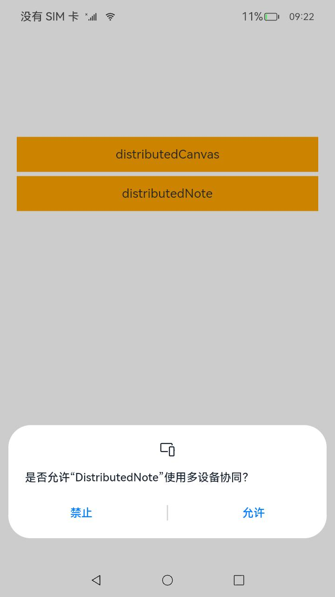
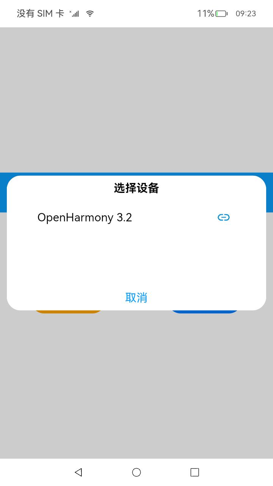
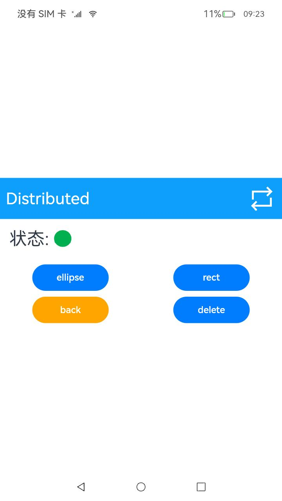
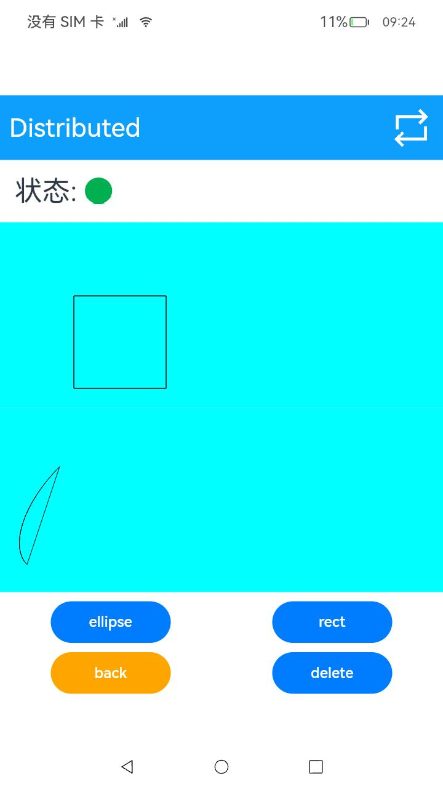

# 分布式画布流转场景

## 场景说明

两台设备组网，当其中一个设备修改文件时，两个设备可以同步修改的结果。分布式场景可以在协同办公（如多人多设备编辑同一文件），设备文档更新（分布式设备更新文件内容，所有设备同步更新）中发挥重要作用，有助于加快工作效率，减少工作中的冗余。

本示例将为大家介绍如何实现上述功能。

## 效果呈现

本例效果如下：

| 设置分布式权限                         | 进行分布式连接                             | 连接后状态显示                            |
| -------------------------------------- | ------------------------------------------ | ----------------------------------------- |
|  |  |  |

| 点击rect和ellipse按钮后后本机显示        | 另外一台机器分布式应用显示               |
| ---------------------------------------- | ---------------------------------------- |
|  |  |

## 运行环境

本例基于以下环境开发，开发者也可以基于其他适配的版本进行开发。

- IDE：DevEco Studio 4.0.0.201 Beta1
- SDK：Ohos_sdk_public 4.0.7.5 (API Version 10 Beta1)

## 实现思路

在分布式文件场景中，分布式设备管理包含了分布式设备搜索、分布式设备列表弹窗、远端设备拉起三部分。
首先在分布式组网内搜索设备，然后把设备展示到分布式设备列表弹窗中，最后根据用户的选择拉起远端设备。

- 分布式设备搜索：通过SUBSCRIBE_ID搜索分布式组网内的设备。

- 分布式设备列表弹窗：使用@CustomDialog装饰器来装饰分布式设备列表弹窗。

- 远端设备拉起：通过startAbility(deviceId)方法拉起远端设备的包。

- 分布式数据管理：(1)管理分布式数据库：创建一个distributedObject分布式数据对象实例，用于管理分布式数据对象。

  ​							   (2)订阅分布式数据变化：通过this.distributedObject.on('status', this.statusCallback)监听分布式数据对象的变更。

## 开发步骤

1. 申请所需权限

   在model.json5中添加以下配置：

   ```json
   "requestPermissions": [
         {
           "name": "ohos.permission.DISTRIBUTED_DATASYNC"//允许不同设备间的数据交换
         },
         {
           "name": "ohos.permission.ACCESS_SERVICE_DM"//允许系统应用获取分布式设备的认证组网能力
         }
       ]
   ```

2. 构建UI框架

   indexCanvas页面：

   TitleBar组件呈现标题栏。通过数据懒加载的方式遍历绘制的图形。被划出可视区域外的资源会被回收。

   绘制ellipse图形、rect图形的按钮使用Button组件呈现。

   返回按钮、删除按钮也通过Button组件呈现。

   ```typescript
   build() {
       Column() {
         TitleBar({ rightBtn: $r('app.media.trans'), onRightBtnClicked: this.showDialog })
   	//自/common/TitleBar.ets中引入标题栏相关。点击标题栏中的右侧按钮会调用showDialog()函数连接组网设备
         Row() {
           Text($r('app.string.state'))
             .fontSize(30)
           Image(this.isOnline ? $r('app.media.green') : $r('app.media.red'))
             .size({ width: 30, height: 30 })
             .objectFit(ImageFit.Contain)
         }
         .width('100%')
         .padding(16)
   	  //通过懒加载模式遍历绘制的图形，将每个图形绘制在画布上
         LazyForEach(this.canvasDataSource, (item: CanvasPath, index) => {
           Canvas(this.context)
             .width('100%')
             .height(200)
             .backgroundColor('#00ffff')
             .onReady(() => {
               if (item.path === 'rect') {
                 this.context.save();
                 this.path2Df.rect(80, 80, 100, 100);
                 this.context.stroke(this.path2Df);
                 this.context.restore();
               }
               if (item.path === 'ellipse') {
                 this.context.restore();
                 this.path2De.ellipse(100, 100, 50, 100, Math.PI * 0.25, Math.PI * 0.5, Math.PI);
                 this.context.stroke(this.path2De);
                 this.context.save();
               }
             })
         }, item => JSON.stringify(item))
   
         Row() {
           Button('ellipse')//绘制ellipse图形的按钮
             .width(130)
             .height(45)
             .key('ellipse')
             .onClick(() => {
               if (this.globalObject.isContainString('ellipse') === -1) {
                 this.globalObject.add('ellipse');  //将绘制信息保存在持久全局数据中
               }
               this.onPageShow();
             })
           Button('rect')//绘制rect图形的按钮
             .width(130)
             .height(45)
             .key('rect')
             .onClick(() => {
               if (this.globalObject.isContainString('rect') === -1) {
                 this.globalObject.add('rect');
               }
               this.onPageShow();
             })
         }.margin({ top: 10 })
         .width('100%')
         .justifyContent(FlexAlign.SpaceAround)
   
         Row() {
           Button('back')
             .width(130)
             .height(45)
             .key('back')
             .backgroundColor(Color.Orange)
             .onClick(() => {
               router.back()
             })
           Button('delete')//删除图形
             .width(130)
             .height(45)
             .key('delete')
             .onClick(() => {
               this.globalObject.clear();
               this.canvasDataSource['pathArray'] = [];
               this.canvasDataSource.notifyDataReload();
               this.context.clearRect(0, 0, 950, 950)
             })
         }.margin({ top: 10 })
         .width('100%')
         .justifyContent(FlexAlign.SpaceAround)
       }
       .width('100%')
       .height('100%')
       .justifyContent(FlexAlign.Center)
       .alignItems(HorizontalAlign.Center)
     }
   }
   ```

3. 数据model

   通过registerDataChangeListener进行对数据变动的监听，数据发生变化时，调用notifyDataReload方法通知数据已经准备就绪。

   ```typescript
   //BasicDataSource.ets
   class BasicDataSource implements IDataSource {
     private listeners: DataChangeListener[] = []
   
     public totalCount(): number {
       return 0
     }
   
     public getData(index: number): any {
       return undefined
     }
   
     //注册数据变动的监听
     registerDataChangeListener(listener: DataChangeListener): void {
       if (this.listeners.indexOf(listener) < 0) {
         console.info('add listener')
         this.listeners.push(listener)
       }
     }
   
     unregisterDataChangeListener(listener: DataChangeListener): void {
       const pos = this.listeners.indexOf(listener);
       if (pos >= 0) {
         console.info('remove listener')
         this.listeners.splice(pos, 1)
       }
     }
   
   //数据reloaded，分布式数据数值变化需要调用这个接口重载下
     notifyDataReload(): void {
       this.listeners.forEach(listener => {
         listener.onDataReloaded()
       })
     }
   
     notifyDataAdd(index: number): void {
       this.listeners.forEach(listener => {
         listener.onDataAdd(index)
       })
     }
   
    ....
   
   export class CanvasDataSource extends BasicDataSource {
     //监听的数据类型
     private pathArray: Canvas[] = []
   
     //重载接口
     public totalCount(): number {
       return this.pathArray.length
     }
   
     public getData(index: number): any {
       return this.pathArray[index]
     }
   
     public addData(index: number, data: Canvas): void {
       this.pathArray.splice(index, 0, data)
       this.notifyDataAdd(index)
     }
   
     public pushData(data: Canvas): void {
       this.pathArray.push(data)
       this.notifyDataAdd(this.pathArray.length - 1)
     }
   }
   ```

4. 将两台设备组网

   使用自RemoteDeviceModel.ts中引入的类RemoteDeviceModel以扫描获得附近可以连接的设备。

   ```typescript
   showDialog = () => {
       //RemoteDeviceModel引入自model/RemoteDeviceModel.ts
       RemoteDeviceModel.registerDeviceListCallback(() => {
           //得到附近可信的设备列表
         Logger.info(TAG, 'registerDeviceListCallback, callback entered')
         this.devices = []
         this.devices = RemoteDeviceModel.discoverDevices.length > 0 ? RemoteDeviceModel.discoverDevices : RemoteDeviceModel.devices
         if (this.dialogController) {
           this.dialogController.close()
           this.dialogController = undefined
         }
         this.dialogController = new CustomDialogController({
           builder: DeviceDialog({
             devices: this.devices,
             onSelectedIndexChange: this.onSelectedDevice
           }),
           autoCancel: true
         })
         this.dialogController.open()
       })
     }
   ....................................
   //model/RemoteDeviceModel.ts
   import deviceManager from '@ohos.distributedHardware.deviceManager'
   registerDeviceListCallback(stateChangeCallback: () => void) {
       if (typeof (this.deviceManager) !== 'undefined') {
         this.registerDeviceListCallbackImplement(stateChangeCallback)
         return
       }
       Logger.info(TAG, 'deviceManager.createDeviceManager begin')
       try {
         deviceManager.createDeviceManager(BUNDLE, (error, value) => {
           if (error) {
             Logger.error(TAG, 'createDeviceManager failed.')
             return
           }
           this.deviceManager = value
           this.registerDeviceListCallbackImplement(stateChangeCallback)
           Logger.info(TAG, `createDeviceManager callback returned,value=${value}`)
         })
       } catch (error) {
         Logger.error(TAG, `createDeviceManager throw error, code=${error.code} message=${error.message}`)
       }
   
       Logger.info(TAG, 'deviceManager.createDeviceManager end')
     }
   registerDeviceListCallbackImplement(stateChangeCallback: () => void) {
       Logger.info(TAG, 'registerDeviceListCallback')
       this.stateChangeCallback = stateChangeCallback
       if (this.deviceManager === undefined) {
         Logger.error(TAG, 'deviceManager has not initialized')
         this.stateChangeCallback()
         return
       }
       Logger.info(TAG, 'getTrustedDeviceListSync begin')
       try {
         let list = this.deviceManager.getTrustedDeviceListSync()//同步获取所有可信设备列表
         Logger.info(TAG, `getTrustedDeviceListSync end, devices=${JSON.stringify(list)}`)
         if (typeof (list) !== 'undefined' && typeof (list.length) !== 'undefined') {
           this.devices = list
         }
       } catch (error) {
         Logger.error(TAG, `getLocalDeviceInfoSync throw error, code=${error.code} message=${error.message}`)
       }
       this.stateChangeCallback()
       Logger.info(TAG, 'callback finished')
       try {
         this.deviceManager.on('deviceStateChange', (data) => {
           if (data === null) {
             return
           }
           Logger.info(TAG, `deviceStateChange data = ${JSON.stringify(data)}`)
           switch (data.action) {
             case deviceManager.DeviceStateChangeAction.READY://即设备处于可用状态，表示设备间信息已在分布式数据中同步完成, 可以运行分布式业务
               this.discoverDevices = []
               this.devices.push(data.device)
               this.stateChangeCallback()
               try {
                 let list = this.deviceManager.getTrustedDeviceListSync()
                 if (typeof (list) !== 'undefined' && typeof (list.length) !== 'undefined') {
                   this.devices = list
                 }
               } catch (error) {
                 Logger.error(TAG, `getTrustedDeviceListSync throw error, code=${error.code} message=${error.message}`)
               }
               this.stateChangeCallback()
               break
             default:
               break
           }
         })
         this.deviceManager.on('deviceFound', (data) => {
           if (data === null) {
             return
           }
           Logger.info(TAG, `deviceFound data=${JSON.stringify(data)}`)
           this.onDeviceFound(data)
         })
         this.deviceManager.on('discoverFail', (data) => {
           Logger.info(TAG, `discoverFail data=${JSON.stringify(data)}`)
         })
         this.deviceManager.on('serviceDie', () => {
           Logger.info(TAG, 'serviceDie')
         })
       } catch (error) {
         Logger.error(TAG, `on throw error, code=${error.code} message=${error.message}`)
       }
       this.startDeviceDiscovery()
     }
   startDeviceDiscovery() {
       SUBSCRIBE_ID = Math.floor(65536 * Math.random())
       var info = {
         subscribeId: SUBSCRIBE_ID,
         mode: 0xAA,
         medium: 2,
         freq: 2,//高频率
         isSameAccount: false,
         isWakeRemote: true,
         capability: 0
       }
       Logger.info(TAG, `startDeviceDiscovery${SUBSCRIBE_ID}`)
       try {
         this.deviceManager.startDeviceDiscovery(info)//开始发现周边设备
       } catch (error) {
         Logger.error(TAG, `startDeviceDiscovery throw error, code=${error.code} message=${error.message}`)
       }
   
     }
   ```

5. 实现同步编辑

   通过AppStorage设置持久性数据，然后实现IDataSource接口，通过注册数据监听接口监听数据的变化。
   
   ```typescript
   onPageShow() {
       //每当完成编辑或者新建文件，就会回到主页，此时就会执行onPageShow()
       //noteDataSource获取globalObject保存的分布式的持久性数据，并进行Reload操作传递。
       this.noteDataSource['dataArray'] = this.globalObject.distributedObject.documents
       this.noteDataSource.notifyDataReload()
       Logger.info(TAG, `this.sessionId = ${this.sessionId}`)
       Logger.info(TAG, `globalSessionId = ${this.globalSessionId}`)
       if (this.sessionId !== this.globalSessionId) {
         this.sessionId = this.globalSessionId
         this.share()
       }
     }
   share() {
       //多个设备间的对象如果设置为同一个sessionId，数据自动同步
       Logger.info(TAG, `sessionId = ${this.sessionId}`)
       this.globalObject.setChangeCallback(() => {
         this.noteDataSource['dataArray'] = this.globalObject.distributedObject.documents
         this.noteDataSource.notifyDataReload()
       })
       this.globalObject.setStatusCallback((session, networkId, status) => {
         Logger.info(TAG, `StatusCallback,${status}`)
         if (status === 'online') {
           this.isOnline = true
         } else {
           this.isOnline = false
         }
       })
       this.globalObject.distributedObject.setSessionId(this.sessionId)
       AppStorage.SetOrCreate('objectModel', this.globalObject)
     }
   ```

## 全部代码

本例完整代码sample示例链接：[分布式对象](https://gitee.com/openharmony/applications_app_samples/tree/master/code/SuperFeature/DistributedAppDev/DistributedNote)

## 参考

[权限列表](../application-dev/security/AccessToken/permissions-for-all.md#ohospermissiondistributed_datasync)

[Path2D对象](../application-dev/reference/apis-arkui/arkui-ts/ts-components-canvas-path2d.md)

[分布式数据对象](../application-dev/reference/apis-arkdata/js-apis-data-distributedobject.md)
