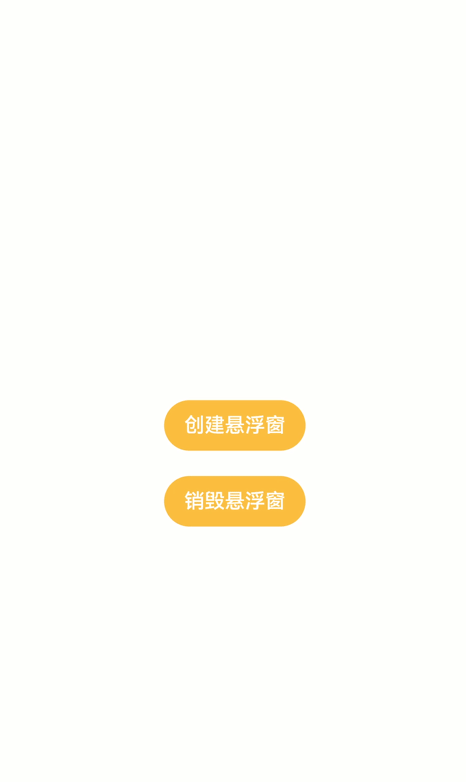

# 如何创建悬浮窗

## 场景说明
悬浮窗功能可以基于当前任务创建一个始终在前台显示的窗口。即使创建悬浮窗的任务退至后台，悬浮窗仍然可以在前台显示，通常悬浮窗位于所有应用窗口之上。很多应用都具有悬浮窗的功能，常见的如视频应用的视频播放窗口，在视频应用切换到后台后，视频播放窗口还可以在前台以小窗形式继续播放。本例即为大家介绍如何开发悬浮窗。

## 效果呈现
本例效果如下：



## 运行环境
本例基于以下环境开发，开发者也可以基于其他适配的版本进行开发：

- IDE: DevEco Studio 4.0 Beta1
- SDK: Ohos_sdk_public 4.0.7.5 (API Version 10 Beta1)


## 实现思路
本例中主要涉及三项关键操作，相关实现方案如下：
- 创建悬浮窗：使用window类的createWindow方法创建窗口，窗口类型设置为window.WindowType.TYPE_FLOAT
- 悬浮窗可拖拽：通过gesture为窗口绑定手势事件，使用PanGesture监听拖拽手势并记录窗口位置，通过moveWindowTo方法将窗口移动到拖拽位置从而实现窗口拖拽。
- 退出悬浮窗口：使用destroyWindow方法，销毁悬浮窗。

## 开发步骤
由于本例重点讲解悬浮窗的创建和使用，所以开发步骤会着重讲解相关实现，不相关的内容不做介绍，全量代码可参考完整代码章节。
1. 申请权限。

    创建悬浮窗需要先申请ohos.permission.SYSTEM_FLOAT_WINDOW权限，要在module.json5文件的requestPermissions对象中进行配置，如下：
    ```json
    {
      "module": {
        "requestPermissions":[
          {
            "name" : "ohos.permission.SYSTEM_FLOAT_WINDOW",
            "usedScene": {
              "abilities": [
                "EntryAbility"
              ],
              "when":"inuse"
            }
          }
        ]
      }
    }
    ```
2. 创建悬浮窗。

    使用window类的createWindow方法创建窗口，窗口类型设置为window.WindowType.TYPE_FLOAT。由于本例通过按钮的点击事件控制悬浮窗的创建和销毁，为了便于操作，本例将创建和销毁悬浮窗的操作写在自定义的方法中，以便绑定到按钮的点击时间中。
    创建悬浮窗的操作在自定义方法createFloatWindow中实现。
    具体代码如下：
    ```ts
    // 引入window类
    import window from '@ohos.window';
    ...
    // 自定义创建悬浮窗方法
    createFloatWindow() {
      let windowClass = null;
      // 窗口类型设置为window.WindowType.TYPE_FLOAT
      let config = {name: "floatWindow", windowType: window.WindowType.TYPE_FLOAT, ctx: getContext(this)};
      // 创建悬浮窗
      window.createWindow(config, (err, data) => {
        if (err.code) {
          console.error('Failed to create the floatWindow. Cause: ' + JSON.stringify(err));
          return;
        }
        console.info('Succeeded in creating the floatWindow. Data: ' + JSON.stringify(data));
        windowClass = data;
      }
    }
    ```
3. 设置窗口信息。

    创建悬浮窗时，可以对窗口的位置、大小、内容等进行设置。
    具体代码如下：
    ```ts
    ...
    window.createWindow(config, (err, data) => {
      ...
      windowClass = data;
      // 设置悬浮窗位置
      windowClass.moveWindowTo(300, 300, (err) => {
        if (err.code) {
          console.error('Failed to move the window. Cause:' + JSON.stringify(err));
          return;
        }
        console.info('Succeeded in moving the window.');
      });
      // 设置悬浮窗大小
      windowClass.resize(500, 500, (err) => {
        if (err.code) {
          console.error('Failed to change the window size. Cause:' + JSON.stringify(err));
          return;
        }
        console.info('Succeeded in changing the window size.');
      });
      //为悬浮窗加载页面内容，这里可以设置在main_pages.json中配置的页面
      windowClass.setUIContent("pages/FloatContent", (err) => {
        if (err.code) {
          console.error('Failed to load the content. Cause:' + JSON.stringify(err));
          return;
        }
        console.info('Succeeded in loading the content.');
        // 显示悬浮窗。
        windowClass.showWindow((err) => {
          if (err.code) {
            console.error('Failed to show the window. Cause: ' + JSON.stringify(err));
            return;
          }
          console.info('Succeeded in showing the window.');
        });
      });
    });
    ```
4. 销毁悬浮窗。

    使用destroyWindow方法销毁悬浮窗，为了便于通过按钮点击控制悬浮窗的销毁，我们这里将销毁逻辑写在自定义方法destroyFloatWindow中。
    具体代码如下：
    ```ts
    // 定义windowClass变量，用来接收创建的悬浮窗
    private windowClass: window.Window;

    createFloatWindow() {
      ...
      // 创建悬浮窗。
      window.createWindow(config, (err, data) => {
        if (err.code) {
          console.error('Failed to create the floatWindow. Cause: ' + JSON.stringify(err));
          return;
        }
        console.info('Succeeded in creating the floatWindow. Data: ' + JSON.stringify(data));
        // 用windowClass变量接收创建的悬浮窗
        this.windowClass = data;
        ...
      }
    }
    // 自定义销毁悬浮窗方法
    destroyFloatWindow() {
      // 用windowClass调用destroyWindow销毁悬浮窗
      this.windowClass.destroyWindow((err) => {
        if (err.code) {
          console.error('Failed to destroy the window. Cause: ' + JSON.stringify(err));
          return;
        }
        console.info('Succeeded in destroying the window.');
      });
    }
    ```
5. 构建主页面UI。

	将创建悬浮窗和销毁悬浮窗绑定到对应的按钮上。
	具体代码如下：
    ```ts
    ...
    build() {
      Row() {
        Column() {
          Button('创建悬浮窗')
            .onClick(() => {
              // 点击按钮调用创建悬浮窗方法
              this.createFloatWindow();
            })
          Button('销毁悬浮窗')
            .margin({top:20})
            .onClick(() => {
              // 点击按钮调用销毁悬浮窗方法
              this.destroyFloatWindow();
            })
        }
        .width('100%')
      }
      .height('100%')
    }
    ...
    ```
6. 创建悬浮窗的显示页面并实现悬浮窗可拖拽。

    为页面内容绑定PanGesture拖拽事件，拖拽事件发生时获取到触摸点的位置信息，使用@Watch监听到位置变量的变化，然后调用窗口的moveWindowTo方法将窗口移动到对应位置，从而实现拖拽效果。
    具体代码如下：
    ```ts
    import window from '@ohos.window';

    interface Position {
      x: number,
      y: number
    }
    @Entry
    @Component
    struct FloatContent {
      @State message: string = 'float window'
      private panOption: PanGestureOptions = new PanGestureOptions({ direction: PanDirection.All });
      // 创建位置变量，并使用@Watch监听，变量发生变化调用moveWindow方法移动窗口
      @State @Watch("moveWindow") windowPosition: Position = { x: 0, y: 0 };
      floatWindow: window.Window
      // 通过悬浮窗名称“floatWindow”获取到创建的悬浮窗
      aboutToAppear() {
        this.floatWindow = window.findWindow("floatWindow")
      }
      // 将悬浮窗移动到指定位置
      moveWindow() {
        this.floatWindow.moveWindowTo(this.windowPosition.x, this.windowPosition.y);
      }

      build() {
        Row() {
          Column() {
            Text(this.message)
              .fontSize(50)
              .fontWeight(FontWeight.Bold)
          }
          .width('100%')
        }
        .height('100%')
        .gesture(
          // 绑定PanGesture事件，监听拖拽动作
          PanGesture(this.panOption)
            .onActionStart((event: GestureEvent) => {
              console.info('Pan start');
            })
            .onActionUpdate((event: GestureEvent) => {
              // 发生拖拽时，获取到触摸点的位置，并将位置信息传递给windowPosition
              this.windowPosition.x += event.offsetX;
              this.windowPosition.y += event.offsetY;
            })
            .onActionEnd(() => {
              console.info('Pan end');
            })
        )
        .border({
          style: BorderStyle.Dotted
        })
        .backgroundColor(Color.Yellow)
      }
    }
    ```

## 完整代码
本例完整代码如下：
主窗口代码（FloatWindow.ets）：
```ts
//FloatWindow.ets
// 引入window类
import window from '@ohos.window';

@Entry
@Component
struct FloatWindow {
  // 定义windowClass变量，用来接收创建的悬浮窗
  private windowClass: window.Window;
  // 自定义创建悬浮窗方法
  createFloatWindow() {
    let windowClass = null;
    // 窗口类型设置为window.WindowType.TYPE_FLOAT
    let config = {name: "floatWindow", windowType: window.WindowType.TYPE_FLOAT, ctx: getContext(this)};
    // 创建悬浮窗
    window.createWindow(config, (err, data) => {
      if (err.code) {
        console.error('Failed to create the floatWindow. Cause: ' + JSON.stringify(err));
        return;
      }
      console.info('Succeeded in creating the floatWindow. Data: ' + JSON.stringify(data));
      windowClass = data;
      // 用windowClass变量接收创建的悬浮窗
      this.windowClass = data;
      // 设置悬浮窗位置
      windowClass.moveWindowTo(300, 300, (err) => {
        if (err.code) {
          console.error('Failed to move the window. Cause:' + JSON.stringify(err));
          return;
        }
        console.info('Succeeded in moving the window.');
      });
      // 设置悬浮窗大小
      windowClass.resize(500, 500, (err) => {
        if (err.code) {
          console.error('Failed to change the window size. Cause:' + JSON.stringify(err));
          return;
        }
        console.info('Succeeded in changing the window size.');
      });
      // 为悬浮窗加载页面内容，这里可以设置在main_pages.json中配置的页面
      windowClass.setUIContent("pages/FloatContent", (err) => {
        if (err.code) {
          console.error('Failed to load the content. Cause:' + JSON.stringify(err));
          return;
        }
        console.info('Succeeded in loading the content.');
        // 显示悬浮窗。
        windowClass.showWindow((err) => {
          if (err.code) {
            console.error('Failed to show the window. Cause: ' + JSON.stringify(err));
            return;
          }
          console.info('Succeeded in showing the window.');
        });
      });

    });
  }
  // 自定义销毁悬浮窗方法
  destroyFloatWindow() {
    // 用windowClass调用destroyWindow销毁悬浮窗
    this.windowClass.destroyWindow((err) => {
      if (err.code) {
        console.error('Failed to destroy the window. Cause: ' + JSON.stringify(err));
        return;
      }
      console.info('Succeeded in destroying the window.');
    });
  }

  build() {
    Row() {
      Column() {
        Button('创建悬浮窗')
          .backgroundColor('#F9C449')
          .onClick(() => {
            // 点击按钮调用创建悬浮窗方法
            this.createFloatWindow();
          })
        Button('销毁悬浮窗')
          .margin({top:20})
          .backgroundColor('#F9C449')
          .onClick(() => {
            // 点击按钮调用销毁悬浮窗方法
            this.destroyFloatWindow();
          })
      }
      .width('100%')
    }
    .height('100%')
  }
}
```
悬浮窗内容页代码（FloatContent.ets）:
```ts
//FloatContent.ets
import window from '@ohos.window';

interface Position {
  x: number,
  y: number
}
@Entry
@Component
struct FloatContent {
  @State message: string = 'float window'
  private panOption: PanGestureOptions = new PanGestureOptions({ direction: PanDirection.All });
  // 创建位置变量，并使用@Watch监听，变量发生变化调用moveWindow方法移动窗口
  @State @Watch("moveWindow") windowPosition: Position = { x: 0, y: 0 };
  floatWindow: window.Window
  // 通过悬浮窗名称“floatWindow”获取到创建的悬浮窗
  aboutToAppear() {
    this.floatWindow = window.findWindow("floatWindow")
  }
  // 将悬浮窗移动到指定位置
  moveWindow() {
    this.floatWindow.moveWindowTo(this.windowPosition.x, this.windowPosition.y);
  }

  build() {
    Row() {
      Column() {
        Text(this.message)
          .fontSize(30)
          .fontColor(Color.White)
          .fontWeight(FontWeight.Bold)
      }
      .width('100%')
    }
    .height('100%')
    .gesture(
      // 绑定PanGesture事件，监听拖拽动作
      PanGesture(this.panOption)
        .onActionStart((event: GestureEvent) => {
          console.info('Pan start');
        })
        // 发生拖拽时，获取到触摸点的位置，并将位置信息传递给windowPosition
        .onActionUpdate((event: GestureEvent) => {
          this.windowPosition.x += event.offsetX;
          this.windowPosition.y += event.offsetY;
        })
        .onActionEnd(() => {
          console.info('Pan end');
        })
    )
    .border({
      style: BorderStyle.Dotted
    })
    .backgroundColor("#E8A49C")
  }
}
```
## 参考
- [管理应用窗口（Stage模型）](../application-dev/windowmanager/application-window-stage.md)
- [@ohos.window (窗口)](../application-dev/reference/apis-arkui/js-apis-window.md)
- [单一手势](../application-dev/ui/arkts-gesture-events-single-gesture.md)
- [@Watch：状态变量更改通知](../application-dev/quick-start/arkts-watch.md)