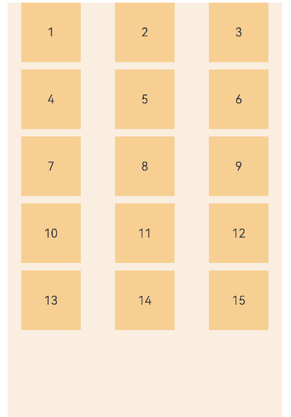

## 如何在网格Grid中通过拖拽交换子组件位置

### 场景说明

在使用网格Grid的应用中，可以通过拖拽子组件GridItem的方式，交换子组件的显示位置。

### 效果呈现

本示例在模拟器中显示的最终效果如下（预览器中显示效果略有差异）：



### 运行环境

- IDE：DevEco Studio 3.1 Beta2
- SDK：Ohos_sdk_public 3.2.11.9 (API Version 9 Release)

### 实现原理

1. 设置Grid的editMode属性为true，使Grid进入编辑模式，从而可以拖拽Grid组件内部GridItem。

2. 在Grid的相关拖拽事件中进行拖拽逻辑处理：
   
   1. 在onItemDragStart事件中显示拖拽过程中的图片，即被拖拽的GridItem。
   
   2. 在onItemDrop事件中根据拖拽前后的位置，完成两个GridItem位置交换的逻辑。

### 开发步骤

1. 构建Grid组件及子组件GridItem，开启Grid组件的editMode属性。
   
   ```ts
   build() {
     Column({ space: 5 }) {
       Grid(this.scroller) {
         ForEach(this.numbers, (day: string) => {
           GridItem() {
             ...
           }
         })
       }
       .editMode(true)
       ...
   
     }.width('100%').margin({ top: 5 })
   }
   ```

2. 当长按GridItem时触发onItemDragStart事件，在该事件中提供被拖拽GridItem的显示逻辑。
   
   ```ts
   .onItemDragStart((event: ItemDragInfo, itemIndex: number) => {
     return this.pixelMapBuilder()
   })
   ```
   
   其中，pixelMapBuilder构造拖拽过程中显示的图片，即被拖拽的GridItem。
   
   ```ts
   @State text: string = 'drag'
   
   @Builder pixelMapBuilder() {
     Column() {
       Text(this.text)
         .fontSize(16)
         .backgroundColor(0xF9CF93)
         .width(80)
         .height(80)
         .textAlign(TextAlign.Center)
     }
   }
   ```
   
   拖拽过程中GridItem显示的内容，在触摸事件发生时进行传递。
   
   ```ts
   ForEach(this.numbers, (day: string) => {
     GridItem() {
       Text(day)
         ...
         .onTouch((event: TouchEvent) => {
           if (event.type === TouchType.Down) {
             this.text = day
           }
         })
     }
   })
   ```

3. 停止拖拽时触发onItemDrop事件，在该事件中完成两个GridItem位置交换的逻辑。
   
   为了防止GridItem被拖拽到空白的区域，在交换之前判断拖拽插入的位置是否超出当前已有内容的范围：
   
   ```ts
   .onItemDrop((event: ItemDragInfo, itemIndex: number, insertIndex: number, isSuccess: boolean) => {
     if(insertIndex < this.numbers.length){
       this.changeIndex(itemIndex, insertIndex)
     }
   })
   ```
   
   其中，changeIndex为具体交换数组元素位置的逻辑：
   
   ```ts
   changeIndex(index1: number, index2: number) {
     [this.numbers[index1], this.numbers[index2]] = [this.numbers[index2], this.numbers[index1]];
   }
   ```

### 完整代码

通过上述步骤可以完成整个示例的开发，完整代码如下：

```ts
@Entry
@Component
struct Index {
  @State numbers: String[] = []
  scroller: Scroller = new Scroller()
  @State text: string = 'drag'

  //拖拽过程中展示的样式
  @Builder pixelMapBuilder() {
    Column() {
      Text(this.text)
        .fontSize(16)
        .backgroundColor(0xF9CF93)
        .width(80)
        .height(80)
        .textAlign(TextAlign.Center)
    }
  }

  aboutToAppear() {
    for (let i = 1;i <= 15; i++) {
      this.numbers.push(i + '')
    }
  }

  //交换数组中元素位置
  changeIndex(index1: number, index2: number) {
    [this.numbers[index1], this.numbers[index2]] = [this.numbers[index2], this.numbers[index1]];
  }

  build() {
    Column({ space: 5 }) {
      Grid(this.scroller) {
        ForEach(this.numbers, (day: string) => {
          GridItem() {
            Text(day)
              .fontSize(16)
              .backgroundColor(0xF9CF93)
              .width(80)
              .height(80)
              .textAlign(TextAlign.Center)
              .onTouch((event: TouchEvent) => {
                if (event.type === TouchType.Down) {
                  this.text = day
                }
              })
          }
        })
      }
      .columnsTemplate('1fr 1fr 1fr')
      .columnsGap(10)
      .rowsGap(10)
      .onScrollIndex((first: number) => {
        console.info(first.toString())
      })
      .width('90%')
      .backgroundColor(0xFAEEE0)
      .height('100%')
      //设置Grid是否进入编辑模式，进入编辑模式可以拖拽Grid组件内部GridItem
      .editMode(true)
      //第一次拖拽此事件绑定的组件时，触发回调
      .onItemDragStart((event: ItemDragInfo, itemIndex: number) => {
        //设置拖拽过程中显示的图片
        return this.pixelMapBuilder()
      })
      //绑定此事件的组件可作为拖拽释放目标，当在本组件范围内停止拖拽行为时，触发回调
      //itemIndex为拖拽起始位置，insertIndex为拖拽插入位置
      .onItemDrop((event: ItemDragInfo, itemIndex: number, insertIndex: number, isSuccess: boolean) => {
        //不支持拖拽到已有内容以外的位置
        if(insertIndex < this.numbers.length){
          this.changeIndex(itemIndex, insertIndex)
        }
      })
    }.width('100%').margin({ top: 5 })
  }
}
```