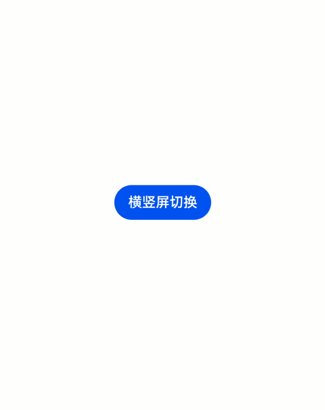

# 如何实现横竖屏切换

## 场景说明
横竖屏切换是音视频应用常用的功能，OpenHarmony也提供了相应的能力，可以方便的实现横竖屏切换，本文即为大家介绍如何完成横竖屏切换。

## 效果呈现
本例效果如下：
- 点击窗口中间的“横竖屏切换”按钮可以实现横竖屏之间的切换。
- 初次点击由竖屏切换为横屏，再次点击由横屏切换为竖屏。



## 环境要求

本例基于以下环境开发，开发者也可以基于其他适配的版本进行开发：

- IDE: DevEco Studio 4.0 Release
- SDK: Ohos_sdk_public 4.0.10.13 (API Version 10 Release)


## 实现思路
通过window模块的getLastWindow接口获取到当前窗口，然后使用窗口的setPreferredOrientation接口实现横竖屏的切换，参数为window.Orientation.PORTRAIT时切换为竖屏，参数为window.Orientation.LANDSCAPE时切换为横屏。

## 开发步骤
开发步骤仅呈现关键代码，全量代码请参考完整代码章节。
1. 搭建UI框架，添加“横竖屏切换”按钮。
    ```ts
    Column(){
      Button("横竖屏切换")
        .onClick(()=>{

        })
    }
    .width('100%')
    .height('100%')
    .justifyContent(FlexAlign.Center)
    ```
2. 实现横竖屏切换接口horVerSwitch。
    ```ts
    horVerSwitch(){
      let context = getContext(this) as common.UIAbilityContext;
      // 使用getLastWindow获取当前窗口
      window.getLastWindow(context).then((lastWindow)=>{
        // 使用setPreferredOrientation实现横竖屏切换
        lastWindow.setPreferredOrientation(this.isFullScreen ? window.Orientation.PORTRAIT : window.Orientation.LANDSCAPE)
        this.isFullScreen = !this.isFullScreen
      })
    }
    ```
3. 给“横竖屏切换”按钮添加点击事件并绑定horVerSwitch，从而实现点击按钮，完成横竖屏切换。
    ```ts
    Column(){
      Button("横竖屏切换")
        .onClick(()=>{
          // 绑定horVerSwitch
          this.horVerSwitch()
        })
    }
    .width('100%')
    .height('100%')
    .justifyContent(FlexAlign.Center)
    ```

## 完整代码
本例完整代码如下：

```ts
// xxx.ets
import window from '@ohos.window';
import common from '@ohos.app.ability.common';

@Entry
@Component
struct HorVerSwitch{
  @State isFullScreen:boolean = false

  // 横竖屏切换
  horVerSwitch(){
    let context = getContext(this) as common.UIAbilityContext;
    // 使用getLastWindow获取当前窗口
    window.getLastWindow(context).then((lastWindow)=>{
      // 使用setPreferredOrientation实现横竖屏切换
      lastWindow.setPreferredOrientation(this.isFullScreen ? window.Orientation.PORTRAIT : window.Orientation.LANDSCAPE)
      this.isFullScreen = !this.isFullScreen
    })
  }

  build(){
    Column(){
      Button("横竖屏切换")
        .onClick(()=>{
          this.horVerSwitch()
        })
    }
    .width('100%')
    .height('100%')
    .justifyContent(FlexAlign.Center)
  }
}
```
## 参考
- [获取当前窗口(getLastWindow)](../application-dev/reference/apis-arkui/js-apis-window.md)
- [横竖屏切换(setPreferredOrientation)](../application-dev/reference/apis-arkui/js-apis-window.md)

