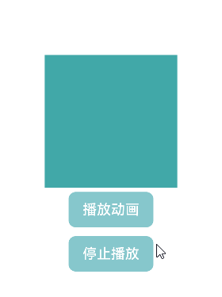
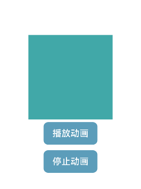

# 如何控制循环动画的播放停止
## 场景介绍
由于循环动画无限播放的效果是通过配置animateTo接口中的iterations属性值为-1实现的。为了控制循环动画的播放，开发者通过添加定时器和通过递归函数方法实现播放停止。本文即为大家介绍该方法如何控制循环动画的播放停止。

## 运行环境
本例基于以下环境开发，开发者也可以基于其他适配的版本进行开发：
- IDE: DevEco Studio 4.0 Release
- SDK: Ohos_sdk_public 4.0.10.13 (API Version 10 Release)
## 实现方案
方案一：将循环动画放到定时其中执行，通过清除定时器实现停止动画。 
创建一个播放一次的animateTo()并通过onFinish()回调，然后通过setInterval重复调用animateTo()，以达到循环动画的播放，最后通过clearInterval清除定时器完成循环播放的停止。具体代码如下：
```ts
class A {
  x:number=0
  y:number=0
}
@Entry
@Component
struct AnimateToStop{
  private Timer: number=0
  @State doScale: A = {x:1,y:1}
  build(){
    Column(){
      Row().width(150).height(150).backgroundColor("#41A8A8").scale(this.doScale)
      Button('播放动画',{type:ButtonType.Normal,stateEffect:true})
        .borderRadius(8)
        .margin(5)
        .backgroundColor('#86C7CC').onClick(() => {
        animateTo({ duration: 400, iterations: 1, onFinish: () => {
          animateTo({ duration: 400, onFinish: () => {
          } }, () => {
            this.doScale = { x: 1, y: 1 }
          })
        } }, () => {
          this.doScale = { x: 0.5, y: 0.5 }
        })

        this.Timer = setInterval(()=>{
          animateTo({ duration: 400, iterations: 1, onFinish: () => {
            animateTo({duration:400, onFinish:()=>{
            } }, ()=>{
              this.doScale ={x:1, y:1}
            })
          } }, ()=>{
            this.doScale={x:0.5,y:0.5}
          })
        },900)
      })
      Button('停止播放',{type:ButtonType.Normal,stateEffect:true})
        .borderRadius(8)
        .margin(5)
        .backgroundColor('#86C7CC')
        .onClick(() => {
          clearInterval(this.Timer)
        })
    }.width('100%')
    .height('100%')
    .justifyContent(FlexAlign.Center)
  }
}
```
效果图如下： 



方案二：通过递归函数使得循环动画无限播放，终止递归函数实现停止循环动画。
doAnimate函数去一直调用animateTo函数,从而实现动画无限循环；
```ts
class A{
  x:number=0
  y:number=0
}
@Entry
@Component
struct AnimateToStop {
  @State doStop: boolean = false
  @State doScale: A = { x: 0.5, y: 0.5 }

  doAnimate(x: number) {
    if (this.doStop) {
      return
    }
    animateTo({ duration: 400, iterations: 1, onFinish: () => {
      if (x == 0.5) {
        this.doAnimate(1)
      } else {
        this.doAnimate(0.5)
      }
    } }, () => {
      this.doScale = { x: x, y: x }
    })
  }

  build() {
    Column() {
      Row().width(150).height(150).backgroundColor("#41A8A8").scale(this.doScale)
      Button('播放动画', { type: ButtonType.Normal, stateEffect: true })
        .borderRadius(8)
        .margin(5)
        .backgroundColor('#5C9DBA')
        .onClick(() => {
          this.doStop = false
          this.doAnimate(0.5)
        })
      Button('停止动画', { type: ButtonType.Normal, stateEffect: true })
        .borderRadius(8)
        .margin(5)
        .backgroundColor('#5C9DBA')
        .onClick(() => {
          this.doStop = true
        })
    }.width('100%')
    .height('100%')
    .justifyContent(FlexAlign.Center)
  }
}
```

效果图如下：



## 参考
[显示动画](../application-dev/reference/apis-arkui/arkui-ts/ts-explicit-animation.md)

[定时器](../application-dev/reference/common/js-apis-timer.md)

