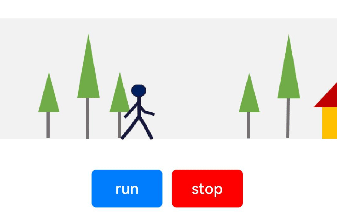
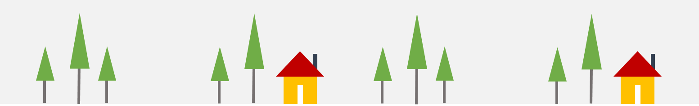

# 如何实现逐帧动画

## 场景说明
逐帧动画是常见的一种动画呈现形式，本例就为大家介绍如何通过translate()，setInterval()，clearAllInterval()等方法实现逐帧动画。

## 效果呈现
本例最终效果如下：
- 点击“run”按钮，火柴人开始走动。
- 点击“stop”按钮，火柴人停止走动。



## 运行环境
- IDE：DevEco Studio 3.1 Beta1
- SDK：Ohos_sdk_public 3.2.11.9 (API Version 9 Release)

## 实现思路
本例的实现有两个关键点：

- 将连续走动的火柴人拆分为多帧静态图像，在固定的时间间隔内逐帧将图像移动到动画窗口，间隔时间要小于肉眼可察觉的时间。循环上述动作，就可以实现火柴人的走动动画。
火柴人静态图像如下：

  

- 将背景图片以固定速度相对于火柴人走动方向反方向移动，从而实现火柴人向前走动的效果。
背景图如下：


本例使用translate()控制火柴人的移动，用backgroundImagePosition()控制背景图的移动。另外，通过setInterval()设置火柴人移动的时间间隔，通过clearAllInterval()清除移动。

## 开发步骤
1. 搭建UI框架。

   使用两个Row组件分别呈现背景图和火柴人，第二个Row组件作为第一个Row组件的子组件，父Row组件的背景设置为背景图，子Row组件中添加Image组件用来呈现火柴人单帧图像。
    ```ts
    @Entry
    @Component
    export default struct frameAnimation {
      build() {
        Column() {
          // 父Row组件
          Row() {
            // 子Row组件
            Row() {
              // 通过Image组件显示火柴人图像
              Image($r("app.media.man")).height(60).width(545.16)
            }.width(100)
            .justifyContent(FlexAlign.Start)
            .alignItems(VerticalAlign.Top)
            // 截取显示与背景同等大小的区域，控制单个火柴人显示在画面中
            .clip(true)
          }
          // 添加背景图像
          .backgroundImage($r("app.media.background"))
          // 保持宽高比进行缩小或者放大，使得图片两边都大于或等于显示边界。
          .backgroundImageSize(ImageSize.Cover)
          .width('100%')
          .height(130)
          .justifyContent(FlexAlign.Center)
          .alignItems(VerticalAlign.Bottom)
          Row() {
            // 添加跑动按钮
            Button('run')
              .margin({ right: 10 })
              .type(ButtonType.Normal)
              .width(75)
              .borderRadius(5)
            // 添加停止按钮
            Button('stop')
              .type(ButtonType.Normal)
              .borderRadius(5)
              .width(75)
              .backgroundColor('#ff0000')
          }.margin({ top: 30, bottom: 10 })
        }.width('100%').width('100%').padding({ top: 30 })
      }
    }
    ```
2. 添加火柴人和背景图片的移动逻辑。

   通过状态变量设定火柴人和背景图片的位置，位置变化时可以实时刷新UI界面。
    ```ts
    // 火柴人位置变量
    @State manPostion: {
      x: number,
      y: number
    } = { x: 0, y: 0 }
    // 背景图位置变量
    @State treePosition: {
      x: number,
      y: number
    } = { x: 0, y: 0 }
    ```
   给火柴人和背景图片添加位置属性。
    ```ts
    Row() {
      Row() {
        Image($r("app.media.man"))
          .height(60)
          .width(545.16)
          // 通过translate实现火柴人的位移。绑定manPosition，用来改变火柴人位置。
          .translate(this.manPostion)
      }
      ...
    }
    .backgroundImage($r("app.media.background"))
    .backgroundImageSize(ImageSize.Cover)
    // 通过backgroundImagePosition实现背景图片的位移。绑定treePosition，用来改变背景图片的位置。
    .backgroundImagePosition(this.treePosition)
    ...
    ```
3. 为''run''按钮和"stop"按钮绑定控制逻辑。

   构建火柴人和背景图片移动的方法，用来设定火柴人和背景图片每次移动的距离。这里要注意火柴人每次移动的距离等于两个火柴人之间的间隔距离（像素值）。
    ```ts
    // 火柴人移动方法
    manWalk() {
      if (this.manPostion.x <= -517.902) {
        this.manPostion.x = 0
      } else {
        // 每次移动的距离为火柴人静态图像之间的间隔距离
        this.manPostion.x -= 129.69
      }
    }
    // 背景移动方法
    treesMove() {
      if (this.treePosition.x <= -1215) {
        this.treePosition.x = 0
      } else {
        this.treePosition.x -= 20
      }
    }
    ```
   创建doAnimation()方法调用上述两个方法，以便在后续的定时器中使用。
    ```ts
    doAnimation() {
      this.manWalk()
      this.treesMove()
      }
    ```
   通过setInterval为“run”按钮绑定走动逻辑。
    ```ts
    Button('run')
      .margin({ right: 10 })
      .type(ButtonType.Normal)
      .width(75)
      .borderRadius(5)
      .onClick(() => {
        this.clearAllInterval()
        // 创建定时器，调用doAnimation方法，启动动画
        let timer = setInterval(this.doAnimation.bind(this), 100)
        this.timerList.push(timer)
      })
    ```
   通过clearAllInterval为“stop”按钮绑定停止逻辑。
    ```ts
    Button('stop')
      .type(ButtonType.Normal)
      .borderRadius(5)
      .width(75)
      .backgroundColor('#ff0000')
      .onClick(() => {
        // 清理定时器，停止动画
        this.clearAllInterval()
    })
    ```

## 完整代码
本例完整代码如下：
```ts
@Entry
@Component
export default struct frameAnimation {
  // 火柴人位置变量
  @State manPostion: {
    x: number,
    y: number
  } = { x: 0, y: 0 }
  // 背景图位置变量
  @State treePosition: {
    x: number,
    y: number
  } = { x: 0, y: 0 }
  // 定时器列表，当列表清空时，动画停止
  private timerList: number[] = []

  // 火柴人移动方法
  manWalk() {
    if (this.manPostion.x <= -517.902) {
      this.manPostion.x = 0
    } else {
      this.manPostion.x -= 129.69
    }
  }
  // 背景移动方法
  treesMove() {
    if (this.treePosition.x <= -1215) {
      this.treePosition.x = 0
    } else {
      this.treePosition.x -= 20
    }
  }

  // 销毁所有定时器
  clearAllInterval() {
    this.timerList.forEach((timer: number) => {
      clearInterval(timer)
    })
    this.timerList = []
  }

  doAnimation() {
    this.manWalk()
    this.treesMove()
  }

  build() {
    Column() {
      // 父Row组件
      Row() {
        // 子Row组件
        Row() {
          // 通过Image组件显示火柴人图像
          Image($r("app.media.man"))
            .height(60)
            .width(545.16)
            // 通过translate实现火柴人的位移。绑定manPosition变量，用来改变火柴人位置。
            .translate(this.manPostion)
        }
        .width(100)
        .justifyContent(FlexAlign.Start)
        .alignItems(VerticalAlign.Top)
        // 截取显示与背景同等大小的区域，控制单个火柴人显示在画面中
        .clip(true)
      }
      // 添加背景图像
      .backgroundImage($r("app.media.background"))
      // 保持宽高比进行缩小或者放大，使得图片两边都大于或等于显示边界。
      .backgroundImageSize(ImageSize.Cover)
      // 通过backgroundImagePosition实现背景图片的位移。绑定treePosition，用来改变背景图片的位置。
      .backgroundImagePosition(this.treePosition)
      .width('100%')
      .height(130)
      .justifyContent(FlexAlign.Center)
      .alignItems(VerticalAlign.Bottom)

      Row() {
        // 添加跑动按钮
        Button('run')
          .margin({ right: 10 })
          .type(ButtonType.Normal)
          .width(75)
          .borderRadius(5)
          .onClick(() => {
            this.clearAllInterval()
            let timer = setInterval(this.doAnimation.bind(this), 100)
            this.timerList.push(timer)
          })
        // 添加停止按钮
        Button('stop')
          .type(ButtonType.Normal)
          .borderRadius(5)
          .width(75)
          .backgroundColor('#ff0000')
          .onClick(() => {
            this.clearAllInterval()
          })
      }.margin({ top: 30, bottom: 10 })
    }.width('100%').width('100%').padding({ top: 30 })
  }
}
```

## 参考
- [Timer (定时器)](../application-dev/reference/common/js-apis-timer.md)
- [图形变换](../application-dev/reference/apis-arkui/arkui-ts/ts-universal-attributes-transformation.md)
- [背景设置](../application-dev/reference/apis-arkui/arkui-ts/ts-universal-attributes-background.md)

