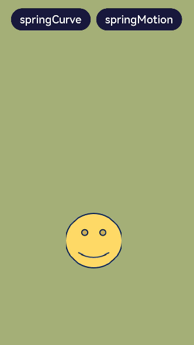
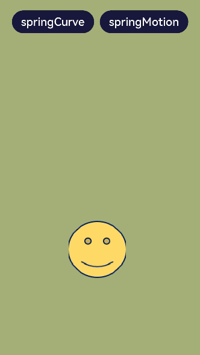
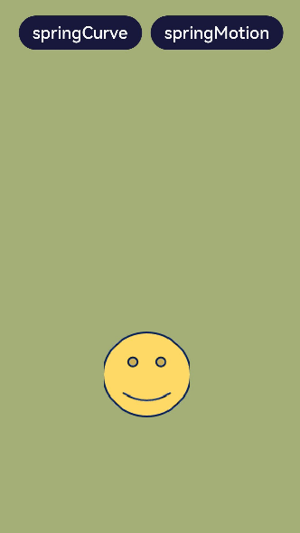

# 如何使用弹簧动画曲线

## 场景说明
在动画开发场景中，经常用到弹性效果，尤其在拖拽某个对象时经常伴随弹性动效。OpenHarmony提供了三种弹簧动画曲线用来实现弹性效果，本例将为大家介绍这三种曲线的用法。

## 效果呈现
本例最终效果如下：



## 运行环境
本例基于以下环境开发，开发者也可以基于其他适配的版本进行开发：

- IDE: DevEco Studio 3.1 Beta2
- SDK: Ohos_sdk_public 3.2.11.9(API Version 9 Release)


## 实现思路
本例主要用到以下三种弹簧动画曲线：
- [curves.springCurve](../application-dev/reference/apis-arkui/js-apis-curve.md#curvesspringcurve9)：通过设置弹簧的初始速度、质量、刚度和阻尼来控制弹簧动画的效果。对应本例中springCurve按钮触发的动画。
- [curves.springMotion](../application-dev/reference/apis-arkui/js-apis-curve.md#curvesspringmotion9)：通过设置弹簧震动时间和阻尼来控制弹簧动画的效果。对应本例中springMotion按钮触发的动画。
- [curves.responsiveSpringMotion](../application-dev/reference/apis-arkui/js-apis-curve.md#curvesresponsivespringmotion9)：构造弹性跟手动画曲线对象，是springMotion的一种特例，仅默认参数不同，可与springMotion混合使用。用来实现拖拽动画。

## 开发步骤
1. 搭建UI框架。
样例中有两个按钮，一个图片。内容整体纵向分布，两个按钮横向分布。纵向布局可以采用Column组件，横向布局可以采用Row组件。代码如下：
    ```ts
    @Entry
    @Component
    struct ImageComponent {
      build() {
        Column() {
          Row() {
            Button('springCurve')
              .margin({right:10})
              .fontSize(20)
              .backgroundColor('#18183C')
            Button('springMotion')
              .fontSize(20)
              .backgroundColor('#18183C')
          }
          .margin({top:30})

          Image($r("app.media.contact2"))
            .width(100)
            .height(100)
        }.width("100%").height("100%").backgroundColor('#A4AE77')
      }
    }
    ```
2. 为springCurve按钮添加curves.springCurve的曲线动画。
    ```ts
    ...
    // 定义状态变量translateY，用来控制笑脸图像的位移
    @State translateY: number = 0
    	...
        Button('springCurve')
          .margin({right:10})
          .fontSize(20)
          .backgroundColor('#18183C')
          // 绑定点击事件
          .onClick(() => {
            // 在点击事件中添加显示动画
            animateTo({
              duration: 2000,
              // 设定curves.springCurve为动画曲线
              curve: curves.springCurve(100, 10, 80, 10)
            },
            () => {
              // 改变translateY的值，使笑脸图像发生位移
              this.translateY = -20
            })
            this.translateY = 0
          })
    	...
        Image($r("app.media.contact2"))
          .width(100)
          .height(100)
          // 为笑脸图像添加位移属性，以translateY为参数
          .translate({ y: this.translateY })
    	...
    ```
    效果如下：
    
    
3. 为springMotion按钮添加curves.springMotion曲线动画。
这里通过position属性控制springMotion按钮的移动，当然开发者也可以继续选择使用translate属性。
    ```ts
    ...
      // 定义状态变量translateY，用来控制笑脸图像的位置变化
      @State imgPos: {
        x: number,
        y: number
      } = { x: 125, y: 400 }
            ...
            Button('springMotion')
              .fontSize(20)
              .backgroundColor('#18183C')
              // 绑定点击事件
              .onClick(() => {
              // 在点击事件中添加显示动画
              animateTo({
                duration: 15,
                //设定curves.springMotion为动画曲线
                curve: curves.springMotion(0.5, 0.5),
                onFinish: () => {
                  animateTo({ duration: 500,
                    curve: curves.springMotion(0.5, 0.5), }, () => {
                    // 动画结束时笑脸图像位置还原
                    this.imgPos = { x: 125, y: 400 }
                  })
                }
              }, () => {
                // 改变笑脸图像位置，y轴位置由400，变为150
                this.imgPos = { x: 125, y: 150 }
              })
            })
          ...
          Image($r("app.media.contact2"))
            .width(100)
            .height(100)
            .translate({ y: this.translateY })
            // 为笑脸图像添加位置属性，以imgPos为参数
            .position(this.imgPos)
         ...
    ```
    效果如下：
  
    
4. 使用curves.responsiveSpringMotion为笑脸图像添加拖拽动画。
    ```ts
    ...
          Image($r("app.media.contact2"))
            .width(100)
            .height(100)
            .translate({ y: this.translateY })
            .position(this.imgPos)
            // 绑定触摸事件
            .onTouch((event: TouchEvent) => {
              // 当触摸放开时，笑脸图像位置还原
              if (event.type == TouchType.Up) {
                animateTo({
                  duration: 50,
                  delay: 0,
                  curve: curves.springMotion(),
                  onFinish: () => {
                  }
                }, () => {
                  this.imgPos = { x: 125, y: 400 }
                })
              } else {
                // 触摸过程中触发跟手动画
                animateTo({
                  duration: 50,
                  delay: 0,
                  //设定跟手动画曲线
                  curve: curves.responsiveSpringMotion(),
                  onFinish: () => {
                  }
                }, () => {
                  // 根据触点位置改变笑脸图像位置，从而实现跟手动画
                  this.imgPos = {
                    x: event.touches[0].screenX - 100 / 2,
                    y: event.touches[0].screenY - 100 / 2
                  }
                })
              }
            })
    ...
    ```
    效果如下：
    
    

## 完整代码
本例完整代码如下：
```ts
import curves from '@ohos.curves';

@Entry
@Component
struct ImageComponent {
  // 定义状态变量translateY，用来控制笑脸图像的位移
  @State translateY: number = 0
  // 定义状态变量translateY，用来控制笑脸图像的位置变化
  @State imgPos: {
    x: number,
    y: number
  } = { x: 125, y: 400 }

  build() {
    Column() {
      Row() {
        Button('springCurve')
          .margin({right:10})
          .fontSize(20)
          .backgroundColor('#18183C')
          // 绑定点击事件
          .onClick(() => {
            // 在点击事件中添加显示动画
            animateTo({
              duration: 2000,
              // 设定curves.springCurve为动画曲线
              curve: curves.springCurve(100, 10, 80, 10)
            },
            () => {
              // 改变translateY的值，使笑脸图像发生位移
              this.translateY = -20
            })
            this.translateY = 0
          })
        Button('springMotion')
          .fontSize(20)
          .backgroundColor('#18183C')
          // 绑定点击事件
          .onClick(() => {
            // 在点击事件中添加显示动画
            animateTo({
              duration: 15,
              //设定curves.springMotion为动画曲线
              curve: curves.springMotion(0.5, 0.5),
              onFinish: () => {
                animateTo({ duration: 500,
                  curve: curves.springMotion(0.5, 0.5), }, () => {
                  // 动画结束时笑脸图像位置还原
                  this.imgPos = { x: 125, y: 400 }
                })
              }
            }, () => {
              // 改变笑脸图像位置，y轴位置由400，变为150
              this.imgPos = { x: 125, y: 150 }
            })
        })
      }
      .margin({top:30})

      Image($r("app.media.contact2"))
        .width(100)
        .height(100)
        // 为笑脸图像添加位移属性，以translateY为参数
        .translate({ y: this.translateY })
        // 为笑脸图像添加位置属性，以imgPos为参数
        .position(this.imgPos)
        // 绑定触摸事件
        .onTouch((event: TouchEvent) => {
          // 当触摸放开时，笑脸图像位置还原
          if (event.type == TouchType.Up) {
            animateTo({
              duration: 50,
              delay: 0,
              curve: curves.springMotion(),
              onFinish: () => {
              }
            }, () => {
              this.imgPos = { x: 125, y: 400 }
            })
          } else {
            // 触摸过程中触发跟手动画，同样通过animateTo实现动画效果
            animateTo({
              duration: 50,
              delay: 0,
              //设定跟手动画曲线
              curve: curves.responsiveSpringMotion(),
              onFinish: () => {
              }
            }, () => {
              // 根据触点位置改变笑脸图像位置，从而实现跟手动画
              this.imgPos = {
                x: event.touches[0].screenX - 100 / 2,
                y: event.touches[0].screenY - 100 / 2
              }
            })
          }
        })
    }.width("100%").height("100%").backgroundColor('#A4AE77')
  }
}
```
## 参考
- [显示动画](../application-dev/reference/apis-arkui/arkui-ts/ts-explicit-animation.md)
- [插值计算](../application-dev/reference/apis-as/js-apis-curve.md)