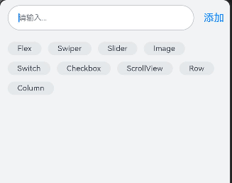

# 如何实现流式布局
## 场景介绍
流式布局是一种自适应布局，在一些无法确定界面元素尺寸的布局中，根据各个元素的尺寸进行自适应布局。

## 效果呈现
本例效果呈现如下：

## 运行环境
本例基于以下环境开发，开发者也可以基于其他适配的版本进行开发：
- IDE: DevEco Studio 4.0 Release
- SDK: Ohos_sdk_public 4.0.10.13 (API Version 10 Release)

## 实现思路
本例包含的关键操作及其实现方案如下：
- 输入和添加文本数据：通过TextInput组件实现文本的输入和通过UNshift()方法实现文本的添加。
- 实现流式布局：通过Flex组件实现。

## 开发步骤
1. 在输入框输入文本：在主界面中自定义一个SearchInput的子组件，使用Flex作为容器组件，默认水平排列，通过TextInput作为输入组件。定义一个变量Input，存储输入框的内容，定义一个变量searchArr，表示FlexLayout要显示输入的新增文本内容。在通过onClick()事件将Input的值通过unshift()方法存放带searchArr的首位(trim())。具体代码如下：
    ```ts
    @Component
    export default struct SearchInput{
      @State input:string = '';
      @Link searchArr:Array<string>

      build(){
        Flex({alignItems:ItemAlign.Center}){
          TextInput({
            placeholder:'请输入...',
            text:this.input
          })
            .placeholderColor('#787F87')
            .placeholderFont({size:'12fp'})
            .height('5.1%')
            .width('81.1%')
            .backgroundColor(Color.White)
            .margin({left:'12vp',right:'15vp',top:'8vp',bottom:'8vp'})
            .border({width:'1vp',color:'#33182431',radius:'20vp',style:BorderStyle.Solid})
            .onChange((value:string)=>{
              this.input = value;
            })
          Text('添加')
            .fontSize('16fp')
            .fontColor('#007DFF')
            .height('5.1%')
            .onClick(()=>{
              if (this.input !== ''&& this.input.trim().length>0){
                this.searchArr.unshift(this.input.trim());
              }
              this.input = '';
            })
        }
        .width('100%')
      }
    }
    ```
2. 流失布局的实现：自定义一个FlexLayou的子组件，Flex作为容器组件，Flex.Wrap自适应布局，通过ForEach遍历变量searchArr使其显示。具体代码如下：
    ```ts
    @Component
    export default struct FlexLayout {
      @Link searchArr :Array<string>;
      build(){
        Scroll(){
          Flex({justifyContent:FlexAlign.Start,wrap:FlexWrap.Wrap}){
            if (this.searchArr.length>0){
              ForEach(this.searchArr,(item:string)=>{
                Text(`${item}`)
                  .fontSize("12fp")
                  .borderStyle(BorderStyle.Solid)
                  .borderWidth('1vp')
                  .borderColor('#E5E8EA')
                  .borderRadius('20vp')
                  .backgroundColor('#E5E8EA')
                  .padding({top:'0.8%',bottom:'0.8%',left:'4.4%',right:'4.4%'})
                  .margin({top:'10vp',right:'10vp'})
                  .textOverflow({overflow:TextOverflow.Ellipsis})
                  .maxLines(2)
              },(item:string)=>JSON.stringify(item))
            }
          }
          .margin({left:'12vp',right:'12vp'})
          .padding({bottom:'12vp'})
        }
      }
    }
    ```

3. 主页面添加文本数据：调用FlexLayout组件、SearchInput组件，定义数组变量searchArr用来存放默认文本和输入的文本，使用$将父组件的变量与添加的文本数组关联起来。具体代码如下：
    ```ts
    import SearchInput from '../view/SearchInput';
    import FlexLayout from '../view/FlexLayout';
    import SearchViewModel from '../viewmodel/SearchViewModel'

    @Entry
    @Component
      struct HomePage {
      @State searchArr:Array<string>=SearchViewModel.getSearchArrData()
      build() {
        Column(){
          SearchInput({searchArr:$searchArr})
          FlexLayout({searchArr:$searchArr})
        }
        .height('100%')
        .width('100%')
        .alignItems(HorizontalAlign.Center)
        .backgroundColor('#F1F3f5')
      }
    }
    ```

4. 原数据建立：定义获取原数据的函数getSearchArrData()。具体代码如下：
    ```ts
    export  class SearchViewModel{
      getSearchArrData(){
        let listItems:Array<string>=[
          'Flex','Swiper','Slider','Image',
           'Switch','Checkbox','ScrollView',
           'Row','Column'
        ];
        return listItems;
      }
    }
    export default new SearchViewModel();
    ```

## 完整代码
上述开发步骤的具体示例代码即为本场景的全部代码

## 参考
[Flex](../application-dev/reference/apis-arkui/arkui-ts/ts-container-flex.md)

[TextInput](../application-dev/reference/apis-arkui/arkui-ts/ts-basic-components-textinput.md)