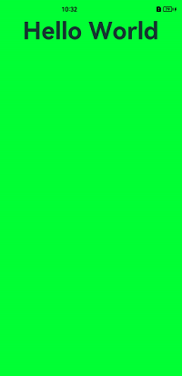
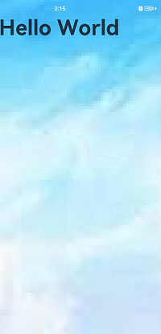
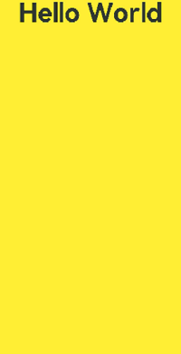

# 沉浸式界面开发

## 场景说明
沉浸式界面通常是指全屏显示，即当前画面占据整个屏幕。画面放大的同时，让用户摆脱无关信息的干扰，带给用户沉浸式的体验。常见的场景有：视频播放、游戏等。本例即为大家介绍如何开发沉浸式界面。

> **说明：**
>
> 当前沉浸式界面开发仅支持window级别的配置，暂不支持Page级别的配置。开发者若有Page级别切换的需要，可以在页面的生命周期开始，例如onPageShow中设置沉浸模式，然后在页面退出，例如onPageHide中恢复默认设置来实现。

## 效果呈现
本例中的沉浸式界面有三种实现方式，对应效果如下：

| 方案一：颜色背景铺满                | 方案二：图片背景铺满                          | 方案三：背景铺满的同时、状态栏不可见  |
| ----------------------------------- | --------------------------------------------- | ------------------------------------- |
|  |  |  |


## 运行环境
本例基于以下环境开发，开发者也可以基于其他适配的版本进行开发：

- IDE: DevEco Studio 3.1 Beta2
- SDK: Ohos_sdk_public 3.2.11.9(API Version 9 Release)

## 实现思路
如果一个应用想要获得沉浸式的体验，开发者可以通过以下三种方式进行实现：

- 颜色背景通铺：使应用页面的背景色和状态栏、导航栏的背景色一致。可通过setWindowSystemBarProperties进行设置。
- 图片背景通铺：将状态栏、导航栏的背景色设置为透明以便呈现应用界面的背景，同时通过 windowClass.on接口获取到状态栏、导航栏的区域信息，进行规避处理，以免状态栏、导航栏的内容遮挡住应用内容。
- 隐藏导航栏和状态栏：使用setWindowSystemBarEnable设置导航栏和状态栏为隐藏状态。

> **说明：**
>
> 沉浸式的设置最好放在ability的onWindowStageCreate的生命周期里，此时刚好可以获取窗口的信息，放在页面生命周期里会出现窗口大小不一致，影响体验。

下文将分别介绍这三种方案的具体开发步骤。


## 开发步骤
### 颜色背景通铺
此方案通过调用setWindowSystemBarProperties接口将状态栏和导航栏的背景色设置为跟应用窗口相同的颜色，以达到界面全屏的效果。

具体代码如下：

```ts
import window from '@ohos.window';
import common from '@ohos.app.ability.common';
 
@Entry
@Component
struct Type2 {
  @State message: string = 'Hello World'
  // 获取UIAbility上下文
  context: common.UIAbilityContext = getContext(this) as common.UIAbilityContext
  async setSystemBar() {
    // 获取当前应用窗口
    let windowClass:window.Window = await window.getLastWindow(context)
    // 将状态栏和导航栏的背景色设置为跟应用窗口相同的颜色
    await windowClass.setWindowSystemBarProperties({
      navigationBarColor: "#00FF00",
      statusBarColor: "#00FF00",
      navigationBarContentColor: "#00FF00",
      statusBarContentColor: "#00FF00"
    })
  }
 
  aboutToAppear() {
    this.setSystemBar()
  }
 
  build() {
    Row() {
      Column() {
        Text(this.message)
          .fontSize(50)
          .fontWeight(FontWeight.Bold)
      }
      .width('100%')
    }
    .height('100%')
  }
}
```
此方案的优势在于不需要处理应用窗口和状态栏、导航栏窗口的遮挡关系，因为此方案没有使用setWindowLayoutFullScreen 接口设置沉浸式布局，所以三个窗口是平铺的，不会重叠。劣势在于无法将应用的背景图等信息延伸到状态栏、导航栏窗口中。适用于扁平化设计风格的应用。

### 图片背景通铺
这种方案可以实现图片背景的通铺，同时又能避免状态栏和导航栏的内容跟应用内容相互遮挡，导致显示效果异常。
为了能让应用的有效显示范围避开系统的状态栏和导航栏，以免内容重叠，我们可以通过windowClass.on(type: ‘avoidAreaChange’, callback: Callback<{AvoidAreaType, AvoidArea}>) 获取系统规避区域的大小，并对这一块区域做出相应的规避。
其中回调参数AvoidArea是规避区域，可以通过其获取规避区域的具体范围；AvoidAreaType是规避区域的类型其取值如下，示例中需要规避的状态栏和导航栏属于TYPE_SYSTEM类型。

| 名称                  | 值   | 说明               |
| -------------------- | ---- | ----------------- |
| TYPE_SYSTEM           | 0    | 表示系统默认区域。 |
| TYPE_CUTOUT           | 1    | 表示刘海屏区域。   |
| TYPE_SYSTEM_GESTURE9+ | 2    | 表示手势区域。     |
| TYPE_KEYBOARD9+       | 3    | 表示软键盘区域     |
具体代码如下：

**page代码**

```ts
// index.ets
@Entry
@Component
struct Type3 {
  @State message: string = 'Hello World'
  @StorageLink("topHeight") topHeight: number = 0
  @StorageLink("bottomHeight") bottomHeight: number = 0
 
  build() {
    Column() {
      // 在界面顶部放置一个Row组件，用于占位
      Row() {
 
      }
      .width("100%")
      // 设置Row组件的高度为状态栏的高度，可避免界面内容与状态栏内容重叠
      .height(px2vp(this.topHeight))
      Row() {
        Text(this.message)
          .fontSize(50)
          .fontWeight(FontWeight.Bold)
          .position({ x: 0, y: 0 })
      }
      .width("100%")
      .flexGrow(1)
      // 在界面底部放置一个Row组件，用于占位
      Row() {
 
      }
      .width("100%")
      // 设置Row组件的高度为导航栏的高度，可避免界面内容与导航栏内容重叠
      .height(px2vp(this.bottomHeight))
    }
    .backgroundImage($r("app.media.icon"))
    .backgroundImageSize(ImageSize.Cover)
    .width("100%")
    .height("100%")
  }
}
```
**ability代码**
```ts
// MainAbility.ts
import window from '@ohos.window';

async function enterImmersion(windowClass: window.Window) {
    // 获取状态栏和导航栏的高度
    windowClass.on("avoidAreaChange", ({ type, area }) => {
        if (type == window.AvoidAreaType.TYPE_SYSTEM) {
            // 将状态栏和导航栏的高度保存在AppStorage中
            AppStorage.SetOrCreate<number>("topHeight", area.topRect.height);
            AppStorage.SetOrCreate<number>("bottomHeight", area.bottomRect.height);
        }
    })
    // 设置窗口布局为沉浸式布局
    await windowClass.setWindowLayoutFullScreen(true)
    await windowClass.setWindowSystemBarEnable(["status", "navigation"])
    // 设置状态栏和导航栏的背景为透明
    await windowClass.setWindowSystemBarProperties({
        navigationBarColor: "#00000000",
        statusBarColor: "#00000000",
        navigationBarContentColor: "#FF0000",
        statusBarContentColor: "#FF0000"
    })
}

export default class MainAbility extends Ability {
  ...
  async onWindowStageCreate(windowStage: window.WindowStage) {
    let windowClass:window.Window = await windowStage.getMainWindow()
    await enterImmersion(windowClass)
    windowStage.loadContent('pages/page5')
  }
  ...
}
```
类似的，若需获取刘海屏遮挡区域，需要将上述代码中注册的监听类型从TYPE_SYSTEM替换为TYPE_CUTOUT，并解析返回的[AvoidArea](../application-dev/reference/apis-arkui/js-apis-window.md#avoidarea7)来进行窗口内容避让。

### 隐藏状态栏、导航栏
隐藏状态栏、导航栏可以达到完全沉浸的效果，使用setWindowSystemBarEnable接口即可实现。

具体代码如下：

```ts
import window from '@ohos.window';
import common from '@ohos.app.ability.common';

@Entry
@Component
struct Type3 {
  @State message: string = 'Hello World'
  context: common.UIAbilityContext = getContext(this) as common.UIAbilityContext
  async setSystemBar() {
	let windowClass = await window.getLastWindow(context)
	//设置导航栏，状态栏不可见
	await windowClass.setWindowSystemBarEnable([])
  }

  aboutToAppear() {
	this.setSystemBar()
  }

  build() {
	Row() {
	  Column() {
		Text(this.message)
		  .fontSize(50)
		  .fontWeight(FontWeight.Bold)
	  }
	  .width('100%')
	}
	.backgroundColor("#ffee33")
	.height('100%')
  }
}
```

## 参考
[窗口](../application-dev/reference/apis-arkui/js-apis-window.md)