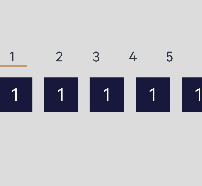

# 二级联动
## 场景介绍
列表的二级联动（Cascading List）是指根据一个列表（一级列表）的选择结果，来更新另一个列表（二级列表）的选项。这种联动可以使用户根据实际需求，快速定位到想要的选项，提高交互体验。例如，短视频中拍摄风格的选择、照片编辑时的场景的选择，本文即为大家介绍如何开发二级联动。
## 效果呈现
本例最终效果如下：



## 运行环境
本例基于以下环境开发，开发者也可以基于其他适配的版本进行开发：
- IDE: DevEco Studio 3.1 Beta2
- SDK: Ohos_sdk_public 3.2.11.9 (API Version 9 Release)
## 实现思路
- 数字标题(titles)以及下方的数字列表(contents)分组展示：通过两个List组件分别承载数字标题和数字项。
- 滚动数字列表，上方数字标题也随之变动：通过List组件的onScrollIndex事件获取到当前滚动数字的索引，根据该索引计算出对应标题数字的索引，然后通过Scroller的scrollToIndex方法跳转到对应的数字标题，且通过Line组件为选中的标题添加下划线。
- 点击数字标题，下方的数字列表也随之变化：首先获取到点击数字标题的索引，通过该索引计算出下方对应数字的起始项索引，然后通过scroller的scrollToIndex方法跳转到对应索引的数字项。

## 开发步骤
根据实现思路，具体实现步骤如下：
1. 首先构建列表数据，在records中记录数字列表中各个数字的首项索引值，具体代码块如下：
    ```ts
    ...
    @State typeIndex: number = 0
    private tmp: number = 0
    private titles: Array<string> = ["1", "2", "3", "4", "5", "6", "7", "8", "9"]
    private contents: Array<string> = ["1", "1", "1", "1", "1", "1", "1", "1", "1", "2", "2", "2", "2", "2", "2", "2", "2", "2", "2", "2", "2", "3"
        , "3", "3", "3", "3", "4", "4", "4", "5", "5", "5", "5", "5", "6", "7", "7", "7", "7", "7", "7", "7", "7", "7", "7", "7", "7",
        "8", "8", "8", "8", "8", "9", "9", "9", "9", "9", "9", "9", "9", "9", "9", "9"]
    private records: Array<number> = [0, 9, 21, 26, 29, 34, 35, 47, 52, 63]
    private classifyScroller: Scroller = new Scroller();
    private scroller: Scroller = new Scroller();
    ...
    ```
    数字标题列表：具体代码块如下：
    ```ts
    ...
    build() {
      Column({ space: 0 }) {
        List  ({ space: 50, scroller: this.classifyScroller, initialIndex: 0 }) {
          ForEach(this.titles, (item, index) => {
            ListItem() {
              Column() {
                Text(item)
                  .fontSize(14)
                ...  
              }
            }
          }
          ...
        }
        .listDirection(Axis.Horizontal)
        .height(50)
      }
    }
    ```
    数字列表，具体代码块如下：
    ```ts
    List({ space: 20, scroller: this.scroller }) {
      ForEach(this.contents, (item, index) => {
        ListItem() {
          Column({ space: 5 }) {
            Image($r("app.media.app_icon"))
              .width(40)
              .height(40)
            Text(item)
              .fontSize(12)
          }
          ...
        }
      }
    }
    .listDirection(Axis.Horizontal) //列表排列方向水平
    .edgeEffect(EdgeEffect.None) //不支持滑动效果
    ```
2. 数字标题的索引值判断，根据当前滚动数字的首项索引值计算出数字标题的索引，具体代码块如下：
    ```ts
    ...
    findClassIndex(ind: number) { // 当前界面最左边图的索引值ind
      let ans = 0
      // 定义一个i 并进行遍历 this.records.length = 10
      for (let i = 0; i < this.records.length; i++) { 
        // 判断ind在this.records中那两个临近索引值之间
        if (ind >= this.records[i] && ind < this.records[i + 1]) {
          ans = i
          break
        }
      }
      return ans
    }
    findItemIndex(ind: number) { 
      // 将ind重新赋值给类型标题列表的索引值
      return this.records[ind]
    }
    ...
    ```
    通过Line组件构成标题下滑线，具体代码块如下：
    ```ts
    ...
    if (this.typeIndex == index) {
      Line()
        //根据长短判断下划线
        .width(item.length === 2 ? 25 : item.length === 3 ? 35 : 50)
        .height(3)
        .strokeWidth(20)
        .strokeLineCap(LineCapStyle.Round)
        .backgroundColor('#ffcf9861')
    }
    ...
    ```
3. 点击数字标题，数字列表随之滑动：首先获取到点击数字标题的索引，通过该索引计算出下方对应数字的起始项索引，然后通过scroller的scrollToIndex方法跳转到对应索引的数字项，具体代码块如下：
    ```ts
    ...
    .onClick(() => {
      this.typeIndex = index
      this.classifyScroller.scrollToIndex(index)
      let itemIndex = this.findItemIndex(index)
      console.log("移动元素：" + itemIndex)
      this.scroller.scrollToIndex(itemIndex)
    })
    ...
    ```
4. 数字列表的滑动或点击导致数字标题的变动：通过List组件中onScrollIndex事件获取的到屏幕中最左边数字的索引值start，然后通过该索引值计算出对应的数字标题的索引currentClassIndex，然后通过scrollToIndex控制数字标题跳转到对应索引处，具体代码块如下：
    ```ts
    ...
    .onScrollIndex((start) => {
      let currentClassIndex = this.findClassIndex(start)
      console.log("找到的类索引为： " + currentClassIndex)
      if (currentClassIndex != this.tmp) {
        this.tmp = currentClassIndex
        console.log("类别移动到索引： " + currentClassIndex)
        this.typeIndex = currentClassIndex
        this.classifyScroller.scrollToIndex(currentClassIndex)
      }
    })
    ...
    ```
## 完整代码
完整示例代码如下：
```ts
@Entry
@Component
struct TwoLevelLink {
  @State typeIndex: number = 0
  private tmp: number = 0
  private titles: Array<string> = ["1", "2", "3", "4", "5", "6", "7", "8", "9"]
  private contents: Array<string> = ["1", "1", "1", "1", "1", "1", "1", "1", "1", "2", "2", "2", "2", "2", "2", "2", "2", "2", "2", "2", "2", "3"
    , "3", "3", "3", "3", "4", "4", "4", "5", "5", "5", "5", "5", "6", "7", "7", "7", "7", "7", "7", "7", "7", "7", "7", "7", "7",
    "8", "8", "8", "8", "8", "9", "9", "9", "9", "9", "9", "9", "9", "9", "9", "9"]
  private colors: Array<string> = ["#18183C", "#E8A027", "#D4C3B3", "#A4AE77", "#A55D51", "#1F3B54", "#002EA6", "#FFE78F", "#FF770F"]
  private records: Array<number> = [0, 9, 21, 26, 29, 34, 35, 47, 52, 63]
  private classifyScroller: Scroller = new Scroller();
  private scroller: Scroller = new Scroller();
  // 根据数字列表索引计算对应数字标题的索引
  findClassIndex(ind: number) {
    let ans = 0
    for (let i = 0; i < this.records.length; i++) {
      if (ind >= this.records[i] && ind < this.records[i + 1]) {
        ans = i
        break
      }
    }
    return ans
  }
  // 根据数字标题索引计算对应数字列表的索引
  findItemIndex(ind: number) {
    return this.records[ind]
  }
  build() {
    Column({ space: 0 }) {
      List  ({ space: 50, scroller: this.classifyScroller, initialIndex: 0 }) {
        ForEach(this.titles, (item, index) => {
          ListItem() {
            Column() {
              Text(item)
                .fontSize(24)
              if (this.typeIndex == index) {
                Line()
                  .width(item.length === 2 ? 25 : item.length === 3 ? 35 : 50)
                  .height(3)
                  .strokeWidth(20)
                  .strokeLineCap(LineCapStyle.Round)
                  .backgroundColor('#ffcf9861')
              }
            }
            .onClick(() => {
              this.typeIndex = index
              this.classifyScroller.scrollToIndex(index)
              let itemIndex = this.findItemIndex(index)
              console.log("移动元素：" + itemIndex)
              this.scroller.scrollToIndex(itemIndex)
            })
          }
        })
      }
      .listDirection(Axis.Horizontal)
      .height(50)
      List({ space: 20, scroller: this.scroller }) {
        ForEach(this.contents, (item, index) => {
          ListItem() {
            Column({ space: 5 }) {
              Text(item)
                .fontSize(30)
                .fontColor(Color.White)
            }
            .width(60)
            .height(60)
            .backgroundColor(this.colors[item-1])
            .justifyContent(FlexAlign.Center)
            .onClick(() => {
              this.scroller.scrollToIndex(index)
            })
          }
        })
      }
      .listDirection(Axis.Horizontal) //列表排列方向水平
      .edgeEffect(EdgeEffect.None) //不支持滑动效果
      .onScrollIndex((start) => {
        let currentClassIndex = this.findClassIndex(start)
        console.log("找到的类索引为： " + currentClassIndex)
        if (currentClassIndex != this.tmp) {
          this.tmp = currentClassIndex
          console.log("类别移动到索引： " + currentClassIndex)
          this.typeIndex = currentClassIndex
          this.classifyScroller.scrollToIndex(currentClassIndex)
        }
      })
    }.width('100%').height('100%').backgroundColor(0xDCDCDC).padding({ top: 5 })
  }
}
```
## 参考
[List](../application-dev/reference/apis-arkui/arkui-ts/ts-container-list.md)

[Line](../application-dev/reference/apis-arkui/arkui-ts/ts-drawing-components-line.md)

[Scroll](../application-dev/reference/apis-arkui/arkui-ts/ts-container-scroll.md)