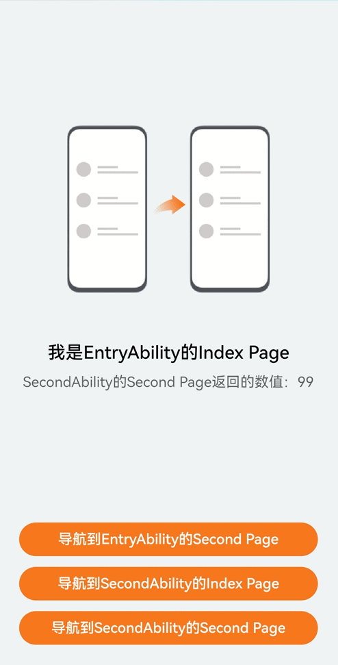
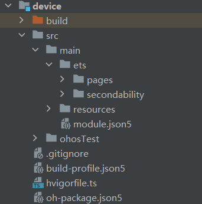

# UIAbility内和UIAbility间页面的跳转
## 场景介绍
UIAbility组件是系统调度的基本单元，为应用提供绘制界面的窗口。一个应用可以包含一个或多个UIAbility组件。例如，在支付应用中，可以将入口功能和收付款功能分别配置为独立的UIAbility。

对于开发者而言，可以根据具体场景选择单个还是多个UIAbility，划分建议如下：
* 如果希望在任务视图中看到一个任务，则建议使用一个UIAbility，多个页面的方式。
* 如果希望在任务视图中看到多个任务，或者需要同时开启多个窗口，则建议使用多个UIAbility开发不同的模块功能。

本例即为大家介绍如何基于Stage模型下的UIAbility开发，实现UIAbility内和UIAbility间页面的跳转与数据传递的功能。

## 效果呈现
本例最终效果如下：



## 运行环境
本例基于以下环境开发，开发者也可以基于其他适配的版本进行开发：
- IDE: DevEco Studio 4.0 Beta1
- SDK: Ohos_sdk_public 4.0.7.5 (API Version 10 Beta1)
## 实现思路
本篇案例是基于Stage模型下的UIAbility开发，实现UIAbility内和UIAbility间页面的跳转。
* UIAbility内页面的跳转：
    entry模块中，通过添加页面路由router来实现，页面路由router根据页面url找到目标页面，从而实现跳转。
* UIAbility间页面的跳转--跳转到指定UIAbility的首页：
    实现UIAbility间页面的跳转，需要启动另外一个UIAbility，可以通过UIAbilityContext的startAbility的方法来完成。
* UIAbility间页面的跳转--跳转到指定UIAbility的指定页面（非首页）：
    实现跳转到指定UIAbility的指定页面（非首页），就需要在跳转到指定UIAbility的首页的基础上，新建一个Second页面，使用UIAbilityContext.startAbilityForResult来实现。
## 开发步骤
由于本例重点介绍UIAbility之间的跳转，所以开发步骤会着重讲解相关实现，不相关的内容不做介绍，全量代码可参考完整代码章节。
1. 从实现效果看，UIAbility之间的跳转，都是通过点击每个页面的button后实现的，因此我们可以先构建一个按钮点击后调用的方法类:ButtonClickMethod。
    具体代码如下：
    ```ts
    // entry/src/main/ets/model/ButtonClickMethod.ets

    ...
    // 按钮点击后调用的方法类
    Class ButtonClickMethod{
        ...

    }
    export default new ButtonClickMethod();   
    ```

2. UIAbility内页面的跳转。
    * 实现UIAbility内页面的跳转，首先构建Index页面，Index页面由一个Image组件、两个Text组件、三个Button组件组成。
        具体代码如下：    
        ```ts
        // entry/src/main/ets/pages/Index.ets
    
        @Entry
        @Component
        struct Index {
            @State text: string = '';

            build() {
                Column() {
                    Image($r('app.media.right'))
                        ...
                    Text($r('app.string.main_index_page_name'))
                        ...
                    // 条件渲染：当text的值不为空时，显示该组件
                    if (this.text !== '') {
                        Text(this.text)
                        ...
                    }
                    // 导航到EntryAbility的Second Page按钮
                    Button($r('app.string.to_main_second_page_btn_text'), { type: ButtonType.Capsule, stateEffect: true })
                        ...
                    // 导航到SecondAbility的Index Page按钮
                    Button($r('app.string.to_second_index_page_btn_text'), { type: ButtonType.Capsule, stateEffect: true })
                        ...
                    // 导航到SecondAbility的Index Page按钮
                    Button($r('app.string.to_second_second_page_btn_text'), { type: ButtonType.Capsule, stateEffect: true })
                        ...
                }
                ...
            }
        }   
        ```
    * 构建Second页面，该页面由一个Image组件、两个Text组件、一个Button组件组成。
        具体代码如下：
        ```ts
        // entry/src/main/ets/pages/Second.ets

        @Entry
        @Component
        struct Second {
            ...

            build() {
                Column() {
                    Image($r('app.media.left'))
                        ...

                    Text($r('app.string.main_second_page_name'))
                        ...

                    Text(`${this.src}：${this.count}`)
                        ...

                    // 返回到EntryAbility的Index Page按钮
                    Button($r('app.string.back_main_index_page_btn_text'), { type: ButtonType.Capsule, stateEffect: true })
                        ...
                }
                ...
            }
        }
        ```
    * entry模块的Index和Second页面之间的跳转以及数据的传递，需要通过router来实现。        
        * 从EntryAbility首页跳转到Second页面：
            1. 导入router模块， 向按钮点击后调用的方法类ButtonClickMethod中添加toEntryAbilitySecond方法，使用router.pushUrl实现跳转，同时通过params来向新页面传入参数。
                具体代码如下：
                ```ts
                // entry/src/main/ets/model/ButtonClickMethod.ets
                import router from '@ohos.router';

                // 按钮点击后调用的方法类
                Class ButtonClickMethod{
                    // 导航entry模块的Second页面
                    toEntryAbilitySecond() {
                        router.pushUrl({
                            url: 'pages/Second',
                            params: {
                                src: textMessage,
                                count: CommonConstants.NUM_VALUES[0]
                            }
                        });
                    }
                    ...

                }
                export default new ButtonClickMethod(); 
                ```
            2. 点击“导航到EntryAbility的Second Page”按钮后，调用ButtonClickMethod类中的toEntryAbilitySecond方法，跳转到EntryAbility的Second页面。
                具体代码如下：
                ```ts
                // entry/src/main/ets/pages/Index.ets
                ...

                @Entry
                @Component
                struct Index {
                    @State text: string = '';
                    @State bottomMargin: string = StyleConstants.MAIN_INDEX_BUTTON_MARGIN_BOTTOM;

                    build() {
                        Column() {
                            Image($r('app.media.right'))
                                ...
                            Text($r('app.string.main_index_page_name'))
                                ...
                            // 条件渲染：当text的值不为空时，显示该组件
                            if (this.text !== '') {
                                Text(this.text)
                                ...
                            }

                            Button($r('app.string.to_main_second_page_btn_text'), { type: ButtonType.Capsule, stateEffect: true })
                                ...
                                .onClick(() => {
                                    // 导航到EntryAbility的Second Page
                                    ButtonClickMethod.toSecondAbilityIndex(context);
                                    this.text = '';
                                    this.bottomMargin = StyleConstants.MAIN_INDEX_BUTTON_MARGIN_BOTTOM;
                                })
                                
                            Button($r('app.string.to_second_index_page_btn_text'), { type: ButtonType.Capsule, stateEffect: true })
                                ...

                            Button($r('app.string.to_second_second_page_btn_text'), { type: ButtonType.Capsule, stateEffect: true })
                                ...
                        }
                        ...
                    }
                }   
                ```
        * 从entry模块的EntryAbility的Second页面返回至EntryAbility首页：
            向EntryAbility的Second页面导入router模块，同时给button添加oncClick事件，使用router.back实现返回至EntryAbility的index页面。
            具体代码如下：
            ```ts
            // entry/src/main/ets/pages/Second.ets
            import router from '@ohos.router';

            @Entry
            @Component
            struct Second {
                ...

                build() {
                    Column() {
                        Image($r('app.media.left'))
                            ...

                        Text($r('app.string.main_second_page_name'))
                            ...

                        Text(`${this.src}：${this.count}`)
                            ...

                        Button($r('app.string.back_main_index_page_btn_text'), { type: ButtonType.Capsule, stateEffect: true })
                            ...
                            .onClick(() => {
                                // 返回到EntryAbility的Index Page
                                router.back();
                                })
                    }
                    ...
                }
            }            
            ```
    
3. 跳转到指定的UIAbility的首页。
    * 实现跳转到指定UIAbility的首页，先构建另外一个模块，方法如下：
        在“Project”窗口，右键点击“entry 文件夹”，选择“New > Module > Empty Ability > Next”，在“Module name”中给新建的模块命名为“device”，点击“Next”，在“Ability name”中给新建模块的Ability命名为“SecondAbility”，点击“Finish”。可以看到文件目录结构如下：
        
    * 构建device模块下SecondAbility的Index页面，该页面由一个Image组件、两个Text组件、一个Button组件组成。
        具体代码如下：
        ```ts
        // device/src/main/ets/pages/Index.ets

        @Entry
        @Component
        struct Index {
            ...

            build() {
                Column() {
                    Image($r('app.media.left'))
                        ...

                    Text($r('app.string.second_index_page_name'))
                        ...

                    Text(`${this.src}：${this.count}`)
                        ...
             
                    // 停止SecondAbility自身按钮
                    Button($r('app.string.terminate_second_btn_text'), { type: ButtonType.Capsule, stateEffect: true })
                        ...
                }
                ...
            }
        }        
        ```
    * 从entry模块的EntryAbility首页跳转至device模块的SecondAbility首页：需要通过UIAbilityContext的startAbility方法来实现。
        1. 在EntryAbility的Index页面获取UIAbilityContext。
            > 使用UIAbilityContext中的方法，需要在对应的页面获取相应的UIAbilityContext。

            具体代码如下：
            ```ts
            // entry/src/main/ets/pages/Index.ets
            ...
            // 获取UIAbilityContext
            let context = getContext(this);
            ...            
            ```
        2. 在EntryAbility的Index页面中,点击“导航到SecondAbility的Index Page”按钮后，调用ButtonClickMethod类中的toSecondAbilityIndex方法，拉起SecondAbility的Index页面，同时通过params来向新页面传入参数。        
            * 向ButtonClickMethod类中添加toSecondAbilityIndex方法。
                具体代码如下：
                ```ts
                // entry/src/main/ets/model/ButtonClickMethod.ets
                import router from '@ohos.router';
                import Logger from '../common/utils/Logger';

                // 按钮点击后调用的方法类
                Class ButtonClickMethod{
                    ...
                    // 导航device模块的Index页面
                    toSecondAbilityIndex(context) {
                        let want = {
                            'deviceId': '',
                            'bundleName': 'com.example.uiability',
                            'abilityName': 'SecondAbility',  
                            'moduleName':'device',
                            'parameters': {
                                src: textMessage,
                                count: 45
                            }
                        };
                        context.startAbility(want).then(() => {
                            Logger.info(CommonConstants.TAG, `start second ability index page succeed with ${JSON.stringify(want)}`);
                        }).catch((error) => {
                            Logger.error(CommonConstants.TAG, `start second ability index page failedwith ${error.code}`);
                        });
                    }
                    ...
                }
                export default new ButtonClickMethod();                 
                ```
            * 在EntryAbility的Index页面中，给“导航到SecondAbility的Index Page”按钮添加onClick事件，调用ButtonClickMethod类中的toSecondAbilityIndex方法，实现到SecondAbility首页的跳转。
                具体代码如下：
                ```ts
                // entry/src/main/ets/pages/Index.ets
                ...

                // 获取UIAbilityContext
                let context = getContext(this);

                @Entry
                @Component
                struct Index {
                    @State text: string = '';
                    @State bottomMargin: string = StyleConstants.MAIN_INDEX_BUTTON_MARGIN_BOTTOM;

                    build() {
                        Column() {
                            Image($r('app.media.right'))
                                ...
                            Text($r('app.string.main_index_page_name'))
                                ...
                            // 条件渲染：当text的值不为空时，显示该组件
                            if (this.text !== '') {
                                Text(this.text)
                                ...
                            }

                            Button($r('app.string.to_main_second_page_btn_text'), { type: ButtonType.Capsule, stateEffect: true })
                                ...
                                
                            Button($r('app.string.to_second_index_page_btn_text'), { type: ButtonType.Capsule, stateEffect: true })
                                ...
                                .onClick(() => {
                                    // 导航到SecondAbility的Index页面
                                    ButtonClickMethod.toSecondAbilityIndex(context);
                                    this.text = '';
                                    this.bottomMargin = StyleConstants.MAIN_INDEX_BUTTON_MARGIN_BOTTOM;
                                })

                            Button($r('app.string.to_second_second_page_btn_text'), { type: ButtonType.Capsule, stateEffect: true })
                                ...
                        }
                        ...
                    }
                }                
                ```
            * 在SecondAbility的Index页面，获取从EntryAbility的Index页面传递过来的自定义参数，并用一个Text文本展示从Index页面传递过来的数据。
                具体代码如下：
                ```ts
                // device/src/main/ets/pages/Index.ets
                ...
                @Entry
                @Component
                struct Index {
                    // 获取从EntryAbility的Index页面传递过来的自定义参数
                    @State src: string = globalThis?.secondAbilityWant?.parameters?.src ?? '-';
                    @State count: number = globalThis?.secondAbilityWant?.parameters?.count ?? 0;

                    build() {
                        Column() {
                            Image($r('app.media.left'))
                                ...
                            Text($r('app.string.second_index_page_name'))
                                ...
                            // 用一个Text文本展示从Index页面传递过来的数据
                            Text(`${this.src}：${this.count}`)
                                ...
                            // 停止SecondAbility自身按钮
                            Button($r('app.string.terminate_second_btn_text'), { type: ButtonType.Capsule, stateEffect: true })
                                ...
                        }
                        ...
                    }
                }                
                ```

    * 从device模块的SecondAbility首页返回到entry模块的EntryAbility首页：通过点击device模块的Index页面的“停止SecondAbility自身”按钮，使用UIAbilityContext.terminateSelf方法手动销毁Ability。
        1. 给ButtonClickMethod类中添加toSecondAbilityIndex方法。
            具体代码如下：
            ```ts
            // entry/src/main/ets/model/ButtonClickMethod.ets
            import router from '@ohos.router';
            import Logger from '../common/utils/Logger';

            // 按钮点击后调用的方法类
            Class ButtonClickMethod{
                ...
                // 停止SecondAbility自身
                terminateSecondAbility(context) {
                    context.terminateSelf().then(() => {
                        Logger.info(CommonConstants.TAG, 'terminate second ability self succeed');
                    }).catch((error) => {
                        Logger.error(CommonConstants.TAG, `terminate second ability self failed with ${error.code}`);
                    });
                }
                ...
            }
            export default new ButtonClickMethod();            
            ```
        2. 在SecondAbility的Index页面中，给“停止SecondAbility自身”按钮添加onClick事件，调用ButtonClickMethod类中的terminateSecondAbility方法，使用UIAbilityContext.terminateSelf方法手动销毁Ability，从而实现从SecondAbility的Index页面返回至entry的Index页面。
            具体代码如下：
            ```ts
            // device/src/main/ets/model/Index.ets

            let context = getContext(this);
            ...
            @Entry
            @Component
            struct Index {
                // 获取从EntryAbility的Index页面传递过来的自定义参数
                @State src: string = globalThis?.secondAbilityWant?.parameters?.src ?? '-';
                @State count: number = globalThis?.secondAbilityWant?.parameters?.count ?? 0;

                build() {
                    Column() {
                        Image($r('app.media.left'))
                            ...
                        Text($r('app.string.second_index_page_name'))
                            ...
                        // 用一个Text文本展示从EntryAbility的Index页面传递过来的数据
                        Text(`${this.src}：${this.count}`)
                            ...
                        
                        Button($r('app.string.terminate_second_btn_text'), { type: ButtonType.Capsule, stateEffect: true })
                            ...
                            .onClick(() => {
                                // 停止SecondAbility自身
                                ButtonClickMethod.terminateSecondAbility(context);
                                })
                    }
                    ...
                }
            }            
            ```

4. 跳转到指定UIAbility的指定页面（非首页）。  
    * 构建device模块下SecondAbility的Second页面。该页面由一个Image组件、两个Text组件、一个Button组件组成。
        具体代码如下：
        ```ts
        // device/src/main/ets/pages/Second.ets

        @Entry
        @Component
        struct Index {
            ...

            build() {
                Column() {
                    Image($r('app.media.left'))
                        ...

                    Text($r('app.string.second_second_page_name'))
                        ...

                    // 用一个Text文本展示从EntryAbility的Index页面传递过来的数据
                    Text(`${this.src}：${this.count}`)
                ...
        
                    // 停止SecondAbility自身且返回结果按钮
                    Button($r('app.string.terminate_second_btn_text'), { type: ButtonType.Capsule, stateEffect: true })
                        ...
                }
                ...
            }
        }    
        ```
    * 从entry模块的EntryAbility的首页跳转至device模块的SecondAbility的Second页面：通过点击“导航到SecondAbility的Second Page”按钮后，调用ButtonClickMethod类中的toSecondAbilitySecond方法，拉起SecondAbility的Second页面。
        1. 给ButtonClickMethod类中添加toSecondAbilitySecond方法,该方法中使用UIAbilityContext.startAbilityForResult来实现，并获取被拉起侧销毁后的返回结果。可以通过parameters来向被拉起方传递参数。
            具体代码如下：
            ```ts
            // entry/src/main/ets/model/ButtonClickMethod.ets
            import router from '@ohos.router';
            import Logger from '../common/utils/Logger';
    
            let currentContext = getContext(this);
    
            // 按钮点击后调用的方法类
            Class ButtonClickMethod{
                ...
                // 导航到SecondAbility的Second页面
                toSecondAbilitySecond(context, callback) {
                    let want = {
                        'deviceId': '',
                        'bundleName': 'com.example.uiability',
                        'abilityName': 'SecondAbility',
                        'moduleName':'device',
                        'parameters': {
                            url: 'pages/Second',
                            src: textMessage,
                            count: 78
                        }
                };
    
                    // 被拉起侧销毁后，在startAbilityForResult回调中可以获取到被拉起侧销毁时传递过来的AbilityResult
                    context.startAbilityForResult(want).then((result) => {
                        callback(result);
                        Logger.info(CommonConstants.TAG, `start second ability second page succeed with ${JSON.stringify(want)}`);
                    }).catch((error) => {
                        Logger.error(CommonConstants.TAG, `start second ability second page failed with ${error.code}`);
                    });
                }
                ...
            }
            export default new ButtonClickMethod();            
            ```
        2. 在EntryAbility的Index页面中，给“导航到SecondAbility的Second Page”按钮添加onClick事件，调用ButtonClickMethod类中的toSecondAbilityIndex方法，实现到SecondAbility首页的跳转。
            具体代码如下：
            ```ts
            // entry/src/main/ets/pages/Index.ets
            ...
    
            // 获取UIAbilityContext
            let context = getContext(this);
    
            @Entry
            @Component
            struct Index {
                @State text: string = '';
            @State bottomMargin: string = StyleConstants.MAIN_INDEX_BUTTON_MARGIN_BOTTOM;
    
                build() {
                    Column() {
                        Image($r('app.media.right'))
                            ...
                        Text($r('app.string.main_index_page_name'))
                            ...
                        // 条件渲染：当text的值不为空时，显示该组件
                        if (this.text !== '') {
                            Text(this.text)
                            ...
                    }
    
                        Button($r('app.string.to_main_second_page_btn_text'), { type: ButtonType.Capsule, stateEffect: true })
                            ...
                            
                        Button($r('app.string.to_second_index_page_btn_text'), { type: ButtonType.Capsule, stateEffect: true })
                        ...
    
                        Button($r('app.string.to_second_second_page_btn_text'), { type: ButtonType.Capsule, stateEffect: true })
                            ...
                            .onClick(() => {
                                this.text = '';
                            this.bottomMargin = StyleConstants.MAIN_INDEX_BUTTON_MARGIN_BOTTOM;
    
                                // 导航到SecondAbility的Second页面
                                ButtonClickMethod.toSecondAbilitySecond(context, (abilityResult) => {
                                    // 获取SecondAbility被销毁时传递的abilityResult
                                    if (abilityResult.resultCode === CommonConstants.RESULT_CODE) {
                                        let src: string = abilityResult?.want?.parameters?.src ?? '-';
                                        let count: number = abilityResult?.want?.parameters?.count ?? 0;
                                        this.text = `${src}：${count}`;
                                        this.bottomMargin = StyleConstants.BUTTON_MARGIN_BOTTOM;
                                    }
                                });
                            })
                    }
                    ...
                }
            } 
            ```
    * 从device模块的SecondAbility的Second页面，返回至entry模块的EntryAbility首页：通过点击“停止SecondAbility自身并返回结果”按钮，调用ButtonClickMethod类中的terminateSecondAbilityForResult方法，使用UIAbilityContext.terminateSelfWithResult方法，同时传入不同的resultCode和want，手动销毁Ability，成功后拉起侧会收到abilityResult的值， 通过Text的方式显示在界面上，从而实现从SecondAbility的Second页面返回至entry的Index页面。
        1. 给ButtonClickMethod类中添加terminateSecondAbilityForResult方法。
            具体代码如下：
            ```ts
            // entry/src/main/ets/model/ButtonClickMethod.ets
            import router from '@ohos.router';
            import Logger from '../common/utils/Logger';
    
            // 按钮点击后调用的方法类
            Class ButtonClickMethod{
                ...
                // 停止SecondAbility自身
                terminateSecondAbilityForResult(context) {
                    let abilityResult = {
                        resultCode: CommonConstants.RESULT_CODE,
                        want: {
                            'parameters': {
                            src: returnMessage,
                            count: 99
                            }
                        }
                };
    
                    // 停止SecondAbility自身，并将abilityResult返回给startAbilityForResult接口调用方
                    context.terminateSelfWithResult(abilityResult).then(() => {
                        Logger.info(CommonConstants.TAG, `terminate second ability self succeed with ${JSON.stringify(abilityResult)}`);
                    }).catch((error) => {
                        Logger.error(CommonConstants.TAG, `terminate second ability self failed with ${error.code}`);
                    });
                }
                ...
            }
            export default new ButtonClickMethod();              
            ```
        2. 在SecondAbility的Index页面中，给“停止SecondAbility自身并返回结果”按钮添加onClick事件，调用ButtonClickMethod类中的terminateSecondAbilityForResult方法，手动销毁自身Ability。
            具体代码如下：
            ```ts
            // device/src/main/ets/pages/Second.ets
            let context = getContext(this);

            @Entry
            @Component
            struct Second {
                // 用来接收parameters参数传过来的值
                @State src: string = globalThis?.secondAbilityWant?.parameters?.src ?? '-';
                @State count: number = globalThis?.secondAbilityWant?.parameters?.count ?? 0;
    
                build() {
                    Column() {
                    Image($r('app.media.left'))
                    ...
    
                    Text($r('app.string.second_second_page_name'))
                    ...
    
                    Text(`${this.src}：${this.count}`)
                    ..
    
                    // 停止SecondAbility自身且返回结果按钮
                    Button($r('app.string.terminate_second_for_result_btn_text'), { type: ButtonType.Capsule, stateEffect: true })
                        ...
                        .onClick(() => {
                        	// 停止SecondAbility自身且返回结果.
                            ButtonClickMethod.terminateSecondAbilityForResult(context);
                        })
                    }
                    ...
                }
            }
            ```
## 完整代码
本例完整代码如下：
1. entry模块的代码：
    * 公共常量类：entry/src/main/ets/common/constants/CommonConstants.ets
        具体代码如下：
        ```ts
        class CommonConstants {
            TAG = '[ButtonClickMethod.ts]';
            RESULT_CODE = 100;
            }
        export default new CommonConstants();
        
        ```
    * 样式常量类：entry/src/main/ets/common/constants/StyleConstants.ets
        具体代码如下：
        ```ts
        class StyleConstants {
            IMAGE_WIDTH = '78%';

            IMAGE_HEIGHT = '25%';

            IMAGE_MARGIN_TOP = '140vp';

            IMAGE_MARGIN_BOTTOM = '55vp';

            MAIN_INDEX_TEXT_MARGIN_BOTTOM = '148vp';

            BUTTON_WIDTH = '87%';

            BUTTON_HEIGHT = '5%';

            BUTTON_MARGIN_BOTTOM = '12vp';

            MAIN_INDEX_BUTTON_MARGIN_BOTTOM = '179vp';

            TEXT_MARGIN_BOTTOM = '250vp';

            FULL_PERCENT = '100%';

            FONT_SIZE_BIG = 20;

            FONT_WEIGHT = 500;

            FONT_SIZE_SMALL = 16;

            OPACITY = 0.6;
        }
        export default new StyleConstants();        
        ```
    * 按钮点击后调用的方法类：entry/src/main/ets/model/ButtonClickMethod.ets
        具体代码如下：
        ```ts
        import router from '@ohos.router';
        import Logger from '../common/utils/Logger';
        import CommonConstants from '../common/constants/CommonConstants';

        let currentContext = getContext(this);
        let textMessage: string = currentContext.resourceManager.getStringSync($r('app.string.text_message'));
        let returnMessage: string = currentContext.resourceManager.getStringSync($r('app.string.return_message'));

        // 按钮点击后调用的方法类
        class ButtonClickMethod {
            // 导航entry模块的Second页面
            toEntryAbilitySecond() {
                router.pushUrl({
                    url: 'pages/Second',
                    params: {
                        src: textMessage,
                        count: 12
                    }
                });
            }

            // 导航device模块的Index页面
            toSecondAbilityIndex(context) {
                let want = {
                    'deviceId': '',
                    'bundleName': 'com.example.uiability',
                    'abilityName': 'SecondAbility', 
                    'moduleName':'device',

                    'parameters': {
                        src: textMessage,
                        count: 45
                    }
                };
                context.startAbility(want).then(() => {
                    Logger.info(CommonConstants.TAG, `start second ability index page succeed with ${JSON.stringify(want)}`);
                }).catch((error) => {
                    Logger.error(CommonConstants.TAG, `start second ability index page failedwith ${error.code}`);
                });
            }

            // 导航到SecondAbility的Second页面
            toSecondAbilitySecond(context, callback) {
                let want = {
                    'deviceId': '',
                    'bundleName': 'com.example.uiability',
                    'abilityName': 'SecondAbility',
                    'moduleName':'device',
                    'parameters': {
                        url: 'pages/Second',
                        src: textMessage,
                        count: 78
                    }
                };

                // 被拉起侧销毁后，在startAbilityForResult回调中可以获取到被拉起侧销毁时传递过来的AbilityResult
                context.startAbilityForResult(want).then((result) => {
                    callback(result);
                    Logger.info(CommonConstants.TAG, `start second ability second page succeed with ${JSON.stringify(want)}`);
                }).catch((error) => {
                    Logger.error(CommonConstants.TAG, `start second ability second page failed with ${error.code}`);
                });
            }
        
            // 停止SecondAbility自身
            terminateSecondAbility(context) {
                context.terminateSelf().then(() => {
                    Logger.info(CommonConstants.TAG, 'terminate second ability self succeed');
                }).catch((error) => {
                    Logger.error(CommonConstants.TAG, `terminate second ability self failed with ${error.code}`);
                });
            }

            // 停止SecondAbility自身并返回结果
            terminateSecondAbilityForResult(context) {
                let abilityResult = {
                    resultCode: CommonConstants.RESULT_CODE,
                    want: {
                        'parameters': {
                        src: returnMessage,
                        count: 99
                        }
                    }
                };

                // 停止SecondAbility自身，并将abilityResult返回给startAbilityForResult接口调用方
                context.terminateSelfWithResult(abilityResult).then(() => {
                    Logger.info(CommonConstants.TAG, `terminate second ability self succeed with ${JSON.stringify(abilityResult)}`);
                }).catch((error) => {
                    Logger.error(CommonConstants.TAG, `terminate second ability self failed with ${error.code}`);
                });
            }
        }

        export default new ButtonClickMethod();
        ```
    * EntryAbility的Index页面：entry/src/main/ets/pages/Index.ets
        具体代码如下：
        ```ts
        import ButtonClickMethod from '../model/ButtonClickMethod';
        import StyleConstants from '../common/constants/StyleConstants';
        import CommonConstants from '../common/constants/CommonConstants';

        // 获取EntryAbility的UIAbilityContext
        let context = getContext(this);

        @Entry
        @Component
        struct Index {
            @State text: string = '';
            @State bottomMargin: string = StyleConstants.MAIN_INDEX_BUTTON_MARGIN_BOTTOM;

            build() {
                Column() {
                    Image($r('app.media.right'))
                        .objectFit(ImageFit.Contain)
                        .width(StyleConstants.IMAGE_WIDTH)
                        .height(StyleConstants.IMAGE_HEIGHT)
                        .margin({
                            top: StyleConstants.IMAGE_MARGIN_TOP,
                            bottom: StyleConstants.IMAGE_MARGIN_BOTTOM
                        })

                    Text($r('app.string.main_index_page_name'))
                        .fontColor('#000')
                        .fontSize(StyleConstants.FONT_SIZE_BIG)
                        .fontWeight(StyleConstants.FONT_WEIGHT)
                        .margin({ bottom: this.bottomMargin })

                    // 条件渲染：当text的值不为空时，显示该组件
                    if (this.text !== '') {
                        Text(this.text)
                        .fontColor('#000')
                        .fontSize(StyleConstants.FONT_SIZE_SMALL)
                        .opacity(StyleConstants.OPACITY)
                        .margin({ bottom: StyleConstants.MAIN_INDEX_TEXT_MARGIN_BOTTOM })
                    }

                    // 导航到EntryAbility的Second Page按钮
                    Button($r('app.string.to_main_second_page_btn_text'),{ type: ButtonType.Capsule, stateEffect: true })
                        .backgroundColor($r('app.color.button_background_color'))
                        .width(StyleConstants.BUTTON_WIDTH)
                        .height(StyleConstants.BUTTON_HEIGHT)
                        .margin({ bottom: StyleConstants.BUTTON_MARGIN_BOTTOM })
                        .onClick(() => {
                            // 导航到EntryAbility的Second page
                            ButtonClickMethod.toEntryAbilitySecond();
                            this.text = '';
                            this.bottomMargin = StyleConstants.MAIN_INDEX_BUTTON_MARGIN_BOTTOM;
                        })

                    // 导航到SecondAbility的Index Page按钮
                    Button($r('app.string.to_second_index_page_btn_text'), { type: ButtonType.Capsule, stateEffect: true })
                        .backgroundColor($r('app.color.button_background_color'))
                        .width(StyleConstants.BUTTON_WIDTH)
                        .height(StyleConstants.BUTTON_HEIGHT)
                        .margin({ bottom: StyleConstants.BUTTON_MARGIN_BOTTOM })
                        .onClick(() => {
                            // 导航到SecondAbility的Index Page
                            ButtonClickMethod.toSecondAbilityIndex(context);
                            this.text = '';
                            this.bottomMargin = StyleConstants.MAIN_INDEX_BUTTON_MARGIN_BOTTOM;
                        })

                    // 导航到SecondAbility的Index Page按钮
                    Button($r('app.string.to_second_second_page_btn_text'), { type: ButtonType.Capsule, stateEffect: true })
                        .backgroundColor($r('app.color.button_background_color'))
                        .width(StyleConstants.BUTTON_WIDTH)
                        .height(StyleConstants.BUTTON_HEIGHT)
                        .onClick(() => {
                            this.text = '';
                            this.bottomMargin = StyleConstants.MAIN_INDEX_BUTTON_MARGIN_BOTTOM;
                            // 导航到SecondAbility的Second Page
                            ButtonClickMethod.toSecondAbilitySecond(context, (abilityResult) => {
                                // 获取SecondAbility被销毁时传递的abilityResult
                                if (abilityResult.resultCode === CommonConstants.RESULT_CODE) {
                                    let src: string = abilityResult?.want?.parameters?.src ?? '-';
                                    let count: number = abilityResult?.want?.parameters?.count ?? 0;
                                    this.text = `${src}：${count}`;
                                    this.bottomMargin = StyleConstants.BUTTON_MARGIN_BOTTOM;
                                }
                            });
                        })
                }
                .width(StyleConstants.FULL_PERCENT)
                .height(StyleConstants.FULL_PERCENT)
                .backgroundColor($r('app.color.background_color'))
            }
        }        
        ```
    * EntryAbility的Second页面：entry/src/main/ets/pages/Second.ets
        具体代码如下：
        ```ts
        import router from '@ohos.router';
        import StyleConstants from '../common/constants/StyleConstants';

        @Entry
        @Component
        struct Second {
            @State src: string = router?.getParams()?.['src'] ?? '-';
            @State count: number = router?.getParams()?.['count'] ?? 0;

            build() {
                Column() {
                    Image($r('app.media.left'))
                        .objectFit(ImageFit.Contain)
                        .width(StyleConstants.IMAGE_WIDTH)
                        .height(StyleConstants.IMAGE_HEIGHT)
                        .margin({
                            top: StyleConstants.IMAGE_MARGIN_TOP,
                            bottom: StyleConstants.IMAGE_MARGIN_BOTTOM
                        })

                    Text($r('app.string.main_second_page_name'))
                        .fontColor('#000')
                        .fontSize(StyleConstants.FONT_SIZE_BIG)
                        .fontWeight(StyleConstants.FONT_WEIGHT)
                        .margin({ bottom: StyleConstants.BUTTON_MARGIN_BOTTOM })

                    // 用一个Text文本展示从EntryAbility的Index页面传递过来的数据
                    Text(`${this.src}：${this.count}`)
                        .fontColor('ccc')
                        .fontSize(StyleConstants.FONT_SIZE_SMALL)
                        .opacity(StyleConstants.OPACITY)
                        .margin({ bottom: StyleConstants.TEXT_MARGIN_BOTTOM })

                    // 返回到EntryAbility的Index Page按钮
                    Button($r('app.string.back_main_index_page_btn_text'),{ type: ButtonType.Capsule, stateEffect: true })
                        .backgroundColor($r('app.color.button_background_color'))
                        .width(StyleConstants.BUTTON_WIDTH)
                        .height(StyleConstants.BUTTON_HEIGHT)
                        .onClick(() => {
                            // 返回到EntryAbility的Index Page
                            router.back();
                        })
                }
                .width(StyleConstants.FULL_PERCENT)
                .height(StyleConstants.FULL_PERCENT)
                .backgroundColor($r('app.color.background_color'))
            }
        }        
        ```
2. device模块的代码：
    * SecondAbility的Index页面：device/src/main/ets/pages/Index.ets
        具体代码如下：
        ```ts
        import ButtonClickMethod from '../../../../../entry/src/main/ets/model/ButtonClickMethod';
        import StyleConstants from '../../../../../entry/src/main/ets/common/constants/StyleConstants';

        // 获取SecondAbility的UIAbilityContext
        let context = getContext(this);

        @Entry
        @Component
        struct Index {
            // 获取从EntryAbility的Index页面传递过来的自定义参数
            @State src: string = globalThis?.secondAbilityWant?.parameters?.src ?? '-';
            @State count: number = globalThis?.secondAbilityWant?.parameters?.count ?? 0;

            build() {
                Column() {
                    Image($r('app.media.left'))
                        .objectFit(ImageFit.Contain)
                        .width(StyleConstants.IMAGE_WIDTH)
                        .height(StyleConstants.IMAGE_HEIGHT)
                        .margin({
                        top: StyleConstants.IMAGE_MARGIN_TOP,
                        bottom: StyleConstants.IMAGE_MARGIN_BOTTOM
                        })

                    // 用一个Text文本展示从EntryAbility的Index页面传递过来的数据
                    Text($r('app.string.second_index_page_name'))
                        .fontColor('#000')
                        .fontSize(StyleConstants.FONT_SIZE_BIG)
                        .fontWeight(StyleConstants.FONT_WEIGHT)
                        .margin({ bottom: StyleConstants.BUTTON_MARGIN_BOTTOM })

                    // 用一个Text文本展示从Index页面传递过来的数据
                    Text(`${this.src}：${this.count}`)
                        .fontColor('#000')
                        .fontSize(StyleConstants.FONT_SIZE_SMALL)
                        .opacity(StyleConstants.OPACITY)
                        .margin({ bottom: StyleConstants.TEXT_MARGIN_BOTTOM })

                    // 停止SecondAbility自身按钮
                    Button($r('app.string.terminate_second_btn_text'), { type: ButtonType.Capsule, stateEffect: true })
                        .backgroundColor($r('app.color.button_background_color'))
                        .width(StyleConstants.BUTTON_WIDTH)
                        .height(StyleConstants.BUTTON_HEIGHT)
                        .onClick(() => {
                            // 停止SecondAbility自身
                            ButtonClickMethod.terminateSecondAbility(context);
                        })
                }
                .width(StyleConstants.FULL_PERCENT)
                .height(StyleConstants.FULL_PERCENT)
                .backgroundColor($r('app.color.background_color'))
            }
        }        
        ```
    * SecondAbility的Second页面：device/src/main/ets/pages/Second.ets
        具体代码如下：
        ```ts
        import ButtonClickMethod from '../../../../../entry/src/main/ets/model/ButtonClickMethod';
        import StyleConstants from '../../../../../entry/src/main/ets/common/constants/StyleConstants';

        let context = getContext(this);

        @Entry
        @Component
        struct Second {
            // 用来接收parameters参数传过来的值
            @State src: string = globalThis?.secondAbilityWant?.parameters?.src ?? '-';
            @State count: number = globalThis?.secondAbilityWant?.parameters?.count ?? 0;

            build() {
                Column() {
                    Image($r('app.media.left'))
                        .objectFit(ImageFit.Contain)
                        .width(StyleConstants.IMAGE_WIDTH)
                        .height(StyleConstants.IMAGE_HEIGHT)
                        .margin({
                            top: StyleConstants.IMAGE_MARGIN_TOP,
                            bottom: StyleConstants.IMAGE_MARGIN_BOTTOM
                        })

                    Text($r('app.string.second_second_page_name'))
                        .fontColor('#000')
                        .fontSize(StyleConstants.FONT_SIZE_BIG)
                        .fontWeight(StyleConstants.FONT_WEIGHT)
                        .margin({ bottom: StyleConstants.BUTTON_MARGIN_BOTTOM })

                    // 用一个Text文本展示从EntryAbility的Index页面传递过来的数据
                    Text(`${this.src}：${this.count}`)
                        .fontColor('#000')
                        .fontSize(StyleConstants.FONT_SIZE_SMALL)
                        .opacity(StyleConstants.OPACITY)
                        .margin({ bottom: StyleConstants.TEXT_MARGIN_BOTTOM })

                    // 停止SecondAbility自身且返回结果按钮
                    Button($r('app.string.terminate_second_for_result_btn_text'), { type: ButtonType.Capsule, stateEffect: true })
                        .backgroundColor($r('app.color.button_background_color'))
                        .width(StyleConstants.BUTTON_WIDTH)
                        .height(StyleConstants.BUTTON_HEIGHT)
                        .onClick(() => {
                            // 停止SecondAbility自身且返回结果
                            ButtonClickMethod.terminateSecondAbilityForResult(context);
                        })
                }
                .width(StyleConstants.FULL_PERCENT)
                .height(StyleConstants.FULL_PERCENT)
                .backgroundColor($r('app.color.background_color'))
            }
        }        
        ```

##  参考

- [UIAbility组件概述](../application-dev/application-models/uiability-overview.md)

- [UIAbility组件使用指导](../application-dev/reference/apis-ability-kit/js-apis-app-ability-uiAbility.md)

- [UIAbilityContext使用指导](../application-dev/reference/apis-ability-kit/js-apis-inner-application-uiAbilityContext.md)

- [router (页面路由)使用指导](../application-dev/reference/apis-arkui/js-apis-router.md)

- [Want使用指导](../application-dev/reference/apis-ability-kit/js-apis-application-want.md)
