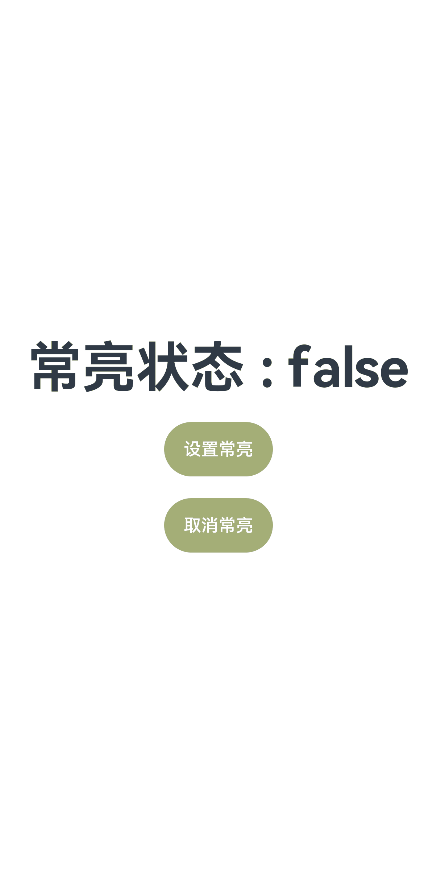

## 保持屏幕常亮

### 场景说明

在使用开发板进行应用开发调试时，不操作屏幕一段时间后，屏幕会熄屏变黑，再操作时需要再次点亮屏幕，耗费时间不利于调试。本例将介绍如何通过窗口管理相关接口实现屏幕常亮。

### 效果呈现

本示例最终效果如下（在开发板中可验证实际常亮效果）：



### 运行环境

本例基于以下环境开发，开发者也可以基于其他适配的版本进行开发：

- IDE：DevEco Studio 3.1 Release
- SDK：Ohos_sdk_public 3.2.12.2 (API Version 9 Release)

### 实现思路

通过Window的setWindowKeepScreenOn方法，在需要时控制屏幕是否常亮，并通过Window的getWindowProperties().isKeepScreenOn查看窗口属性中屏幕常亮的状态。

### 开发步骤

1. 构建简易界面，用于显示当前屏幕常亮的状态，并绘制按钮用于设置常亮和取消常亮。
   
   ```ts
   build() {
   	Row() {
   	  Column() {
   		Text(this.message + this.isScreenOn)
   		  ...
   
   		Button('设置常亮')
   		  ...
   		  .onClick(()=>{
   			this.keepScreenOn(true)
   		  })
   
   		Button('取消常亮')
   		  ...
   		  .onClick(()=>{
   			this.keepScreenOn(false)
   		  })
   	  }
   	  .width('100%')
   	}
   	.height('100%')
   }
   ```

2. 获取应用上下文并通过其获取到当前窗口实例，通过窗口实例的setWindowKeepScreenOn方法控制屏幕是否常亮，并通过getWindowProperties获取窗口属性，从而查看属性中屏幕常亮状态isKeepScreenOn的取值。
   
   ```ts
   import common from '@ohos.app.ability.common';
   import window from '@ohos.window';
   
   private context: common.BaseContext = getContext(this) as common.BaseContext
   
   async keepScreenOn(status) {
   	let windowClass = await window.getLastWindow(this.context) //获取窗口实例
   	await windowClass.setWindowKeepScreenOn(status) //设置窗口常亮或取消
   	this.isScreenOn = await windowClass.getWindowProperties().isKeepScreenOn//查看屏幕常亮状态
   }
   ```

### 完整代码

通过上述步骤可以完成整个示例的开发，完整代码如下：

```ts
import common from '@ohos.app.ability.common';
import window from '@ohos.window';

@Entry
@Component
struct KeepScreenOn {
  @State message: string = '常亮状态 : '
  @State isScreenOn: boolean = false
  private context: common.BaseContext = getContext(this) as common.BaseContext

  async keepScreenOn(status) {
    let windowClass = await window.getLastWindow(this.context) //获取窗口实例
    await windowClass.setWindowKeepScreenOn(status) //设置窗口常亮或取消
    this.isScreenOn = await windowClass.getWindowProperties().isKeepScreenOn//查看屏幕常亮状态
  }

  build() {
    Row() {
      Column() {
        Text(this.message + this.isScreenOn)
          .fontSize(50)
          .fontWeight(FontWeight.Bold)

        Button('设置常亮')
          .fontSize(16)
          .height(50)
          .width(100)
          .borderRadius(10)
          .margin({top:20})
          .backgroundColor('#A4AE77')
          .onClick(()=>{
            this.keepScreenOn(true)
          })

        Button('取消常亮')
          .fontSize(16)
          .height(50)
          .width(100)
          .borderRadius(10)
          .margin({top:20})
          .backgroundColor('#A4AE77')
          .onClick(()=>{
            this.keepScreenOn(false)
          })
      }
      .width('100%')
    }
    .height('100%')
  }
}
```