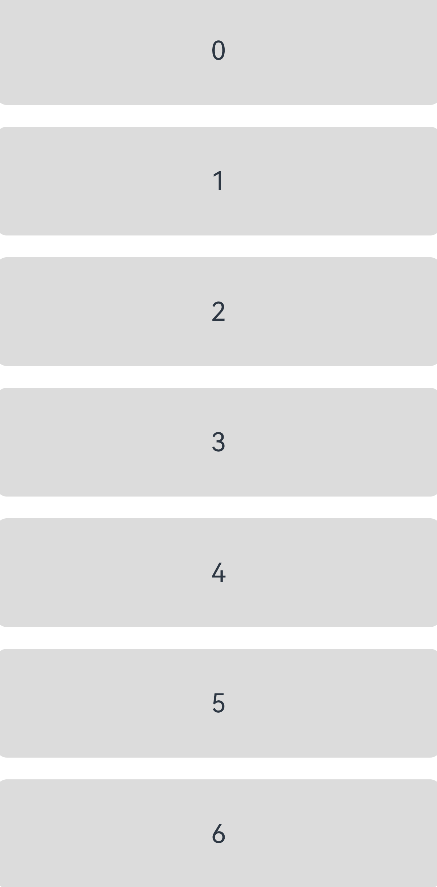

## 列表上拉加载更多内容

### 场景说明

列表上拉加载更多内容是一种常见的数据更新场景，常见于各类阅读类应用中，例如新闻阅读应用中，当用户浏览新闻列表到底部时，上拉将加载更多的新闻内容。本例将介绍列表上拉加载更多内容这个场景的具体实现方式。

### 效果呈现

本示例最终效果如下：



### 运行环境

本例基于以下环境开发，开发者也可以基于其他适配的版本进行开发：

- IDE：DevEco Studio 3.1 Release
- SDK：Ohos_sdk_public 3.2.12.2 (API Version 9 Release)

### 实现思路

1. 在页面布局上，通过在List列表末尾手工增加一个ListItem用于显示加载更多布局，通过visibility属性控制该ListItem的显示和隐藏，当上拉时显示，并根据加载中以及加载结果显示不同内容，加载完成后则隐藏。
2. 监听List列表的onTouch事件，并判断是否为上划、滑动距离是否达到设定的阈值等条件，在条件满足后，触发数据加载逻辑，重新渲染列表。

### 开发步骤

1. 利用ForEach循环渲染初始列表，在列表末尾增加一个ListItem用于显示加载更多布局，通过visibility属性控制显示和隐藏，并在List列表上拉过程中监听并处理onTouch事件。
   
   末尾的ListItem可呈现的内容有：
   
   * 正在加载中显示“正在加载”。
   
   * 加载失败则显示"加载失败，点击重试"，引导用户进行点击，从而重新加载。
   
   ```ts
   List({ space: 20, initialIndex: 0 }) {
       ForEach(this.list, (item) => {
         ListItem() {
           ...
         }
       }, item => item.toString())
   
       ListItem() { // 加载更多布局
         Flex({ justifyContent: FlexAlign.Center, alignItems: ItemAlign.Center }) {
           if (this.isShowRetry) {
             Text('加载失败，点击重试')
               ...
           } else {
             ...
             LoadingProgress()
             Text('正在加载...')
           }
         }
   
       }.visibility(this.isLoadMore ? Visibility.Visible : Visibility.None)
   }
   .onTouch(event => this.handleTouchEvent(event))
   ```

2. 实现列表上拉加载更多内容的核心，是设计处理onTouch事件的响应函数handleTouchEvent，在该函数中需要根据手指滑动的类型TouchType进行不同的处理：
   
   a. 手指按下时（TouchType.Down），记录按下的坐标，用于后续滑动方向及滑动距离计算：
   
   ```ts
   case TouchType.Down: // 手指按下
       this.downY = event.touches[0].y; // 记录按下的y坐标
       this.lastMoveY = event.touches[0].y;
       break;
   ```
   
   b. 手指滑动时（TouchType.Move），首先判断是否为上拉动作，如果为上拉动作，再判断是否达到上拉加载更多内容的条件。条件包括：
   
   * 是否有更多数据正在处于加载中状态，避免同时加载更多数据，只有当前未处于数据加载状态时才可以加载更多数据，否则直接忽略本次上拉动作。
   
   * 是否当前列表已滑动到最后一项，只有在最后一项时才可以加载更多数据。
   
   * 上拉滑动的偏移量是否达到设定的阈值，只有达到阈值才可以加载更多数据。
   
   ```ts
   case TouchType.Move: // 手指滑动
       if (this.isLoading) { // 更多数据加载中，不进入处理逻辑
         return;
       }
       if (event.touches[0].y - this.lastMoveY < 0) { // 手指上滑
         // 因为加载更多是在列表后面新增一个item，当一屏能够展示全部列表，endIndex 为 length+1
         if (this.endIndex == this.list.length - 1 || this.endIndex == this.list.length) {
           this.offsetY = event.touches[0].y - this.downY; // 滑动的偏移量
           if (Math.abs(this.offsetY) > this.loadMoreHeight) { // 数据加载的阈值
             this.isLoadMore = true // 可以刷新了
             this.offsetY = this.loadMoreHeight + this.offsetY * 0.1 // 偏移量缓慢增加
           }
         }
       }
       this.lastMoveY = event.touches[0].y;
       break;
   ```
   
   c. 手指抬起或滑动取消时（TouchType.UP或TouchType.Cancel），如果正处于数据加载中状态，则忽略，否则加载更多数据。
   
   ```ts
   case TouchType.Up:// 手指抬起
   
   case TouchType.Cancel:// 事件取消
   	if (this.isLoading) { // 更多数据加载中，不进入处理逻辑
   	  return;
   	}
   	this.touchUpLoadMore()
   	break
   ```

3. 实现加载更多数据的逻辑，即在上述步骤的touchUpLoadMore方法中实现以下处理逻辑：
   
   a. 通过动画处理列表回弹效果。
   
   ```ts
   animateTo({
     duration: 300, // 动画时长
   }, () => {
     this.offsetY = 0 // 偏移量设置为0
   })
   ```
   
   b. 模拟请求加载更多数据的结果，包括：
   - 正在加载：显示加载中效果。
   
   - 加载成功：重新渲染List，更新加载状态。
   
   - 加载失败：展示重新加载的引导说明，点击后重新触发touchUpLoadMore方法。
   
   ```ts
   if (this.isLoadMore) {
     this.isLoading = true // 加载中...
     setTimeout(() => { // 模拟耗时操作
   	this.getData()
   	  .then(data => {
   		if (data === StatusType.SUCCESS) { // 加载成功
   		  this.isShowRetry = false
   		  this.loadMoreData() // 加载数据
   		  this.isLoadMore = false // 关闭加载更多
   		  this.isLoading = false
   		}
   	  })
   	  .catch(error => { // 加载失败
   		this.isShowRetry = true // 展示“点击重试”
   		console.info('error message ' + error)
   	  })
     }, 2000)
   } else { // 关闭加载更多
     this.isLoadMore = false
     this.isLoading = false
   }
   ```
   
   

### 完整代码

通过上述步骤可以完成整个示例的开发，完整代码如下：

```ts
@Entry
@Component
struct ListPullupLoading {
  @State list: number[] = [0, 1, 2, 3, 4, 5, 6, 7, 8, 9]
  @State offsetY: number = 0 // 列表y坐标偏移量
  private downY: number = 0 // 按下的y坐标
  private lastMoveY: number = 0 // 上一次移动的坐标
  private endIndex: number = 0 // 当前列表尾部索引
  private loadMoreHeight = 100 // 触发上拉加载的阈值高度

  @State isLoadMore: boolean = false // 是否可以加载更多，上拉加载的布局是否显示
  private  isLoading: boolean = false // 是否加载中，加载中不进入触摸逻辑
  @State isShowRetry: boolean = false // 点击重试 是否显示

  build() {
    Column() {
      List({ space: 20, initialIndex: 0 }) {
        ForEach(this.list, (item) => {
          ListItem() {
            Text('' + item).width('100%').height('100%')
              .fontSize(24)
              .textAlign(TextAlign.Center)
              .borderRadius(10)
              .backgroundColor(0xDCDCDC)
          }.width('100%').height(100)
        }, item => item.toString())

        ListItem() { // 加载更多布局
          Flex({ justifyContent: FlexAlign.Center, alignItems: ItemAlign.Center }) {
            if (this.isShowRetry) {
              Text('加载失败，点击重试')
                .margin({ left: 7, bottom: 1 })
                .fontColor(Color.Grey)
                .fontSize(24)
                .onClick(() => {
                  this.isShowRetry = false
                  this.touchUpLoadMore()
                })
            } else {
              LoadingProgress()
                .width(36).height(36)

              Text('正在加载...')
                .margin({ left: 7, bottom: 1 })
                .fontColor(Color.Grey)
                .fontSize(24)
            }
          }.width('100%').height('100%')
          .backgroundColor(0xFFFFFF)

        }
        .height(this.loadMoreHeight)
        .visibility(this.isLoadMore ? Visibility.Visible : Visibility.None)

      }
      .width('100%')
      .height('100%')
      .listDirection(Axis.Vertical) // 排列方向
      .onScrollIndex((start: number, end: number) => {
        console.info('start = ' + start.toString() + ' end = ' + end.toString())
        this.endIndex = end
      })
      .onTouch(event => this.handleTouchEvent(event))
    }
    .width('100%')
    .height('100%')
    .backgroundColor(0xFFFFFF)
  }

  /**
   * 处理onTouch事件
   */
  handleTouchEvent(event: TouchEvent) {
    switch (event.type) {
      case TouchType.Down: // 手指按下
        this.downY = event.touches[0].y; // 记录按下的y坐标
        this.lastMoveY = event.touches[0].y;
        break;

      case TouchType.Move: // 手指滑动
        if (this.isLoading) { // 更多数据加载中，不进入处理逻辑
          return;
        }
        if (event.touches[0].y - this.lastMoveY < 0) { // 手指上滑
          // 因为加载更多是在列表后面新增一个item，当一屏能够展示全部列表，endIndex 为 length+1
          if (this.endIndex == this.list.length - 1 || this.endIndex == this.list.length) {
            this.offsetY = event.touches[0].y - this.downY; // 滑动的偏移量
            if (Math.abs(this.offsetY) > this.loadMoreHeight) { // 数据加载的阈值
              this.isLoadMore = true // 可以刷新了
              this.offsetY = this.loadMoreHeight + this.offsetY * 0.1 // 偏移量缓慢增加
            }
          }
        }
        this.lastMoveY = event.touches[0].y;
        break;

      case TouchType.Up:// 手指抬起

      case TouchType.Cancel:// 事件取消
        if (this.isLoading) { // 更多数据加载中，不进入处理逻辑
          return;
        }
        this.touchUpLoadMore()
        break
    }
  }

  /**
   * 手指抬起，处理加载更多
   */
  private touchUpLoadMore() {
    animateTo({
      duration: 300, // 动画时长
    }, () => {
      this.offsetY = 0 // 偏移量设置为0
    })

    if (this.isLoadMore) {
      this.isLoading = true // 加载中...
      setTimeout(() => { // 模拟耗时操作
        this.getData()
          .then(data => {
            if (data === StatusType.SUCCESS) { // 加载成功
              this.isShowRetry = false
              this.loadMoreData() // 加载数据
              this.isLoadMore = false // 关闭加载更多
              this.isLoading = false
            }
          })
          .catch(error => { // 加载失败
            this.isShowRetry = true // 展示“点击重试”
            console.info('error message ' + error)
          })
      }, 2000)
    } else { // 关闭加载更多
      this.isLoadMore = false
      this.isLoading = false
    }
  }

  /**
   * mock 产生更多数据
   */
  private loadMoreData() {
    let initValue = this.list[this.list.length - 1] + 1;
    for (let i = initValue; i < initValue + 10; i++) {
      this.list.push(i)
    }
  }

  /**
   * 模拟数据加载结果
   */
  private getData(): Promise<StatusType> {
    return new Promise((resolve, reject) => {
      const randomNumber: number = Math.random();
      if (randomNumber >= 0.5) {
        resolve(StatusType.SUCCESS)
      } else {
        reject(StatusType.FAIL)
      }
    })
  }
}

enum StatusType {
  SUCCESS,
  FAIL
}
```