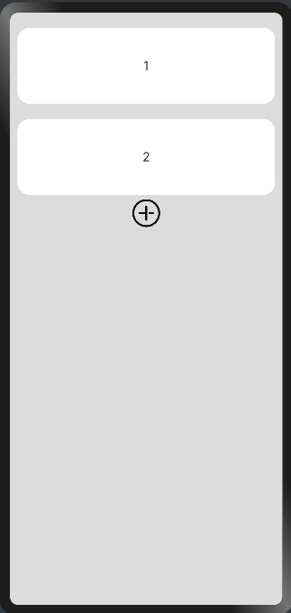

# 如何实现列表项ListItem滑动显示快捷菜单

## 场景说明

在使用列表List的应用中，可以滑动列表项ListItem显示快捷菜单，快速完成对列表项的操作。List垂直布局时滑动操作支持左滑和右滑。

## 效果呈现

本示例最终效果如下：



## 运行环境

- IDE：DevEco Studio 3.1 Beta2
- SDK：Ohos_sdk_public 3.2.11.9 (API Version 9 Release)

## 实现原理

1. 自定义组件实现划出后的快捷菜单。

2. 利用ListItem组件的swipeAction属性，设置ListItem的划出组件为上述自定义组件。

## 开发步骤

1. 实现自定义组件。本示例使用Row、Image组件组装一个包含两个图标按钮的快捷菜单组件。在定义组件时，给定入参便于后续定位到被滑动的ListItem。本示例中，当滑动出菜单后，点击删除按钮可以删除当前ListItem。
   
   ```ts
   @Builder itemEnd(index:number) {
     Row () {
       Image($r("app.media.ic_public_settings_filled"))
         ...
         })
       Image($r("app.media.ic_public_delete_filled"))
         ...
         .onClick(()=>{
           this.itemIndexArr.splice(index,1)
         })
     }.padding(4).justifyContent(FlexAlign.SpaceEvenly)
   }
   ```

2. 使用ForEach循环渲染列表，并为ListItem设置swipeAction属性为上述自定义组件，设置属性时绑定入参。
   
   swipeAction支持设置不同的滑动方向：
   
   * start：List垂直布局时，向右滑动ListItem时在左侧显示的组件。本示例中未配置。
   
   * end：List垂直布局时，向左滑动ListItem时在右侧显示的组件。
   
   ```ts
   ForEach(this.itemIndexArr,(item,index) =>{
     ListItem(){
       Text('' + item)
         ...
     }.swipeAction({ end:this.itemEnd.bind(this,index), edgeEffect: SwipeEdgeEffect.Spring})
   },item=>item)
   ```

## 完整代码

通过上述步骤可以完成整个示例的开发，完整代码如下：

```ts
@Entry
@Component
struct Index {
  @State itemIndexArr:number[] = [1,2]
  @Builder itemEnd(index:number) {
    Row () {
      Image($r("app.media.ic_public_settings_filled"))
        .width(32)
        .height(32)
        .margin(4)
        .onClick(()=>{
          console.info('Click Setting Icon')
        })
      Image($r("app.media.ic_public_delete_filled"))
        .width(32)
        .height(32)
        .margin(4)
        .onClick(()=>{
          this.itemIndexArr.splice(index,1)
        })
    }.padding(4).justifyContent(FlexAlign.SpaceEvenly)
  }

  build() {
    Column() {
      List({space:10}) {
        ForEach(this.itemIndexArr,(item,index) =>{
          ListItem(){
            Text('' + item)
              .width('100%')
              .height(100)
              .fontSize(16)
              .margin({ top: 10 })
              .borderRadius(16)
              .textAlign(TextAlign.Center)
              .backgroundColor(Color.White)
          }.swipeAction({ end:this.itemEnd.bind(this,index), edgeEffect: SwipeEdgeEffect.Spring})
        },item=>item)
      }

      Row() {
        Image($r("app.media.ic_public_add_norm"))
          .width(40)
          .height(40)
          .margin(4)
          .onClick(()=>{
            this.itemIndexArr.push(this.itemIndexArr.length + 1)
          })
      }

    }
    .padding(10)
    .backgroundColor(0xDCDCDC)
    .width('100%')
    .height('100%')
  }
}
```