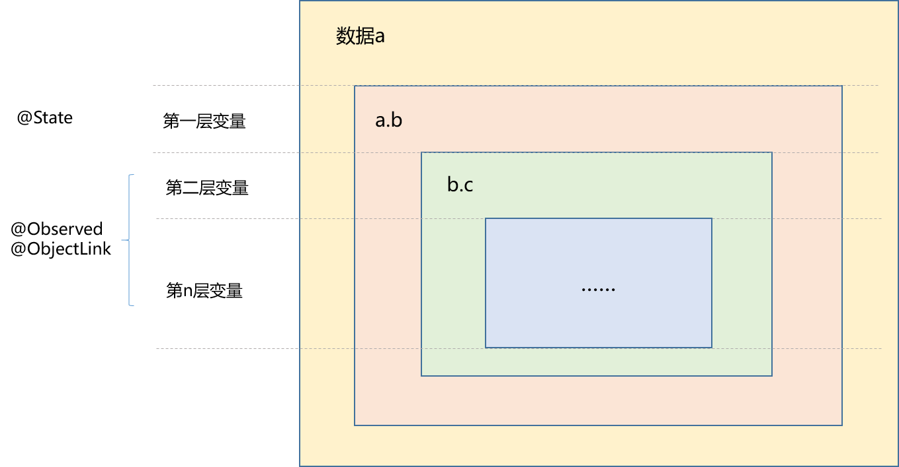
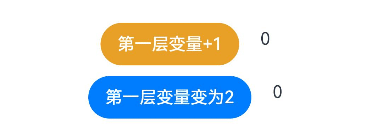

# 如何监听多层状态变化

## 场景说明
应用开发过程中，当希望通过状态变量控制页面刷新时，大家通常想到的就是装饰器@State，但是在嵌套场景下，单单使用@State并不能监听到变量的状态变化，这就引出了@Observed/@ObjectLink装饰器。本文就为大家介绍如何配合使用@State、@Observed、@ObjectLink三个装饰器监听多层状态变化。

## 概念原理
在讲解具体操作前，大家先理解以下几个概念：
- 第一层状态变化：指不包含嵌套关系的变量的变化，比如string、number、boolean等基础数据类型的状态变化，以及嵌套结构中第一层变量的状态变化。

- 多层状态变化：指包含嵌套关系的二层及以下变量的变化，比如嵌套类中被嵌套类的成员变量的状态变化，嵌套数组中被嵌套数组的状态变化等。

第一层变量的状态变化可以用@State监听，二层及以下变量的状态变化则需要使用@Observed/@ObjectLink监听。以嵌套结构举例，如下图：




为便于理解，通过以下例子具体说明单层和多层状态变化：
```ts
class ClassB {
  public c: number;

  constructor(c: number) {
    this.c = c;
  }
}

class ClassA {
  // ClassA成员变量的类型为ClassB，ClassB为被嵌套类
  public b: ClassB;

  constructor(b: ClassB) {
    this.b = b;
  }
}

a: ClassA
// 变量b为ClassA的成员变量，为第一层变量，所以变量b的状态变化即为第一层状态变化
this.a.b = new ClassB(0)
// 变量c为被嵌套类ClassB的成员变量，变量c的状态变化即为第二层状态变化
this.a.b.c = 5
```

## 监听第一层状态变化
监听第一层状态变化可以使用@State修饰变量，变量发生变化后即可同步刷新UI，这是大家最常用的场景，为便于理解，此处举例说明一下：
```ts
class ClassA {
  public a:number

  constructor(a:number) {
    this.a = a;
  }
}

@Entry
@Component
struct ViewA {
  // 使用@State修饰变量class_A，以监听其变化
  @State class_A: ClassA = new ClassA(0);

  build() {
    Column() {
      Row(){
        Button(`第一层变量+1`)
          .margin({top:10,right:20})
          .backgroundColor('#E8A027')
          .onClick(() => {
            // class_A的成员变量a加1，class_A发生变化
            this.class_A.a += 1;
          })
        // 将第一层变量在UI呈现出来
        Text(`${this.class_A.a}`)
      }
      .margin({top:50})

      Row(){
        Button(`第一层变量变为2`)
          .margin({top:10,right:20})
          .onClick(() => {
            // 将新的ClassA实例赋值给class_A，class_A发生变化
            this.class_A = new ClassA(2);
          })
        // 将第一层变量在UI呈现出来
        Text(`${this.class_A.a}`)
      }
    }
    .width('100%')
    .justifyContent(FlexAlign.Center)
  }
}
```
效果如下，如图可以看出第一层变量发生变化后可以实时在UI呈现出来，所以@State可以有效的监听第一层变量的状态变化：



## 监听多层状态变化
接下来，我们介绍如何使用@Observed/@ObjectLink监听多层状态变化。
在第一层状态监听的基础上我们引入ClassB，构造一个嵌套结构，从而具有多层变量，如下：
```ts
// 引入ClassB
class ClassB {
  public b: number;

  constructor(b: number) {
    this.b = b;
  }
}


class ClassA {
  // ClassA成员变量a的类型为ClassB，从而形成嵌套结构，ClassB的成员变量b为第二层变量
  public a:ClassB

  constructor(a:ClassB) {
    this.a = a;
  }
}
```
此时我们可以验证一下，如果仅使用@State是否可以监听到第二层变量的变化：

```ts
// 引入ClassB
class ClassB {
  public b: number;

  constructor(b: number) {
    this.b = b;
  }
}

class ClassA {
  // ClassA成员变量a的类型为ClassB，从而形成嵌套结构，ClassB的成员变量b为第二层变量
  public a:ClassB

  constructor(a:ClassB) {
    this.a = a;
  }
}

@Entry
@Component
struct ViewA {
  // 使用@State修饰变量class_A
  @State class_A: ClassA = new ClassA(new ClassB(0));

  build() {
    Column() {
      Row(){
        // 点击按钮，第二层变量发生变化
        Button('第二层变量+1')
          .margin({top:10,right:20})
          .backgroundColor('#E8A027')
          .onClick(() => {
            // 第二层变量变化，嵌套类ClassB的成员变量b加1
            this.class_A.a.b += 1;
          })
        // 将第二层变量在UI呈现出来
        Text(`${this.class_A.a.b}`)
      }
      .margin({top:50})
    }
    .width('100%')
    .justifyContent(FlexAlign.Center)
  }
}
```
效果如下，可以看出当第二层变量发生变化时，UI没有任何变化，所以单纯使用@State不能监听到二层及以下变量的变化：


接下来我们使用@Observed/@ObjectLink监听本例中第二层变量的变化。
根据使用规则，需要使用@Observed修饰嵌套类，使用@ObjectLink修饰嵌套类的实例，且@ObjectLink不能在被@Entry修饰的组件中使用，所以我们构建一个子组件，然后在父组件中进行引用，具体代码如下：
```ts
// 使用@Observed修饰ClassB
@Observed
class ClassB {
  public b: number;

  constructor(b: number) {
    this.b = b;
  }
}

class ClassA {
  // ClassA成员变量a的类型为ClassB，从而形成嵌套结构，ClassB的成员变量b为第二层变量
  public a:ClassB

  constructor(a:ClassB) {
    this.a = a;
  }
}

// 构建子组件ViewB用于承载@ObjectLink修饰的变量
@Component
struct ViewB {
  // 使用@ObjectLink修饰ClassB的实例class_B
  @ObjectLink class_B: ClassB;
  build() {
    Row() {
      // 将ClassB的成员变量b在UI呈现出来
      Text(`${this.class_B.b}`)
    }
    .margin({top:100})
  }
}

@Entry
@Component
struct ViewA {
  @State class_A: ClassA = new ClassA(new ClassB(0));

  build() {
    Column() {
      ViewB({ class_B: this.class_A.a })
      Row(){
        // 点击按钮，第二层变量发生变化
        Button('第二层变量class_B.b加1')
          .margin({top:10,right:20})
          .backgroundColor('#E8A027')
          .onClick(() => {
            // 第二层变量变化，嵌套类ClassB的成员变量b加1
            this.class_A.a.b += 1;
          })
      }
      .margin({top:50})
    }
    .width('100%')
    .justifyContent(FlexAlign.Center)
  }
}
```
我们来看下效果：


如图，现在当二层变量发生变化时，可以完美的被监听到，并在UI中刷新出来了。

当然，嵌套数组等也是同样的原理，大家可以参考[官方指南](../application-dev/quick-start/arkts-observed-and-objectlink.md)进行尝试。

## 参考
[@Observed和@ObjectLink：嵌套类对象属性变化](../application-dev/quick-start/arkts-observed-and-objectlink.md)