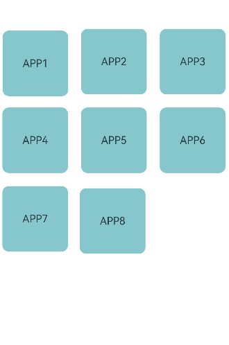
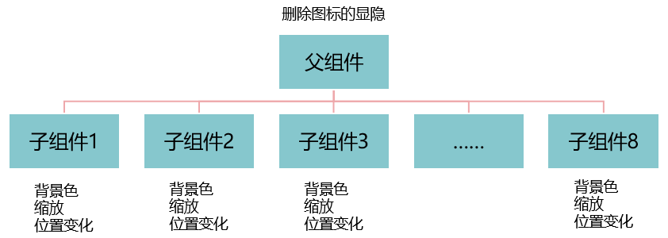

# 控制页面刷新范围

## 场景说明
在实现页面UI时，业务方需要根据业务逻辑动态更新组件的状态，常见的如在手机桌面长按某个App的图标时，图标背景色、大小等会发生变化。根据业务需要，有时我们需要触发单个组件的状态更新，有时需要触发部分或全部组件的状态更新。那么如何控制组件状态刷新的范围呢？本例将为大家提供一种参考方案。

## 效果呈现
本例最终效果如下：



## 运行环境
本例基于以下环境开发，开发者也可以基于其他适配的版本进行开发：

- IDE: DevEco Studio 3.1 Release
- SDK: Ohos_sdk_public 3.2.12.5(API Version 9 Release)


## 实现思路
ArkUI可以通过页面的状态数据驱动UI的更新，其UI更新机制可以通过如下表达式来体现：

***UI=f(state)***

用户构建了UI模型，其中参数state代表页面组件的运行时状态。当state改变时，UI作为返回结果，也将进行对应的改变刷新。f作为状态管理机制，维护组件运行时的状态变化所带来的UI重新渲染。组件的状态改变可通过状态变量进行控制。

基于上述理论，如果要控制页面的更新范围，我们必须要：**定义准确状态变量，并控制状态变量影响的组件范围。**

本例中包含8个APP图标，其中涉及5种状态变化，按照局部刷新和全局刷新可分为：

- 局部刷新（单个卡片变化）

  - 点击卡片，卡片背景色变为红色。
  - 点击卡片，卡片进行缩放。
  - 拖拽卡片，卡片位置变化。

- 全局刷新（全部卡片变化）

  - 长按某个卡片，为所有卡片添加删除图标。
  - 点击删除图标外的任意地方，删除图标消失。

所以处理思路为，控制局部刷新的状态变量在子组件中定义，绑定子组件，控制全局刷新的状态变量在父组件中进行定义，并由父组件传递给所有子组件。如下图：



## 开发步骤
由于本例重点讲解刷新区域的控制，所以开发步骤会着重讲解相关实现，不相关的内容不做介绍，全量代码可参考完整代码章节。
1. 创建APP卡片组件作为子组件，每个卡片包含文本和删除图标。
具体代码如下：
    ```ts
    @Component
    export struct AppItem {
      ...
      build() {
        Stack({ alignContent: Alignment.TopEnd }) {
          Image($r('app.media.ic_public_close'))
            .height(30)
            .width(30)
            .zIndex(2)
            .offset({
              x: -12,
              y: 12
            })
          Text(this.data.title)
            .width(100)
            .height(100)
            .fontSize(16)
            .margin(10)
            .textAlign(TextAlign.Center)
            .borderRadius(10)
        }   
      }
    }
    ```
2. 创建父组件，并在父组件中引用子组件。
具体代码如下：
    ```ts
    @Entry
    @Component
    struct Sample {
      ...
      build() {
        Stack({ alignContent: Alignment.Bottom }) {
          Flex({ wrap: FlexWrap.Wrap }) {
            // 通过循环渲染加载所有子组件
            ForEach(this.items, (item: ItemProps, index: number) => {
              // 引用App卡片子组件
              AppItem({data: this.items[index]})
            }, (item: ItemProps) => item.id.toString())
          }
          .width('100%')
          .height('100%')
        }
        .width('100%')
        .height('100%')
        .backgroundColor('#ffffff')
        .margin({ top:50 })
      }
    }
    ```
3. 由于卡片背景色变化、卡片缩放、卡片拖拽在触发时都是针对单个卡片的状态变化，所以在卡片子组件中定义相应的状态变量，用来控制单个卡片的状态变化。
本例中定义状态变量“data”用来控制卡片拖拽时位置的刷新；定义状态变量”downFlag“用来监听卡片是否被按下，从而控制卡片背景色及缩放状态的更新。
具体代码如下：
    ```ts
    @Component
    export struct AppItem {
      // 定义状态变量data，用来控制卡片被拖拽时位置的刷新
      @State data: ItemProps = {};
      // 定义状态变量downFlag用来监听卡片是否被按下，从而控制卡片背景色及缩放状态的更新
      @State downFlag: boolean = false;
      ...
      build() {
        Stack({ alignContent: Alignment.TopEnd }) {
          Image($r('app.media.ic_public_close'))
                .height(30)
                .width(30)
                .zIndex(2)
                .offset({
                  x: -12,
                  y: 12
                })
          Text(this.data.title)
            .width(100)
            .height(100)
            .fontSize(16)
            .margin(10)
            .textAlign(TextAlign.Center)
            .borderRadius(10)
            // 根据状态变量downFlag的变化，更新背景色
            .backgroundColor(this.downFlag ? '#EEA8AB' : '#86C7CC')
            // 背景色更新时添加属性动画
            .animation({
              duration: 500,
              curve: Curve.Friction
            })
            // 绑定onTouch事件，监听卡片是否被按下，根据不同状态改变downFlag的值
            .onTouch((event: TouchEvent) => {
              if (event.type == TouchType.Down) {
                this.downFlag = true
              } else if (event.type == TouchType.Up) { 
                this.downFlag = false
              }
            })
        }
        // 根据状态变量downFlag的变化，控制卡片的缩放
        .scale(this.downFlag ? { x: 0.8, y: 0.8 } : { x: 1, y: 1 })
        // 通过状态变量data的变化，控制卡片位置的更新
        .offset({
          x: this.data.offsetX,
          y: this.data.offsetY
        })
        // 拖动触发该手势事件
        .gesture(
          GestureGroup(GestureMode.Parallel,
            ...
            PanGesture(this.panOption)
              .onActionStart((event: GestureEvent) => {
                console.info('Pan start')
              })
              // 拖动卡片时，改变状态变量data的值
              .onActionUpdate((event: GestureEvent) => {
                this.data.offsetX = this.data.positionX + event.offsetX
                this.data.offsetY = this.data.positionY + event.offsetY
              })
              .onActionEnd(() => {
                this.data.positionX = this.data.offsetX
                this.data.positionY = this.data.offsetY
                console.info('Pan end')
              })
          )
        )
      }
    }
    ```
4. 长按卡片，卡片右上角会出现删除图标。由于所有卡片右上角都会出现删除图标，所以这里需要做全局的刷新。本例在父组件中定义状态变量“deleteVisibility”，在调用子组件时，将其作为参数传递给所有卡片子组件，并且通过@Link装饰器与子组件进行双向绑定，从而可以控制所有卡片子组件中删除图标的更新。
**父组件代码：**
    ```ts
    @Entry
    @Component
    struct Sample {
      ...
      // 定义状态变量deleteVisibility，控制App卡片上删除图标的更新
      @State deleteVisibility: boolean = false
      ...
      build() {
        Stack({ alignContent: Alignment.Bottom }) {
          Flex({ wrap: FlexWrap.Wrap }) {
            // 通过循环渲染加载所有子组件
            ForEach(this.items, (item: ItemProps, index: number) => {
              // 将状态变量deleteVisibility传递给每一个子组件，从而deleteVisibility变化时可以触发所有子组件的更新
              AppItem({ deleteVisibility: $deleteVisibility, data: this.items[index], onDeleteClick: this.delete })
            }, (item: ItemProps) => item.id.toString())
          }
          .width('100%')
          .height('100%')
        }
        .width('100%')
        .height('100%')
        .backgroundColor('#ffffff')
        .margin({ top:50 })
        .onClick(() => {
          this.deleteVisibility = false
        })
      }
    ```
	**子组件代码：**
    ```ts
    @Component
    export struct AppItem {
      ...
      // 定义deleteVisibility状态变量，并通过@Link装饰器与父组件中的同名变量双向绑定，该变量值发生变化时父子组件可双向同步
      @Link deleteVisibility: boolean;
      ...
      build() {
        Stack({ alignContent: Alignment.TopEnd }) {
          // 通过deleteVisibility控制删除图标的隐藏和显示，当deleteVisibility值为true时显示，为false时隐藏
          if(this.deleteVisibility){
            Image($r('app.media.ic_public_close'))
              .height(30)
              .width(30)
              .zIndex(2)
              // 控制删除图标的显隐
              .visibility(Visibility.Visible)
              .offset({
                x: -12,
                y: 12
              })
              .onClick(() => this.onDeleteClick(this.data.id))
          }else{
            Image($r('app.media.ic_public_close'))
              .height(30)
              .width(30)
              .zIndex(2)
              .visibility(Visibility.Hidden)
              .offset({
                x: -12,
                y: 12
              })
              .onClick(() => this.onDeleteClick(this.data.id))
          }
        ...
        .gesture(
          GestureGroup(GestureMode.Parallel,
            // 识别长按手势
            LongPressGesture({ repeat: true })
              .onAction((event: GestureEvent) => {
                if (event.repeat) {
                  // 长按时改变deleteVisibility的值为true，从而更新删除图标为显示状态
                  this.deleteVisibility = true
                }
                console.info('LongPress onAction')
              }),
            ...
          )
        )
      }
    }
    ```


## 完整代码
本例完整代码如下：
data.ets文件（数据模型文件）
```ts
// data.ets
// AppItem组件接口信息
export interface ItemProps {
  id?: number,
  title?: string,
  offsetX?: number, // X偏移量
  offsetY?: number, // Y偏移量
  positionX?: number, // 在X的位置
  positionY?: number, // 在Y的位置
}

// AppItem初始数据
export const initItemsData: ItemProps[] = [
  {
    id: 1,
    title: 'APP1',
    offsetX: 0,
    offsetY: 0,
    positionX: 0,
    positionY: 0
  },
  {
    id: 2,
    title: 'APP2',
    offsetX: 0,
    offsetY: 0,
    positionX: 0,
    positionY: 0
  },
  {
    id: 3,
    title: 'APP3',
    offsetX: 0,
    offsetY: 0,
    positionX: 0,
    positionY: 0
  },
  {
    id: 4,
    title: 'APP4',
    offsetX: 0,
    offsetY: 0,
    positionX: 0,
    positionY: 0
  },
  {
    id: 5,
    title: 'APP5',
    offsetX: 0,
    offsetY: 0,
    positionX: 0,
    positionY: 0
  },
  {
    id: 6,
    title: 'APP6',
    offsetX: 0,
    offsetY: 0,
    positionX: 0,
    positionY: 0
  },
  {
    id: 7,
    title: 'APP7',
    offsetX: 0,
    offsetY: 0,
    positionX: 0,
    positionY: 0
  },
  {
    id: 8,
    title: 'APP8',
    offsetX: 0,
    offsetY: 0,
    positionX: 0,
    positionY: 0
  },
]
```
AppItem.ets文件（卡片子组件）
```ts
// AppItem.ets
import { ItemProps } from '../model/data';

@Component
export struct AppItem {
  // 定义状态变量data，用来控制卡片被拖拽时位置的刷新
  @State data: ItemProps = {};
  // 定义状态变量downFlag用来监听卡片是否被按下，从而控制卡片背景色及缩放状态的更新
  @State downFlag: boolean = false;
  // 定义deleteVisibility状态变量，并通过@Link装饰器与父组件中的同名变量双向绑定，该变量值发生变化时父子组件可双向同步
  @Link deleteVisibility: boolean;

  private onDeleteClick: (id: number) => void;
  private panOption: PanGestureOptions = new PanGestureOptions({ direction: PanDirection.All });
  build() {
    Stack({ alignContent: Alignment.TopEnd }) {
      // 通过deleteVisibility控制删除图标的隐藏和显示，当deleteVisibility值为true时显示，为false时隐藏
      if(this.deleteVisibility){
        Image($r('app.media.ic_public_close'))
          .height(30)
          .width(30)
          .zIndex(2)
          // 控制删除图标的显隐
          .visibility(Visibility.Visible)
          .offset({
            x: -12,
            y: 12
          })
          .onClick(() => this.onDeleteClick(this.data.id))
      }else{
        Image($r('app.media.ic_public_close'))
          .height(30)
          .width(30)
          .zIndex(2)
          .visibility(Visibility.Hidden)
          .offset({
            x: -12,
            y: 12
          })
          .onClick(() => this.onDeleteClick(this.data.id))
      }

      Text(this.data.title)
        .width(100)
        .height(100)
        .fontSize(16)
        .margin(10)
        .textAlign(TextAlign.Center)
        .borderRadius(10)
        // 根据状态变量downFlag的变化，更新背景色
        .backgroundColor(this.downFlag ? '#EEA8AB' : '#86C7CC')
        // 背景色更新时添加属性动画
        .animation({
          duration: 500,
          curve: Curve.Friction
        })
        // 绑定onTouch事件，监听卡片是否被按下，根据不同状态改变downFlag的值
        .onTouch((event: TouchEvent) => {
          if (event.type == TouchType.Down) {
            this.downFlag = true
          } else if (event.type == TouchType.Up) { // 手指抬起
            this.downFlag = false
          }
        })
    }
    // 根据状态变量downFlag的变化，控制卡片的缩放
    .scale(this.downFlag ? { x: 0.8, y: 0.8 } : { x: 1, y: 1 })
    // 通过状态变量data的变化，控制卡片位置的更新
    .offset({
      x: this.data.offsetX,
      y: this.data.offsetY
    })
    // 拖动触发该手势事件
    .gesture(
      GestureGroup(GestureMode.Parallel,
        // 识别长按手势
        LongPressGesture({ repeat: true })
          .onAction((event: GestureEvent) => {
            if (event.repeat) {
              // 长按时改变deleteVisibility的值为true，从而更新删除图标为显示状态
              this.deleteVisibility = true
            }
            console.info('LongPress onAction')
          }),
        PanGesture(this.panOption)
          .onActionStart((event: GestureEvent) => {
            console.info('Pan start')
          })
          // 拖动卡片时，改变状态变量data的值
          .onActionUpdate((event: GestureEvent) => {
            this.data.offsetX = this.data.positionX + event.offsetX
            this.data.offsetY = this.data.positionY + event.offsetY
          })
          .onActionEnd(() => {
            this.data.positionX = this.data.offsetX
            this.data.positionY = this.data.offsetY
            console.info('Pan end')
          })
      )
    )
  }
}
```
Index.ets文件（父组件）
```ts
// Index.ets
import { AppItem } from '../components/MyItem';
import { initItemsData } from '../model/data';
import { ItemProps } from '../model/data';

@Entry
@Component
struct Sample {
  @State items: ItemProps[] = [];
  // 定义状态变量deleteVisibility，控制App卡片上删除图标的更新
  @State deleteVisibility: boolean = false

  // 删除指定id组件
  private delete = (id: number) => {
    const index = this.items.findIndex(item => item.id === id);
    this.items.splice(index, 1);
  }

  // 生命周期函数：组件即将出现时调用
  aboutToAppear() {
    this.items = [...initItemsData];
  }

  build() {
    Stack({ alignContent: Alignment.Bottom }) {
      Flex({ wrap: FlexWrap.Wrap }) {
        // 通过循环渲染加载所有子组件
        ForEach(this.items, (item: ItemProps, index: number) => {
          // 将状态变量deleteVisibility传递给每一个子组件，从而deleteVisibility变化时可以触发所有子组件的更新
          AppItem({ deleteVisibility: $deleteVisibility, data: this.items[index], onDeleteClick: this.delete })
        }, (item: ItemProps) => item.id.toString())
      }
      .width('100%')
      .height('100%')
    }
    .width('100%')
    .height('100%')
    .backgroundColor('#ffffff')
    .margin({ top:50 })
    .onClick(() => {
      // 点击组件，deleteVisibility值变为false，从而隐藏所有卡片的删除图标
      this.deleteVisibility = false
    })
  }
}
```


## 参考
- [@Link](../application-dev/ui/state-management/arkts-link.md)
- [显隐控制](../application-dev/reference/apis-arkui/arkui-ts/ts-universal-attributes-visibility.md)
- [组合手势](../application-dev/reference/apis-arkui/arkui-ts/ts-combined-gestures.md)