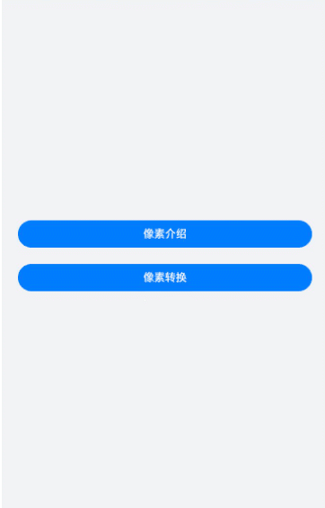

# 像素单位转换

在日常应用页面布局设计时，开发者需要知道每个组件的样式及位置，这时就需要了解像素单位及相互转换方法，ArkUI 开发框架提供了4种像素单位供开发者使用，分别是： px 、 vp 、 fp 和 lpx ，框架采用 vp 为基准数据单位，本篇就简单为大家介绍下像素单位的基本知识与像素单位转换API的使用。通过像素转换案例，向开发者讲解了如何使用像素单位设置组件的尺寸、字体的大小以及不同像素单位之间的转换方法。

## 效果呈现
本例最终效果如下：




## 运行环境
本例基于以下环境开发，开发者也可以基于其他适配的版本进行开发：
- IDE: DevEco Studio 3.1 Release
- SDK: Ohos_sdk_public 3.2.12.5(API Version 9 Release)
## 实现思路
本篇案例主要功能包括：①像素单位基本知识介绍；②像素单位转换相关API的使用。
* 构建入口页面：该页面包含两个button组件，通过点击按钮事件，实现到详细页面的跳转

* 像素单位介绍页面：
  * 构建IntroducitonViewModel.ets

    创建自定义接口IntroductionItem，根据IntroductionItem接口参数，创建对象数组INTRODUCE_LIST，向对象数组INTRODUCE_LIST中填充像素单位介绍页面所需参数内容。

  * 构建IntroducitonPage.ets

    通过ForEach循环渲染上一步骤中对象数组中的每个Item；通过if判断组件的显隐，同时添加样式，完成像素介绍页面。

* 像素转换页面：
  * 构建ConvertionViewModel.ets

    创建自定义接口ConversionItem，根据ConversionItem接口参数，创建对象数组ConversionViewModel，向对象数组ConversionViewModel中填充像素转换页面所需参数内容。

  * 构建ConvertionPage.ets

    通过ForEach循环渲染上一步构建的ConversionViewModel的每个子菜单Item，同时添加样式，构建像素介绍页面。


## 开发步骤
1. 构建入口页面：该页面包含两个button按钮，通过点击按钮事件，实现到详细页的跳转。
    具体代码如下：    
    ```ts
    // entry/src/main/ets/pages/IndexPage.ets
    
    import router from '@ohos.router';
    @Entry
    @Component
    struct IndexPage {
        // 定义jumpPage方法，实现路由跳转
        jumpPage(url: string) {
            router.pushUrl({ url })
        }
    
        build() {
            Column({ space: 24 }) {
                Button('像素介绍')
                    .height('40vp')
                    .width('100%')
                    .backgroundColor($r('app.color.blue_background'))
                    // 点击时回调jumpPage方法，跳转到pages/IntroductionPage页面
                .onClick(() => this.jumpPage('pages/IntroductionPage'))
    
                Button('像素转换')
                    .height('40vp')
                    .width('100%')
                    .backgroundColor($r('app.color.blue_background'))
                    // 点击时回调jumpPage方法，跳转到pages/ConversionPage页面
                    .onClick(() => this.jumpPage('pages/ConversionPage'))
            }
            .backgroundColor($r('app.color.page_background'))
            .justifyContent(FlexAlign.Center)
            .padding(24)
            .width('100%')
            .height('100%')
        }
    }
    
    ```
    
2. 像素单位介绍页面创建。
    此页面主要系统介绍像素单位的概念，包含px、vp、lpx以及fp，并在页面中 为Text组件的宽度属性设置不同的像素单位（如px、vp、lpx），fp像素单位则设置为Text组件的字体大小。

    * 从效果图看，此页面由4个功能相同的菜单组成，我们先构建功能菜单。
    创建IntroducitonViewModel.ets定义每个子功能菜单Item。
    具体代码如下:
      
        ```ts
        // entry/src/main/ets/viewmodel/IntroducitonViewModel.ets
      
        // 创建自定义接口，定义每个Item中的内容
        interface IntroductionItem {
            name: string;
            title: string;
            subTitle: string;
            value: string;
            smallFontSize: number;
            largeFontSize: number;
        }
      
        // 根据自定义接口IntroductionItem，填充内容
        const INTRODUCE_LIST: IntroductionItem[] = [
        {
            name: 'px',
            title: '屏幕物理像素单位。',
            subTitle: null,
            value: '200px',
            smallFontSize: 0,
            largeFontSize: 0
        },
        {
            name: 'vp',
            title:'屏幕密度相关像素，根据屏幕像素密度转换为屏幕物理像素。',
            value:'200vp',
            subTitle:'像素密度为160dpi的设备上1vp=1px,1vp对应的物理屏幕像素=（屏幕像素密度/160）px',
            smallFontSize: 0,
            largeFontSize: 0
        },
        {
            name: 'lpx',
            title:'视窗逻辑像素单位，lpx单位为实际屏幕宽度与逻辑宽度（通过designWidth配置）的比值。',
            subTitle: null,
            value: '200lpx',
            smallFontSize: 0,
            largeFontSize: 0
        },
        {
            name: 'fp',
            title:'字体像素，与vp类似，随系统字体大小设置变化。',
            subTitle:'默认情况下与vp相同，即1vp=1fp,如果用户手动调整了系统字体，scale为缩放比例，设置后的字体大小（单位fp） = 设置前的字体大小 * scale',
            value: '',
            smallFontSize: 14,
            largeFontSize: 24
        }
        ];
      
        // 定义类IntroductionViewModel，获取像素介绍页面的数据
        class IntroductionViewModel {
            getIntroductionList() {
                let introductionItems = INTRODUCE_LIST;
                return introductionItems;
        	}
        }
      
        let introductionViewModel = new IntroductionViewModel();
        export default introductionViewModel as IntroductionViewModel;
       
        ```
    * 渲染像素单位介绍页面,通过ForEach循环渲染上一步构建的IntroductionViewModel的每个子菜单Item；通过if判断组件的显隐，为显示的组件，添加样式，构建像素介绍页面。
        具体代码如下：
        
        ```ts
        // entry/src/main/ets/pages/IntroducitonPages.ets
        import IntroductionViewModel from '../viewmodel/IntroductionViewModel';
            
            interface IntroductionItem {
                name: string;
                title: Resource;
                subTitle: Resource;
                value: string;
                smallFontSize: number;
                largeFontSize: number;
        	}
            
            @Extend(Text) function titleTextStyle() {
                .fontColor($r('app.color.title_font'))
                .fontFamily('HarmonyHeiTi_Medium')
                .fontWeight(500)
        	}
            
            @Entry
            @Component
            struct IntroductionPage {
                build() {
                    Column() {
                        Navigation() {
                            List({ space: 12 }) {
                            //通过ForEach循环渲染Item，构建像素介绍页面
                                ForEach(IntroductionViewModel.getIntroductionList(), (item: IntroductionItem) => {
                                    //渲染每个Item
                                    ListItem() {
                                        Column() {
                                            Text(item.name)
                                                .titleTextStyle()
                                                .fontSize('16fp')
                                            Text(item.title)
                                                .titleTextStyle()
                                                .fontSize('14fp')
                                                .fontFamily('HarmonyHeiTi')
                                                .lineHeight('20fp')
                                                .margin({ top: '8vp'})
                                                .fontWeight(400)
                                            // subTitle非空，添加Text组件，显示subTitle内容，同时添加样式；不存在则不显示
                                            if (item.subTitle) {
                                                Text(item.subTitle)
                                                    .titleTextStyle()
                                                    .opacity(0.6)
                                                    .lineHeight('16fp')
                                                    .fontSize('12fp')
                                                    .fontFamily($r('app.string.HarmonyHeiTi'))
                                                    .margin({ top: '20vp' })
                                                    .fontWeight(400)
                                        }
            
                                            // value非空，添加Text组件且通过宽度属性设置不同的像素单位
                                            if (item.value.length > 0) {
                                                Text(item.value)
                                                    .titleTextStyle()
                                                    .fontColor($r('app.color.item_background'))
                                                    .fontSize('16fp')
                                                    .textAlign(TextAlign.Center)
                                                    .backgroundColor($r('app.color.blue_background'))
                                                    .height('28vp')
                                                    .width(item.value)
                                                    .borderRadius('4vp')
                                                    .margin({ top: '12vp' })
                                            // value为空，添加两个text组件，使用fp像素单位设置为Text组件的字体大小
                                            } else {
                                                Column() {
                                                    Text($r('app.string.font_desc', item.smallFontSize))
                                                        .titleTextStyle()
                                                        .fontSize(item.smallFontSize)
                                                    Text($r('app.string.font_desc', item.largeFontSize))
                                                        .titleTextStyle()
                                                        .fontSize(item.largeFontSize)
                                                        .margin({ top: '6vp' })
                                                }
                                                    .alignItems(HorizontalAlign.Start)
                                                    .backgroundColor($r('app.color.font_background'))
                                                    .width('100%')
                                                    .borderRadius('12vp')
                                                    .padding('12vp')
                                                    .margin({ top: '12vp' })
                                            }
                                        }
                                        .alignItems(HorizontalAlign.Start)
                                        .width('100%')
                                        .padding('12vp')
                                        .borderRadius('24vp')
                                        .backgroundColor('#FFFFFF')
                                    }
                                    .padding({
                                    left: '12vp',
                                    right: '12vp'
                                    })
                                })
                            }
                            .width('100%')
                            .height('100%')
                        }
                        .titleMode(NavigationTitleMode.Mini)
                        .title('像素介绍')
                    }
                    .backgroundColor($r('app.color.page_background'))
                    .width('100%')
                    .height('100%')
                }
            }
        ```
    
3. 像素转换页面创建。
    此页面主要是通过使用像素转换API，实现不同像素单位之间的相互转换功能。

    * 从效果图看，此页面由3个功能相同的菜单组成，我们先构建功能菜单。
    创建ConversionViewModel.ets定义每个子功能菜单Item。
    具体代码如下:
      
        ```ts
        // entry/src/main/ets/viewmodel/ConversionViewModel.ets
      
        // 创建自定义接口，定义每个Item中的内容
        interface ConversionItem {
            title: string;
            subTitle: string;
            value: number;
            conversionTitle: string;
            conversionSubTitle: string;
            conversionValue: number;
            notice: string;
        }
      
        // 定义类ConversionViewModel，获取像素转换页面的数据
        class ConversionViewModel {
            getConversionList() {
                let conversionItems = CONVERSION_LIST;
                return conversionItems;
            }
        }
      
        // 根据自定义接口ConversionItem，填充内容
        export const CONVERSION_LIST: ConversionItem[] = [
        {
            title: 'vp > px',
            subTitle: `vp2px(60)`,
            value: vp2px(60),
            conversionTitle: 'px > vp',
            conversionSubTitle: `px2vp(60)`,
            conversionValue: px2vp(60),
            notice: null
        },
        {
            title: 'fp > px',
            subTitle: `fp2px(60)`,
            value: fp2px(60),
            conversionTitle: 'px > fp',
            conversionSubTitle: `px2fp(60})`,
            conversionValue: px2fp(60),
            notice: null
        },
        {
            title: 'lpx > px',
            subTitle: `lpx2px(60)`,
            value: lpx2px(60),
            conversionTitle: 'px > lpx',
            conversionSubTitle: `px2lpx(60)`,
            conversionValue: px2lpx(60),
            notice: 'lpx与px之间的转换，需要根据实际情况设置designWidth'
        }
        ];
      
        let conversionViewModel = new ConversionViewModel();
        export default conversionViewModel as ConversionViewModel;
      
        ```
    * 渲染像素单位介绍页面,通过ForEach循环渲染上一步构建的ConversionViewModel的每个子菜单Item，同时添加样式，构建像素介绍页面。
        具体代码如下：
        
        ```ts
        // entry/src/main/ets/pages/ConversionPage.ets
    
        import ConversionViewModel from '../viewmodel/ConversionViewModel';
        
        interface ConversionItem {
            title: string;
            subTitle: string;
            value: number;
            conversionTitle: string;
            conversionSubTitle: string;
            conversionValue: number;
            notice: string;
        }
        
        @Extend(Text) function descTextStyle() {
            .fontColor($r('app.color.title_font'))
            .fontSize('14fp')
            .fontFamily($r('app.string.HarmonyHeiTi'))
            .lineHeight('20fp')
            .fontWeight(400)
            .margin({ top: '8vp' })
        }
        
        @Extend(Text) function titleTextStyle() {
            .fontColor($r('app.color.title_font'))
            .fontSize('16fp')
            .fontFamily($r('app.string.HarmonyHeiTi_Medium'))
            .fontWeight(500)
        }
        
        @Styles function blueStyle() {
            .backgroundColor($r('app.color.blue_background'))
            .height('28vp')
            .borderRadius('4vp')
            .margin({ top: '4vp' })
        }
        
        @Entry
        @Component
        struct ConversionPage {
            build() {
                Column() {
                    Navigation() {
                        List({ space: 12 }) {
                        //通过ForEach循环渲染Item，构建像素转换页面
                            ForEach(ConversionViewModel.getConversionList(), (item: ConversionItem) => {
                                //渲染每个Item
                                ListItem() {
                                    Column() {
                                        Text(item.title)
                                            .titleTextStyle()
                                            .margin({ top: '6vp' })
                                            Text(item.subTitle)
                                            .descTextStyle()
                                            .opacity(0.6)
                                        Row()
                                        .blueStyle()
                                            // 为宽度属性设置不同的像素单位
                                            .width(item.value)
                                        Text(item.conversionTitle)
                                            .titleTextStyle()
                                            .margin({ top: '18vp' })
                                        Text(item.conversionSubTitle)
                                            .descTextStyle()
                                            .opacity(0.6)
                                        Row()
                                            .blueStyle()
                                            // 为宽度属性设置不同的像素单位
                                            .width(item.conversionValue)
                                        if (item.notice) {
                                            Text(item.notice)
                                                .descTextStyle()
                                                .fontColor($r('app.color.notice_font'))
                                        }
                                    }
                                    .alignItems(HorizontalAlign.Start)
                                    .width('100%')
                                    .padding('12vp')
                                    .borderRadius('24vp')
                                    .backgroundColor('#FFFFFF')
                                }
                                .padding({left: '12vp',right: '12vp'})
                            })
                        }
                        .width('100%')
                        .height('100%')
                    }
                    .titleMode(NavigationTitleMode.Mini)
                    .title('像素转换')
                }
                .backgroundColor($r('app.color.page_background'))
                .width('100%')
                .height('100%')
            }
        }
        
        ```


## 完整代码
本例完整代码如下：

* 应用主页面：entry/src/main/ets/pages/IndexPage.ets。

  ```ts
  import router from '@ohos.router';
  @Entry
  @Component
  struct IndexPage {
      // 定义jumpPage方法，实现路由跳转
      jumpPage(url: string) {
          router.pushUrl({ url })
      }
  
      build() {
          Column({ space: 24 }) {
          Button('像素介绍')
              .height('40vp')
              .width('100%')
              .backgroundColor($r('app.color.blue_background'))
              // 点击时回调jumpPage方法，跳转到pages/IntroductionPage页面
              .onClick(() => this.jumpPage('pages/IntroductionPage'))
  
          Button('像素转换')
              .height('40vp')
              .width('100%')
              .backgroundColor($r('app.color.blue_background'))
              // 点击时回调jumpPage方法，跳转到pages/ConversionPage页面
              .onClick(() => this.jumpPage('pages/ConversionPage'))
          }
          .backgroundColor($r('app.color.page_background'))
          .justifyContent(FlexAlign.Center)
          .padding(24)
          .width('100%')
          .height('100%')
      }
  }
  ```

  

* 像素介绍ViewModel：entry/src/main/ets/viewmodel/IntroducitonViewModel.ets。

  ```ts
    // 创建自定义接口，定义每个Item中的内容
    interface IntroductionItem {
        name: string;
        title: string;
        subTitle: string;
        value: string;
        smallFontSize: number;
        largeFontSize: number;
    }
  
    // 根据自定义接口IntroductionItem，填充内容
    const INTRODUCE_LIST: IntroductionItem[] = [
    {
        name: 'px',
        title: '屏幕物理像素单位。',
        subTitle: null,
        value: Constants.PIXEL_WIDTH + 'px',
        smallFontSize: 0,
        largeFontSize: 0
    },
    {
        name: 'vp',
        title:'屏幕密度相关像素，根据屏幕像素密度转换为屏幕物理像素。',
        value: Constants.PIXEL_WIDTH + 'vp',
        subTitle:'像素密度为160dpi的设备上1vp=1px,1vp对应的物理屏幕像素=（屏幕像素密度/160）px',
        smallFontSize: 0,
        largeFontSize: 0
    },
    {
        name: 'lpx',
        title:'视窗逻辑像素单位，lpx单位为实际屏幕宽度与逻辑宽度（通过designWidth配置）的比值。',
        subTitle: null,
        value: Constants.PIXEL_WIDTH + 'lpx',
        smallFontSize: 0,
        largeFontSize: 0
    },
    {
        name: 'fp',
        title:'字体像素，与vp类似，随系统字体大小设置变化。',
        subTitle:'默认情况下与vp相同，即1vp=1fp,如果用户手动调整了系统字体，scale为缩放比例，设置后的字体大小（单位fp） = 设置前的字体大小 * scale',
        value: '',
        smallFontSize: Constants.SMALL_FONT_SIZE,
        largeFontSize: Constants.LARGE_FONT_SIZE
    }
    ];
  
    // 定义类IntroductionViewModel，获取像素介绍页面的数据
    class IntroductionViewModel {
        getIntroductionList() {
            let introductionItems = INTRODUCE_LIST;
            return introductionItems;
    	}
    }
  
    let introductionViewModel = new IntroductionViewModel();
    export default introductionViewModel as IntroductionViewModel;
  ```

  

* 像素介绍页面：entry/src/main/ets/pages/IntroducitonPages.ets。

  ```ts
  import IntroductionViewModel from '../viewmodel/IntroductionViewModel';
  
  interface IntroductionItem {
      name: string;
      title: Resource;
      subTitle: Resource;
      value: string;
      smallFontSize: number;
      largeFontSize: number;
  }
  
  @Extend(Text) function titleTextStyle() {
      .fontColor($r('app.color.title_font'))
      .fontFamily('HarmonyHeiTi_Medium')
      .fontWeight(500)
  }
  
  @Entry
  @Component
  struct IntroductionPage {
      build() {
          Column() {
              Navigation() {
                  List({ space: 12 }) {
                  //通过ForEach循环渲染Item，构建像素介绍页面
                      ForEach(IntroductionViewModel.getIntroductionList(), (item: IntroductionItem) => {
                          //渲染每个Item
                          ListItem() {
                              Column() {
                                  Text(item.name)
                                      .titleTextStyle()
                                      .fontSize('16fp')
                                  Text(item.title)
                                      .titleTextStyle()
                                      .fontSize('14fp')
                                      .fontFamily('HarmonyHeiTi')
                                      .lineHeight('20fp')
                                      .margin({ top: '8vp'})
                                      .fontWeight(400)
                                  // subTitle非空，添加Text组件，显示subTitle内容，同时添加样式；不存在则不显示
                                  if (item.subTitle) {
                                      Text(item.subTitle)
                                          .titleTextStyle()
                                          .opacity(0.6)
                                          .lineHeight('16fp')
                                          .fontSize('12fp')
                                          .fontFamily($r('app.string.HarmonyHeiTi'))
                                          .margin({ top: '20vp' })
                                          .fontWeight(400)
                                  }
  
                                  // value非空，添加Text组件且通过宽度属性设置不同的像素单位
                                  if (item.value.length > 0) {
                                      Text(item.value)
                                          .titleTextStyle()
                                          .fontColor($r('app.color.item_background'))
                                          .fontSize('16fp')
                                          .textAlign(TextAlign.Center)
                                          .backgroundColor($r('app.color.blue_background'))
                                          .height('28vp')
                                          .width(item.value)
                                          .borderRadius('4vp')
                                          .margin({ top: '12vp' })
                                  // value为空，添加两个text组件，使用fp像素单位设置为Text组件的字体大小
                                  } else {
                                      Column() {
                                          Text($r('app.string.font_desc', item.smallFontSize))
                                              .titleTextStyle()
                                              .fontSize(item.smallFontSize)
                                          Text($r('app.string.font_desc', item.largeFontSize))
                                              .titleTextStyle()
                                              .fontSize(item.largeFontSize)
                                              .margin({ top: '6vp' })
                                      }
                                          .alignItems(HorizontalAlign.Start)
                                          .backgroundColor($r('app.color.font_background'))
                                          .width('100%')
                                          .borderRadius('12vp')
                                          .padding('12vp')
                                          .margin({ top: '12vp' })
                                  }
                              }
                              .alignItems(HorizontalAlign.Start)
                              .width('100%')
                              .padding('12vp')
                              .borderRadius('24vp')
                              .backgroundColor('#FFFFFF')
                          }
                          .padding({
                          left: '12vp',
                          right: '12vp'
                          })
                      })
                  }
                  .width('100%')
                  .height('100%')
              }
              .titleMode(NavigationTitleMode.Mini)
              .title('像素介绍')
          }
          .backgroundColor($r('app.color.page_background'))
          .width('100%')
          .height('100%')
      }
  }
  ```

  

* 像素转换ViewModel：entry/src/main/ets/viewmodel/ConversionViewModel.ets。

  ```ts
    // 创建自定义接口，定义每个Item中的内容
    interface ConversionItem {
        title: string;
        subTitle: string;
        value: number;
        conversionTitle: string;
        conversionSubTitle: string;
        conversionValue: number;
        notice: string;
    }
  
    // 定义类ConversionViewModel，获取像素转换页面的数据
    class ConversionViewModel {
        getConversionList() {
            let conversionItems = CONVERSION_LIST;
            return conversionItems;
        }
    }
  
    // 根据自定义接口ConversionItem，填充内容
    export const CONVERSION_LIST: ConversionItem[] = [
    {
        title: 'vp > px',
        subTitle: `vp2px(60)`,
        value: vp2px(60),
        conversionTitle: 'px > vp',
        conversionSubTitle: `px2vp(60)`,
        conversionValue: px2vp(60),
        notice: null
    },
    {
        title: 'fp > px',
        subTitle: `fp2px(60)`,
        value: fp2px(60),
        conversionTitle: 'px > fp',
        conversionSubTitle: `px2fp(60})`,
        conversionValue: px2fp(60),
        notice: null
    },
    {
        title: 'lpx > px',
        subTitle: `lpx2px(60)`,
        value: lpx2px(60),
        conversionTitle: 'px > lpx',
        conversionSubTitle: `px2lpx(60)`,
        conversionValue: px2lpx(60),
        notice: 'lpx与px之间的转换，需要根据实际情况设置designWidth'
    }
    ];
  
    let conversionViewModel = new ConversionViewModel();
    export default conversionViewModel as ConversionViewModel;
  ```

  

* 像素转换页面：entry/src/main/ets/pages/ConversionPage.ets。

  ```ts
  import ConversionViewModel from '../viewmodel/ConversionViewModel';
  
  interface ConversionItem {
      title: string;
      subTitle: string;
      value: number;
      conversionTitle: string;
      conversionSubTitle: string;
      conversionValue: number;
      notice: string;
  }
  
  @Extend(Text) function descTextStyle() {
      .fontColor($r('app.color.title_font'))
      .fontSize('14fp')
      .fontFamily($r('app.string.HarmonyHeiTi'))
      .lineHeight('20fp')
      .fontWeight(400)
      .margin({ top: '8vp' })
  }
  
  @Extend(Text) function titleTextStyle() {
      .fontColor($r('app.color.title_font'))
      .fontSize('16fp')
      .fontFamily($r('app.string.HarmonyHeiTi_Medium'))
      .fontWeight(500)
  }
  
  @Styles function blueStyle() {
      .backgroundColor($r('app.color.blue_background'))
      .height('28vp')
      .borderRadius('4vp')
      .margin({ top: '4vp' })
  }
  
  @Entry
  @Component
  struct ConversionPage {
      build() {
          Column() {
              Navigation() {
                  List({ space: 12 }) {
                  //通过ForEach循环渲染Item，构建像素转换页面
                      ForEach(ConversionViewModel.getConversionList(), (item: ConversionItem) => {
                          //渲染每个Item
                          ListItem() {
                              Column() {
                                  Text(item.title)
                                      .titleTextStyle()
                                      .margin({ top: '6vp' })
                                      Text(item.subTitle)
                                      .descTextStyle()
                                      .opacity(0.6)
                                  Row()
                                  .blueStyle()
                                      // 为宽度属性设置不同的像素单位
                                      .width(item.value)
                                  Text(item.conversionTitle)
                                      .titleTextStyle()
                                      .margin({ top: '18vp' })
                                  Text(item.conversionSubTitle)
                                      .descTextStyle()
                                      .opacity(0.6)
                                  Row()
                                      .blueStyle()
                                      // 为宽度属性设置不同的像素单位
                                      .width(item.conversionValue)
                                  if (item.notice) {
                                      Text(item.notice)
                                          .descTextStyle()
                                          .fontColor($r('app.color.notice_font'))
                                  }
                              }
                              .alignItems(HorizontalAlign.Start)
                              .width('100%')
                              .padding('12vp')
                              .borderRadius('24vp')
                              .backgroundColor('#FFFFFF')
                          }
                          .padding({left: '12vp',right: '12vp'})
                      })
                  }
                  .width('100%')
                  .height('100%')
              }
              .titleMode(NavigationTitleMode.Mini)
              .title('像素转换')
          }
          .backgroundColor($r('app.color.page_background'))
          .width('100%')
          .height('100%')
      }
  }
  ```

  

 ##  参考

[像素单位](../application-dev/reference/apis-arkui/arkui-ts/ts-pixel-units.md)

[List](../application-dev/reference/apis-arkui/arkui-ts/ts-container-list.md)

[Column](../application-dev/reference/apis-arkui/arkui-ts/ts-container-column.md)

[Text](../application-dev/reference/apis-arkui/arkui-ts/ts-basic-components-text.md)

[Navigation](../application-dev/reference/apis-arkui/arkui-ts/ts-basic-components-navigation.md)