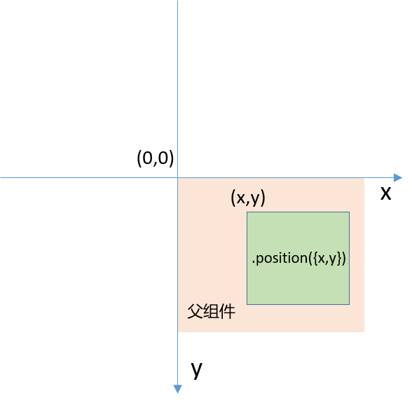
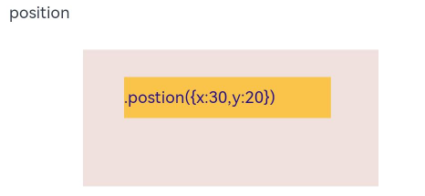
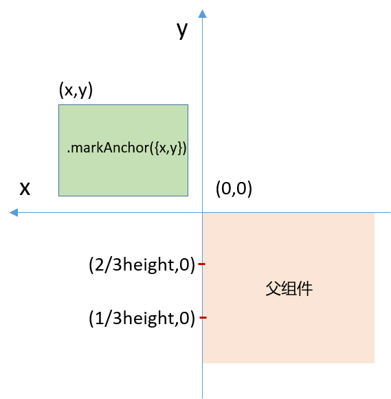
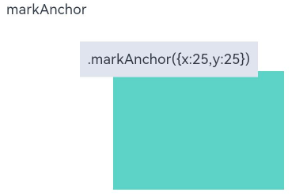
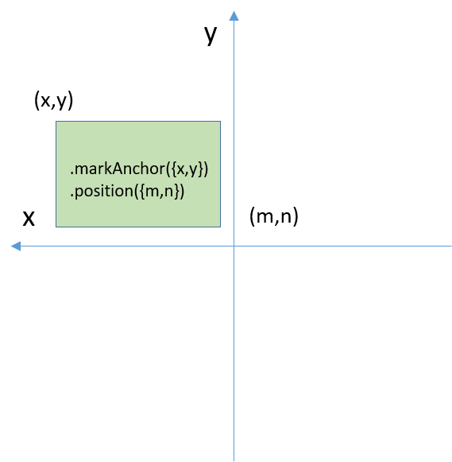
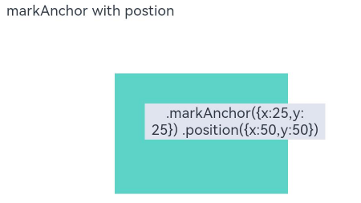
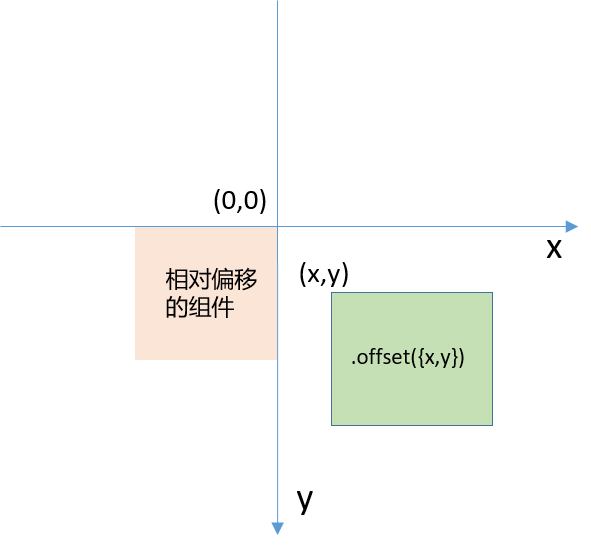
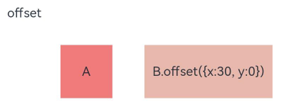

# 组件布局中相对定位的分类和使用

## 场景说明

OpenHarmony为开发者提供了丰富的组件布局能力，当开发者在布局时希望组件的位置不采用固定的对齐方式，就可以使用相对布局对组件进行精确定位。其中position、markAnchor、offset三种方式可以实现相对定位，开发者容易混淆，本文将结合图文和具体示例，为大家讲解三者的用法和区别。

## position

**使用语法：**
```js
组件.position({x,y})
```

开发者可以通过position属性来固定组件的位置。以父组件的左上角为坐标原点，添加了position属性的子组件左上角固定在参数x、y指定的坐标点。x，y均延坐标箭头方向递增。

参考坐标图如下（以x>0，y>0为例）：



**示例：**

本例在一个Row组件中添加一个Text子组件，如果希望Text组件相对于Row组件左上角向右下方偏移到（30,20）的位置，使用position实现的代码如下：
```js
Row() {
  Text('.postion({x:30,y:20})')
    ......
    .position({ x: 30, y: 20 })
}
......
```
示例图如下：



## markAnchor

**使用语法：**
```js
组件.markAnchor({x,y})
```

开发者也可以通过markAnchor属性对组件进行相对定位。markAnchor属性通常和position属性一起使用，也可以单独使用。

- 当单独使用markAnchor属性时，markAnchor的坐标系会随父组件中子组件对齐方式的变化而变化，当子组件为顶部对齐时，坐标系原点为父组件的左上角；当子组件居中对齐时，坐标系原点为父组件高度2/3处的顶点；当子组件底部对齐时，坐标系原点为父组件高度1/3处的顶点。
  添加了markAnchor属性的组件的左上角固定在参数x、y指定的坐标点，与position属性不同的是，x轴和y轴的递增方向相反。

  以父组件中子组件顶部对齐为例，参考坐标图如下（以x>0，y>0为例）：

    

  **示例:**

  本例在一个Column组件中添加一个Text子组件，由于Column组件默认子组件顶部对齐，所以坐标原点为Column组件的左上角。如果希望Text组件相对于Column组件左上角向左上方偏移到（25,25）的位置，使用markAnchor实现的代码如下：

    ```js
    Column() {
      Text('.markAnchor({x:25,y:25})')
        ......
        .markAnchor({ x: 25, y: 25 })
    }
    ......
    ```
  示例图如下：
  
    

- 当跟position属性一起使用时，此时会先以父组件的左上角为原点移动到position参数x，y指定的坐标点，然后以position中x，y的值为坐标原点，再将组件按照markAnchor中x，y的值进行移动。这里就体现出锚点的概念，position的位置即为锚点。
    >  **说明：**
    > 由于position的坐标系不受父组件中子组件的对齐方式影响，所以当和position属性一起使用时，markAnchor的坐标系也不受父组件中子组件的对齐方式影响。

    其坐标图如下（以x>0，y>0为例）：

    
    
    **示例:**

    本例在一个Stack组件中添加一个Text子组件，同时给Text组件添加position属性和markAnchor属性。Text组件会先采用position的坐标系，以Stack组件左上角为原点，移动到（50,50）的位置，再以（50,50）为坐标原点，采用markAnchor的坐标系移动到（25,25）的位置，代码如下：
    ```js
    Stack({ alignContent: Alignment.TopStart }) {
      Text('.markAnchor({x:25,y:25}) .position({x:50,y:50})')
        ......
        .markAnchor({ x: 25, y: 25 })
        .position({x:50,y:50})
    }
    ......
    ```
    示例图如下：

    

## offset

**使用语法：**
```js
组件.offset({x,y})
```

开发者可以通过offset属性设置组件相对于前一个组件的偏移量。添加了offset属性的组件以前一个组件的右上角为坐标原点进行偏移，其左上角偏移到（x，y）坐标点。x，y均延坐标箭头方向递增。

参考坐标图如下（以x>0，y>0为例）：



**示例：**

本例在一个Row组件中添加A、B两个Text子组件，如果希望B相对于A的左上角偏移到（30,0）的位置，使用offset实现的代码如下：
```js
Row() {
  Text('A')
    ......
  Text('B.offset({x:30, y:0})')
    .offset({ x: 30, y: 0 })
    ......
}.width('90%').height(50)
......
```

示例图如下：



## 参考
- [position/markAnchor/offset属性使用指导](../application-dev/reference/apis-arkui/arkui-ts/ts-universal-attributes-location.md)