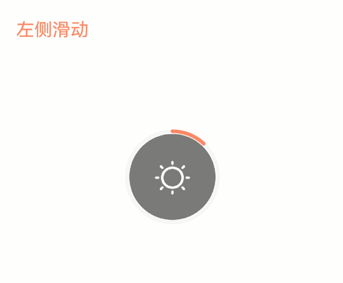

# 如何通过上下滑动实现亮度和音量调节

## 场景说明
在音视频应用中通常可以通过上下滑动来调节屏幕亮度和音量大小，本例即为大家介绍如何实现上述UI效果。

>  **说明：**
>
> 由于当前亮度和音量调节功能仅对系统应用开发，所以本例仅讲解UI效果的实现。


## 效果呈现
本例效果如下：
- 当在屏幕左侧滑动时，可以调节亮度，上滑亮度提升，下滑亮度降低。
- 当在屏幕右侧滑动时，可以调节音量，上滑音量增大，下滑音量减小。



## 环境要求

本例基于以下环境开发，开发者也可以基于其他适配的版本进行开发：

- IDE: DevEco Studio 4.0 Release
- SDK: Ohos_sdk_public 4.0.10.13 (API Version 10 Release)


## 实现思路
本例中几个关键的功能点及其实现思路如下：
- 区分屏幕左右两侧的滑动，从而使其触发不同效果：通过识别触摸点的坐标（event.fingerList[0].localX）来判断滑动是在左侧还是右侧。
- 区分滑动是上滑还是下滑：通过触摸点在Y轴方向的偏移量（event.offsetY）来识别上滑还是下滑。
- 上滑和下滑控制亮度和音量的大小：亮度和音量的大小使用环形进度条（Progress组件）来呈现，通过滑动改变Progress的value值。

## 开发步骤
开发步骤仅呈现关键代码，全量代码请参考完整代码章节；另外，开发者在运行时需要将本例中使用的图片等资源替换为本地资源。
1. 搭建UI框架。
    ```ts
    Column(){
      // 添加需要呈现的文本
      Row(){
        Text('左侧滑动')
        Text('右侧滑动')
      }
      Stack(){
        // 亮度调节UI
        Image($r('app.media.ic_brightness'))
        Progress({value:this.bright,type:ProgressType.Ring})
        // 音量调节UI
        Image($r('app.media.ic_volume'))
        Progress({value:this.volume,type:ProgressType.Ring})
      }
    }
    ```
2. 为Column组件添加触摸手势，并通过触摸点的坐标区分左侧滑动和右侧滑动。左右两侧的分界点可以根据屏幕尺寸自行设置，本例采用200为分界点。
    ```ts
    Column(){
    //...
    }
    .gesture(
      GestureGroup(GestureMode.Exclusive,
        // 添加触摸手势，并通过direction控制手势滑动方向为上下滑动
        PanGesture({direction:PanDirection.Vertical})
          .onActionUpdate((event?:GestureEvent)=>{
            // 通过event.fingerList[0].localX获取触摸点的横坐标
            this.fingerPosition = event.fingerList[0].localX

            // 当触摸点的横坐标>200时，判定触摸点在屏幕右侧，控制音量
            if (this.fingerPosition > 200){
              //...
            }
            // 当触摸点的横坐标<200时，判定触摸点在屏幕左侧，控制亮度
            if (this.fingerPosition < 200){
              //...
            }
          }),
      )
    )
    ```
3. 通过触摸点在Y轴方向的偏移量来识别上滑和下滑。
    ```ts
    Column(){
      // ...
    }
    .gesture(
      GestureGroup(GestureMode.Exclusive,
        PanGesture({direction:PanDirection.Vertical})
          .onActionUpdate((event?:GestureEvent)=>{
            this.fingerPosition = event.fingerList[0].localX
            // 当触摸点在Y轴方向的偏移量<0时，滑动方向为上滑
            if (event.offsetY < 0){
              // ...
            // 反之，滑动方向为上滑
            }else{
              // ...
            }
          }),
      )
    )
    ```
4. 手势识别之后，通过手势控制Progress的value值，从而调节亮度和音量的大小。
    ```ts
    Column(){
      // ...
      Stack(){
        // 亮度调节UI
        if (this.fingerPosition != 0 && this.fingerPosition < 200){
          // 通过变量bright控制亮度进度条的变化
          Progress({value:this.bright,type:ProgressType.Ring})
          // 音量调节UI
        }else if (this.fingerPosition != 0 && this.fingerPosition > 200){
          // 通过变量volume控制音量进度条的变化
          Progress({value:this.volume,type:ProgressType.Ring})
        }
      }
    }
    .gesture(
      GestureGroup(GestureMode.Exclusive,
        PanGesture({direction:PanDirection.Vertical})
          .onActionUpdate((event?:GestureEvent)=>{
            this.fingerPosition = event.fingerList[0].localX
            // 向上滑动
            if (event.offsetY < 0){
              // 触摸点在屏幕右侧
              if (this.volume < 100 && this.fingerPosition > 200){
                // 音量值增加
                this.volume += 1
              }
              // 触摸点在屏幕左侧
              if (this.bright < 100 && this.fingerPosition < 200){
                // 亮度值增加
                this.bright += 1
              }
            // 向下滑动
            }else{
              // 触摸点在屏幕右侧
              if (this.volume > 0 && this.fingerPosition > 200){
                // 音量值减小
                this.volume -= 1
              }
              // 触摸点在屏幕左侧
              if (this.bright > 0 && this.fingerPosition < 200){
                // 亮度值减小
                this.bright -= 1
              }
            }
          }),
      )
    )
    ```

## 完整代码

本例完整代码如下：

```ts
// xxx.ets
@Entry
@Component
struct ChangeVolume{
  @State volume:number = 0
  @State bright:number = 0
  @State fingerPosition:number = 0
  build(){
    Column(){
      // 添加需要呈现的文本
      Row(){
        if (this.fingerPosition != 0 && this.fingerPosition < 200){
          Text('左侧滑动')
            .fontColor('#FD836E')
            .fontSize(20)
            .textAlign(TextAlign.Start)
            .width('85%')
        }
        if (this.fingerPosition != 0 && this.fingerPosition > 200){
          Text('右侧滑动')
            .fontColor('#0AAF88')
            .fontSize(20)
            .textAlign(TextAlign.End)
            .align(Alignment.End)
            .width('100%')
        }
      }
      .width('90%')
      .height('50%')
      .alignItems(VerticalAlign.Bottom)
      Stack(){
        // 亮度调节UI
        if (this.fingerPosition != 0 && this.fingerPosition < 200){
          Image($r('app.media.ic_brightness'))
            .width(100)
            .aspectRatio(1.0)
          Progress({value:this.bright,type:ProgressType.Ring})
            .color('#FD836E')
            .width(105)
            .aspectRatio(1.0)
          // 音量调节UI
        }else if (this.fingerPosition != 0 && this.fingerPosition > 200){
          Image($r('app.media.ic_volume'))
            .width(100)
            .aspectRatio(1.0)
          Progress({value:this.volume,type:ProgressType.Ring})
            .color('#0AAF88')
            .width(105)
            .aspectRatio(1.0)
        }
      }
      .width('100%')
      .height('40%')
    }
    .width('100%')
    .height('100%')
    .gesture(
      GestureGroup(GestureMode.Exclusive,
        // 添加触摸手势，并通过direction控制手势滑动方向为上下滑动
        PanGesture({direction:PanDirection.Vertical})
          .onActionUpdate((event?:GestureEvent)=>{
            // 通过event.fingerList[0].localX获取触摸点的横坐标
            this.fingerPosition = event.fingerList[0].localX
            // 向上滑动
            if (event.offsetY < 0){
              // 触摸点在屏幕右侧
              if (this.volume < 100 && this.fingerPosition > 200){
                // 音量值增加
                this.volume += 1
              }
              // 触摸点在屏幕左侧
              if (this.bright < 100 && this.fingerPosition < 200){
                // 亮度值增加
                this.bright += 1
              }
            // 向下滑动
            }else{
              // 触摸点在屏幕右侧
              if (this.volume > 0 && this.fingerPosition > 200){
                // 音量值减小
                this.volume -= 1
              }
              // 触摸点在屏幕左侧
              if (this.bright > 0 && this.fingerPosition < 200){
                // 亮度值减小
                this.bright -= 1
              }
            }
          }),
      )
    )
  }
}
```

## 参考
- [Progress组件指南](../application-dev/reference/apis-arkui/arkui-ts/ts-basic-components-progress.md)
- [PanGesture手势指南](../application-dev/reference/apis-arkui/arkui-ts/ts-basic-gestures-pangesture.md)
- [GestureEvent手势对象说明](../application-dev/reference/apis-arkui/arkui-ts/ts-gesture-common.md#gestureevent对象说明)