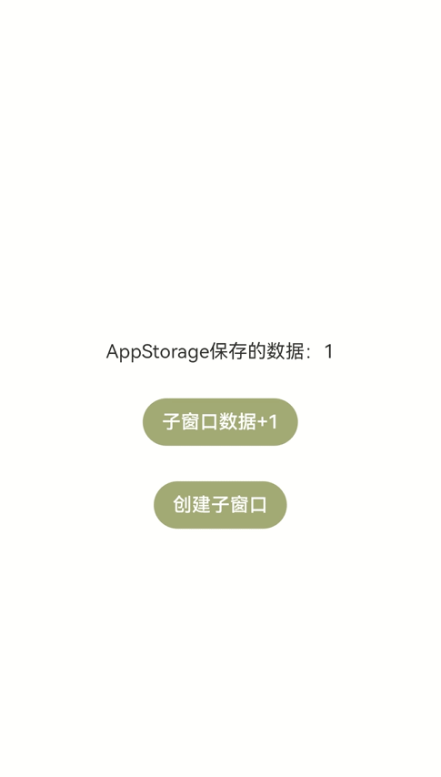

# 如何创建子窗口并与主窗口通信

## 场景介绍
应用开发过程中，经常需要创建弹窗（子窗口）用来承载跟当前内容相关的业务，比如电话应用的拨号弹窗；阅读应用中长按当前内容触发的编辑弹窗；购物应用经常出现的抽奖活动弹窗等。
本文为大家介绍如何创建子窗口并实现子窗口与主窗口的数据通信。

## 效果呈现
本例最终效果如下：



## 环境要求
本例基于以下环境开发，开发者也可以基于其他适配的版本进行开发：

- IDE: DevEco Studio 4.0 Beta1
- SDK: Ohos_sdk_public 4.0.7.5 (API Version 10 Beta1)


## 实现思路
本例关键特性及实现方案如下：
- 点击“创建子窗口”按钮创建子窗口：使用window模块的createSubWindow方法创建子窗口，在创建时设置子窗口的大小、位置、内容等。
- 子窗口可以拖拽：通过gesture属性为子窗口绑定PanGesture拖拽事件，使用moveWindowTo方法将窗口移动到拖拽位置，呈现拖拽效果。
- 点击主窗口的“子窗口数据+1”按钮，子窗口中的数据加1，反之亦然，即实现主窗口和子窗口间的数据通信：将数据变量存储在AppStorage中，在主窗口和子窗口中引用该数据，并通过@StorageLink与AppStorage中的数据进行双向绑定，从而实现主窗口和子窗口之间的数据联动。
>  **说明：**
> 本文使用AppStorage实现主窗口和子窗口之间的数据传递，除此之外，Emitter和EventHub等方式也可以实现，开发者可以根据实际业务需要进行选择。


## 开发步骤
由于本例重点讲解子窗口的创建以及主窗口和子窗口之间的通信，所以开发步骤会着重讲解相关内容的开发，其余内容不做赘述，全量代码可参考完整代码章节。
1. 创建子窗口。
    使用createSubWindow方法创建名为“hiSubWindow”的子窗口，并设置窗口的位置、大小、显示内容。将创建子窗口的动作放在自定义成员方法showSubWindow()中，方便后续绑定到按钮上。具体代码如下：
    ```ts
    showSubWindow() {
        // 创建应用子窗口。
        this.windowStage.createSubWindow("hiSubWindow", (err, data) => {
          if (err.code) {
            console.error('Failed to create the subwindow. Cause: ' + JSON.stringify(err));
            return;
          }
          this.sub_windowClass = data;
          console.info('Succeeded in creating the subwindow. Data: ' + JSON.stringify(data));
          // 子窗口创建成功后，设置子窗口的位置
          this.sub_windowClass.moveWindowTo(300, 300, (err) => {
            if (err.code) {
              console.error('Failed to move the window. Cause:' + JSON.stringify(err));
              return;
            }
            console.info('Succeeded in moving the window.');
          });
          // 设置子窗口的大小
          this.sub_windowClass.resize(350, 350, (err) => {
            if (err.code) {
              console.error('Failed to change the window size. Cause:' + JSON.stringify(err));
              return;
            }
            console.info('Succeeded in changing the window size.');
          });
          // 为子窗口加载对应的目标页面。
          this.sub_windowClass.setUIContent("pages/SubWindow",(err) => {
            if (err.code) {
              console.error('Failed to load the content. Cause:' + JSON.stringify(err));
              return;
            }
            console.info('Succeeded in loading the content.');
            // 显示子窗口。
            this.sub_windowClass.showWindow((err) => {
              if (err.code) {
                console.error('Failed to show the window. Cause: ' + JSON.stringify(err));
                return;
              }
              console.info('Succeeded in showing the window.');
            });
            this.sub_windowClass.setWindowBackgroundColor('#E8A027')
          });
        })
      }
    ```
2. 实现子窗口可拖拽。
    为页面内容绑定PanGesture拖拽事件，拖拽事件发生时获取到触摸点的位置信息，使用@Watch监听到位置变量的变化，然后调用窗口的moveWindowTo方法将窗口移动到对应位置，从而实现拖拽效果。

    具体代码如下：
    ```ts
    import window from '@ohos.window';

    interface Position {
      x: number,
      y: number
    }

    @Entry
    @Component
    struct SubWindow{
      ...
      // 创建位置变量，并使用@Watch监听，变量发生变化调用moveWindow方法移动窗口
      @State @Watch("moveWindow") windowPosition: Position = { x: 0, y: 0 };
      private panOption: PanGestureOptions = new PanGestureOptions({ direction: PanDirection.All });
      private subWindow: window.Window
      // 通过悬浮窗名称“hiSubWindow”获取到创建的悬浮窗
      aboutToAppear() {
        this.subWindow = window.findWindow("hiSubWindow")
      }
      // 将悬浮窗移动到指定位置
      moveWindow() {
        this.subWindow.moveWindowTo(this.windowPosition.x, this.windowPosition.y);
      }

      build(){
        Column(){
          Text(`AppStorage保存的数据：${this.storData}`)
            .fontSize(12)
            .margin({bottom:10})
          Button('主窗口数据+1')
            .fontSize(12)
            .backgroundColor('#A4AE77')
            .onClick(()=>{
              this.storData += 1
            })
        }
        .height('100%')
        .width('100%')
        .alignItems(HorizontalAlign.Center)
        .justifyContent(FlexAlign.Center)
        .gesture(
          PanGesture(this.panOption)
            .onActionStart((event: GestureEvent) => {
              console.info('Pan start');
            })
            // 发生拖拽时，获取到触摸点的位置，并将位置信息传递给windowPosition
            .onActionUpdate((event: GestureEvent) => {
              this.windowPosition.x += event.offsetX;
              this.windowPosition.y += event.offsetY;
            })
            .onActionEnd(() => {
              console.info('Pan end');
            })
        )
      }
    }
    ```
3. 实现主窗口和子窗口间的数据通信。本例中即实现点击主窗口的“子窗口数据+1”按钮，子窗口中的数据加1，反之亦然。本例使用应用全局UI状态存储AppStorage来实现对应效果。
    - 在创建窗口时触发的onWindowStageCreate回调中将自定义数据变量“data”存入AppStorage。
        ```ts
        onWindowStageCreate(windowStage: window.WindowStage) {
            // 将自定义数据变量“data”存入AppStorage
            AppStorage.SetOrCreate('data', 1);
            ...
            windowStage.loadContent('pages/Index', (err, data) => {
              if (err.code) {
                hilog.error(0x0000, 'testTag', 'Failed to load the content. Cause: %{public}s', JSON.stringify(err) ?? '');
                return;
              }
              hilog.info(0x0000, 'testTag', 'Succeeded in loading the content. Data: %{public}s', JSON.stringify(data) ?? '');
            });
          }
        ```
    - 在主窗口中定义变量“storData”，并使用@StorageLink将其与AppStorage中的变量“data”进行双向绑定，这样一来，“mainData”的变化可以传导至“data”，并且该变化可以被UI框架监听到，从而完成UI状态刷新。
        ```ts
        ...
        // 使用@StorageLink将"mainData"与AppStorage中的变量"data"进行双向绑定
        @StorageLink('data') mainData: number = 1;
        ...
        build() {
            Row() {
              Column() {
                Text(`AppStorage保存的数据：${this.mainData}`)
                  .margin({bottom:30})
                Button('子窗口数据+1')
                  .backgroundColor('#A4AE77')
                  .margin({bottom:30})
                  .onClick(()=>{
                    // 点击，storData的值加1
                    this.mainData += 1
                  })
              ...
              }
              .width('100%')
            }
            .height('100%')
          }
        ```
    - 在子窗口中定义变量“subData”，并使用@StorageLink将其与AppStorage中的变量“data”进行双向绑定。由于主窗口的“mainData”也与“data”进行了绑定，因此，“mainData”的值可以通过“data”传递给“subData”，反之亦然。这样就实现了主窗口和子窗口之间的数据同步。
        ```ts
        ...
        // 使用@StorageLink将"subData"与AppStorage中的变量"data"进行双向绑定
          @StorageLink('data') subData: number = 1;
        ...
          build(){
            Column(){
              Text(`AppStorage保存的数据：${this.subData}`)
                .fontSize(12)
                .margin({bottom:10})
              Button('主窗口数据+1')
                .fontSize(12)
                .backgroundColor('#A4AE77')
                .onClick(()=>{
                  // 点击，subData的值加1
                  this.subData += 1
                })
            }
            ...
          }
        ```

## 完整代码
本例完整代码如下：
EntryAbility文件代码：
```ts
// EntryAbility.ts
import AbilityConstant from '@ohos.app.ability.AbilityConstant';
import hilog from '@ohos.hilog';
import UIAbility from '@ohos.app.ability.UIAbility';
import Want from '@ohos.app.ability.Want';
import window from '@ohos.window';

let sub_windowClass = null;
export default class EntryAbility extends UIAbility {

  destroySubWindow() {
    // 销毁子窗口。当不再需要子窗口时，可根据具体实现逻辑，使用destroy对其进行销毁。
    sub_windowClass.destroyWindow((err) => {
      if (err.code) {
        console.error('Failed to destroy the window. Cause: ' + JSON.stringify(err));
        return;
      }
      console.info('Succeeded in destroying the window.');
    });
  }

  onCreate(want: Want, launchParam: AbilityConstant.LaunchParam) {

    hilog.info(0x0000, 'testTag', '%{public}s', 'Ability onCreate');
  }

  onDestroy() {
    hilog.info(0x0000, 'testTag', '%{public}s', 'Ability onDestroy');
  }

  onWindowStageCreate(windowStage: window.WindowStage) {
    // 将自定义数据变量“data”存入AppStorage
    AppStorage.SetOrCreate('data', 1);
    AppStorage.SetOrCreate('window', windowStage);
    // 为主窗口添加加载页面
    hilog.info(0x0000, 'testTag', '%{public}s', 'Ability onWindowStageCreate');

    windowStage.loadContent('pages/Index', (err, data) => {
      if (err.code) {
        hilog.error(0x0000, 'testTag', 'Failed to load the content. Cause: %{public}s', JSON.stringify(err) ?? '');
        return;
      }
      hilog.info(0x0000, 'testTag', 'Succeeded in loading the content. Data: %{public}s', JSON.stringify(data) ?? '');
    });
  }

  onWindowStageDestroy() {
    this.destroySubWindow();
    hilog.info(0x0000, 'testTag', '%{public}s', 'Ability onWindowStageDestroy');
  }

  onForeground() {
    hilog.info(0x0000, 'testTag', '%{public}s', 'Ability onForeground');
  }

  onBackground() {
    hilog.info(0x0000, 'testTag', '%{public}s', 'Ability onBackground');
  }
}
```
主窗口代码：
```ts
// Index.ets
import window from '@ohos.window';

@Entry
@Component
struct Index {
  // 使用@StorageLink将"mainData"与AppStorage中的变量"data"进行双向绑定
  @StorageLink('data') mainData: number = 1;
  @StorageLink('window') storWindow:window.WindowStage = null
  private windowStage = this.storWindow
  private sub_windowClass = null

  showSubWindow() {
    // 创建应用子窗口。
    this.windowStage.createSubWindow("hiSubWindow", (err, data) => {
      if (err.code) {
        console.error('Failed to create the subwindow. Cause: ' + JSON.stringify(err));
        return;
      }
      this.sub_windowClass = data;
      console.info('Succeeded in creating the subwindow. Data: ' + JSON.stringify(data));
      // 子窗口创建成功后，设置子窗口的位置、大小及相关属性等。
      this.sub_windowClass.moveWindowTo(300, 300, (err) => {
        if (err.code) {
          console.error('Failed to move the window. Cause:' + JSON.stringify(err));
          return;
        }
        console.info('Succeeded in moving the window.');
      });
      this.sub_windowClass.resize(350, 350, (err) => {
        if (err.code) {
          console.error('Failed to change the window size. Cause:' + JSON.stringify(err));
          return;
        }
        console.info('Succeeded in changing the window size.');
      });
      // 为子窗口加载对应的目标页面。
      this.sub_windowClass.setUIContent("pages/SubWindow",(err) => {
        if (err.code) {
          console.error('Failed to load the content. Cause:' + JSON.stringify(err));
          return;
        }
        console.info('Succeeded in loading the content.');
        // 显示子窗口。
        this.sub_windowClass.showWindow((err) => {
          if (err.code) {
            console.error('Failed to show the window. Cause: ' + JSON.stringify(err));
            return;
          }
          console.info('Succeeded in showing the window.');
        });
        this.sub_windowClass.setWindowBackgroundColor('#E8A027')
      });
    })
  }

  build() {
    Row() {
      Column() {
        Text(`AppStorage保存的数据：${this.mainData}`)
          .margin({bottom:30})
        Button('子窗口数据+1')
          .backgroundColor('#A4AE77')
          .margin({bottom:30})
          .onClick(()=>{
            // 点击，storData的值加1
            this.mainData += 1
          })
        Button('创建子窗口')
          .backgroundColor('#A4AE77')
          .onClick(()=>{
            // 点击弹出子窗口
            this.showSubWindow()
          })
      }
      .width('100%')
    }
    .height('100%')
  }
}
```
子窗口代码：
```ts
// SubWindow.ets
import window from '@ohos.window';

interface Position {
  x: number,
  y: number
}

@Entry
@Component
struct SubWindow{
  // 使用@StorageLink将"subData"与AppStorage中的变量"data"进行双向绑定
  @StorageLink('data') subData: number = 1;
  // 创建位置变量，并使用@Watch监听，变量发生变化调用moveWindow方法移动窗口
  @State @Watch("moveWindow") windowPosition: Position = { x: 0, y: 0 };
  private panOption: PanGestureOptions = new PanGestureOptions({ direction: PanDirection.All });
  private subWindow: window.Window
  // 通过悬浮窗名称“hiSubWindow”获取到创建的悬浮窗
  aboutToAppear() {
    this.subWindow = window.findWindow("hiSubWindow")
  }
  // 将悬浮窗移动到指定位置
  moveWindow() {
    this.subWindow.moveWindowTo(this.windowPosition.x, this.windowPosition.y);
  }

  build(){
    Column(){
      Text(`AppStorage保存的数据：${this.subData}`)
        .fontSize(12)
        .margin({bottom:10})
      Button('主窗口数据+1')
        .fontSize(12)
        .backgroundColor('#A4AE77')
        .onClick(()=>{
          // 点击，subData的值加1
          this.subData += 1
        })
    }
    .height('100%')
    .width('100%')
    .alignItems(HorizontalAlign.Center)
    .justifyContent(FlexAlign.Center)
    .gesture(
      PanGesture(this.panOption)
        .onActionStart((event: GestureEvent) => {
          console.info('Pan start');
        })
        // 发生拖拽时，获取到触摸点的位置，并将位置信息传递给windowPosition
        .onActionUpdate((event: GestureEvent) => {
          this.windowPosition.x += event.offsetX;
          this.windowPosition.y += event.offsetY;
        })
        .onActionEnd(() => {
          console.info('Pan end');
        })
    )
  }
}
```
## 参考
- [窗口开发](../application-dev/windowmanager/application-window-stage.md)
- [AppStorage：应用全局的UI状态存储](../application-dev/ui/state-management/arkts-appstorage.md)