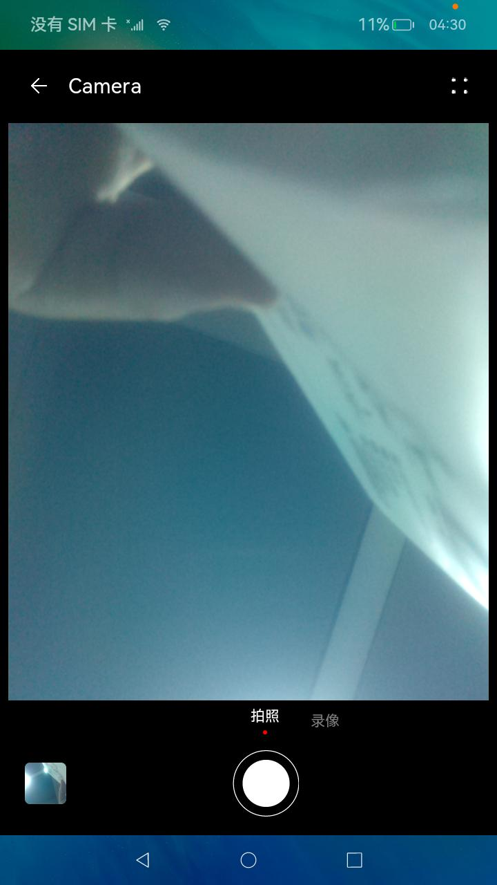

# 如何调用设备摄像头进行拍照、预览并将拍摄结果保存在媒体库中

## 场景说明

调用设备摄像头进行拍照、预览是许多应用开发过程中都需要的功能。在拍照完成时显示照片预览图可以确认拍摄的照片是否达到预期，本例将为大家介绍如何实现上述功能。

## 效果呈现

本例效果如下：

|                             拍照                             |                             预览                             |
| :----------------------------------------------------------: | :----------------------------------------------------------: |
|  |  |


## 运行环境

本例基于以下环境开发，开发者也可以基于其他适配的版本进行开发。

- IDE：DevEco Studio 4.0.0.201 Beta1
- SDK：Ohos_sdk_public 4.0.7.5 (API Version 10 Beta1)

## 实现思路

本例使用@ohos.multimedia.camera接口实现相机示例的主要功能：拍照、预览；

- 拍照：XComponent组件负责绘制摄像头画面呈现的窗口，其onload事件调用cameraModel.ts的initCamera方法初始化相机功能输出画面信息。拍照动作使用Image组件实现，其onclick事件调用cameraModel.ts的takepicture方法开始拍照。

- 预览：返回相机界面点击底部左侧预览图可进入相册应用，可以在其中查看照片和录制的视频。

## 开发步骤

1. 申请所需权限

   在model.json5中添加以下配置：

   ```json
   "requestPermissions": [
         {
           "name": "ohos.permission.CAMERA"//允许应用使用相机拍摄照片和录制视频
         },
         {
           "name": "ohos.permission.MICROPHONE"//允许应用使用麦克风
         },
         {
           "name": "ohos.permission.MEDIA_LOCATION"//允许应用访问用户媒体文件中的地理位置信息
         },
         {
           "name": "ohos.permission.WRITE_MEDIA"//允许应用读写用户外部存储中的媒体文件信息
         },
         {
           "name": "ohos.permission.READ_MEDIA"//允许应用读取用户外部存储中的媒体文件信息
         }
       ]
   ```

2. 创建绘制组件XComponent以输出摄像头获取的画面，其绑定的onload方法中设定了画幅的大小。

   ```typescript
   build() {
       Column() {
         Title()
           .visibility(this.isTitleShow ? Visibility.Visible : Visibility.None) 
         Stack({ alignContent: Alignment.Bottom }) {
           Stack({ alignContent: Alignment.TopStart }) {
             XComponent({
               id: 'componentId',
               type: 'surface',
               controller: this.mXComponentController  //将控制器绑定至XComponent组件
             })
               .onLoad(() => {
                 this.mXComponentController.setXComponentSurfaceSize({ surfaceWidth: 640, surfaceHeight: 480 });//设置surface大小
                 this.surfaceId = this.mXComponentController.getXComponentSurfaceId();
                 this.currentModel = CameraMode.modePhoto; 
                 this.cameraModel.initCamera(this.surfaceId); //调用model/cameraModel.ts初始化相机功能
               })
               .width('100%')
               .height('100%')
               .margin({ bottom: 152 })
               Column() {
           }
           .width('97%')
           .height('100%')
   ```

3. 初始化相机功能

   initCamera方法通过创建相机管理器实例cameraMgr来创建画面输出对象previewOutput。cameraMgr再通过创建CaptureSession实例来配置会话，完成相机功能的准备工作。

   ```typescript
   import image from '@ohos.multimedia.image';//自@ohos.multimedia.image引入image，提供图片处理效果
   ...
   private receiver: image.ImageReceiver = undefined;//图像接收类，用于获取组件surface id，接收最新的图片和读取下一张图片
   ...
   constructor() {
       this.mediaModel = MediaModel.getMediaInstance();//通过调用model/MediaModel.ets中的方法创建mediaInstance类mediaModel
       //创建ImageReceiver实例receiver
       this.receiver = image.createImageReceiver(
         cameraWH.width,
         cameraWH.height,
         FOUR,
         EIGHT
       );
       //接收图片时注册回调
       this.receiver.on('imageArrival', () => {
          //从ImageReceiver读取下一张图片
         this.receiver.readNextImage((err, image) => {
           if (err || image === undefined) {
             return;
           }
           //根据图像的组件类型从图像中获取组件缓存 
           image.getComponent(FOUR, (errMsg, img) => {
             if (errMsg || img === undefined) {
               return;
             }
             let buffer = new ArrayBuffer(FOUR_THOUSAND_AND_SIXTY_NINE);
             if (img.byteBuffer) {
               buffer = img.byteBuffer;
             } 
             this.saveImage(buffer, image);
           });
         });
       });
     }
   
   
   async initCamera(surfaceId: string): Promise<void> {
       ...
       try {
         this.cameraMgr = camera.getCameraManager(globalThis.cameraContext);//获取相机管理器实例
       } 
       this.camerasArray = this.cameraMgr.getSupportedCameras();//获取支持指定的相机设备对象
       if (this.camerasArray.length === 0) {
         return;
       }
       let mCamera = this.camerasArray[0];
       this.cameraInput = this.cameraMgr.createCameraInput(mCamera);
       this.cameraInput.open();
       this.capability = this.cameraMgr.getSupportedOutputCapability(mCamera);//查询相机设备支持的输出能力
       let previewProfile = this.capability.previewProfiles[0];
   	//通过相机管理器创建预览输出对象
       this.previewOutput = this.cameraMgr.createPreviewOutput(
         previewProfile,												
         surfaceId												//surfaceId从XComponent组件获取
       );
       let rSurfaceId = await this.receiver.getReceivingSurfaceId();//获取一个surface id供其他组件使用
       let photoProfile = this.capability.photoProfiles[0];
   	//通过相机管理器创建照片输出对象
       this.photoOutPut = this.cameraMgr.createPhotoOutput(
         photoProfile,
         rSurfaceId										//rSurfaceId通过构造函数中定义的图像接收类receiver获取
       );
       this.capSession = this.cameraMgr.createCaptureSession();//创建CaptureSession实例
       this.capSession.beginConfig();//开始配置会话
       this.capSession.addInput(this.cameraInput);//将cameraInput加入会话
       this.capSession.addOutput(this.previewOutput);//将预览输出加入会话
       this.capSession.addOutput(this.photoOutPut);//将照片输出加入会话
       await this.capSession.commitConfig();//提交配置信息
       await this.capSession.start();//开始输出
     }
   
   ```

4. 点击按钮进行拍照

   拍照按钮通过Image组件呈现，其绑定的onClick方法调用takePicture方法开始拍照。

   ```typescript
   Image(this.getCameraIcon())
                 .size({ width: 64, height: 64 })
                 .margin({ left: 10 })
                 .id('camera')
                 .onClick(() => {
                   if (this.currentModel === CameraMode.modePhoto) {
                     prompt.showToast({ message: '拍照中...', duration: 200 });
                     this.cameraModel.takePicture();//调用model/cameraModel.takePicture()开始拍照
                   } 
                 })
   ```

5. 拍照功能具体实现

   - 拍照

     ```typescript
     async takePicture(): Promise<void> {
         //设置拍照相关参数
         let photoSettings = {
           rotation: this.imageRotation,
           quality: camera.QualityLevel.QUALITY_LEVEL_MEDIUM,
           location: {
             // 位置信息，经纬度
             latitude: 12.9698,
             longitude: 77.75,
             altitude: 1000,
           },
           mirror: false,
         };
         await this.photoOutPut.capture(photoSettings);
         AppStorage.Set('isRefresh', true);
       }
     ```

   - 保存图片

     saveImage方法使用MediaModel中的createAndGetUri方法创建Image类型资源，将拍摄到的照片写入到这个资源中去。

     ```typescript
     //model/MediaModel.ts中定义的负责保存图片的相关方法
     async createAndGetUri(mediaType: mediaLibrary.MediaType): Promise<mediaLibrary.FileAsset> {
         let dateTimeUtil: DateTimeUtil = new DateTimeUtil();
         let info: FileInfo = this.getInfoFromMediaType(mediaType);
         let name: string = `${dateTimeUtil.getDate()}_${dateTimeUtil.getTime()}`;//获取当前时间
         let displayName: string = `${info.prefix}${name}${info.suffix}`;
     	//获取公共目录路径。
         let publicPath: string = await this.mediaLibraryTest.getPublicDirectory(
           info.directory
         );//通过引用自@ohos.multimedia.mediaLibrary的mediaLibraryTest类创建媒体资源，其中定义了媒体类型、名称、路径。
         let fileAsset: mediaLibrary.FileAsset = await this.mediaLibraryTest.createAsset(
           mediaType,//根据传入函数createAndGetUri的mediaType参数决定创建什么类型的媒体资源
           displayName,
           publicPath
         );
         return fileAsset;
       }
       async getFdPath(fileAsset: mediaLibrary.FileAsset): Promise<number> {
         let fd: number = await fileAsset.open('Rw');//打开当前文件
         return fd;
       }
     ...
     
     async saveImage(buffer: ArrayBuffer, img: image.Image): Promise<void> {
         this.fileAsset = await this.mediaModel.createAndGetUri(mediaLibrary.MediaType.IMAGE);
     	//通过调用MediaModel中的方法创建Image类型资源
         this.photoPath = this.fileAsset.uri;
         this.fd = await this.mediaModel.getFdPath(this.fileAsset);
         await fileIo.write(this.fd, buffer);//将拍摄的照片写入到Mediamodel传回的资源中去
         await this.fileAsset.close(this.fd);//释放open函数
         await img.release();
         if (this.takePictureHandle) {
           this.takePictureHandle(this.photoPath);
         }
       }
     ```

## 全部代码

本例完整代码sample示例链接：[相机](https://gitee.com/openharmony/applications_app_samples/tree/master/code/SystemFeature/Media/Camera)

## 参考

- [权限列表](https://gitee.com/openharmony/docs/blob/master/zh-cn/application-dev/security/AccessToken/permissions-for-all.md#ohospermissiondistributed_datasync)
- [@ohos.multimedia.camera](../application-dev/reference/apis-camera-kit/js-apis-camera.md)


