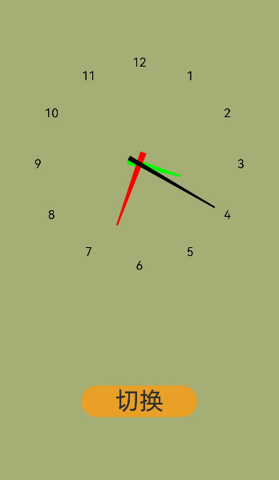

# 时钟开发
## 场景介绍
常见的时钟呈现方式有两种，一种是表盘方式，一种是数字方式。用户可根据个人喜好在两种形式间进行切换。本例即为大家讲解如何开发上述两种钟表样式，以供参考。
## 效果呈现
本例最终效果如下：



## 运行环境
本例基于以下环境开发，开发者也可以基于其他适配的版本进行开发：
- IDE: DevEco Studio 3.1 Beta2
- SDK: Ohos_sdk_public 3.2.11.9 (API Version 9 Release)
## 实现思路
- 表盘方式的展示：通过Canvas组件提供画布;在画布上，通过CanvasRenderingContext2D对象使用RenderingContext在Canvas组件上进行绘制，绘制表盘上的数字、时针、分针、秒针。表盘上数字的分布使用fillText绘制填充类文本并确定其在画布上位置；表盘上时针的运动通过theta的角度决定时针的移动；分针和秒针同上。
- 数字时间方式的展示：使用TextClock组件通过文本将系统时间显示在设备上。
## 开发步骤
根据上述思路，具体实现步骤如下：
1. 表盘方式：通过CanvasRenderingContext2D对象使用RenderingContext在Canvas组件上进行绘制，绘制表盘上的数字、时针、分针、秒针。
    首先，创建画布，具体代码如下：
    ```ts
    // clock ets
    clear() { // clear canvas function
      this.ctx.clearRect(0, 0, 360, 500);
    }
    drawScene() { // main drawScene function 绘制场景
      this.clear(); // clear canvas
    ...
    build() {
      Column({ space: 5 }) {
        Canvas(this.ctx)
          .width(360)
          .height(500)
          .border({ width: 1, color: '#ffff00'})
          .onReady(() => {
            setInterval(() => {
              this.drawScene()
            }, 1000)
          })
          ...
      }
    } 
    ```
    声明相关变量，具体代码如下：
    ```ts
    // clock ets
    let date = new Date();
    let hours = date.getHours();
    let minutes = date.getMinutes();
    let seconds = date.getSeconds();
    hours = hours > 12 ? hours - 12 : hours;
    let hour = hours + minutes / 60;
    let minute = minutes + seconds / 60;
    ```
    使用fillText方法绘制表盘数字并确定其位置
    ```ts
    // clock ets
    ...
    // draw numbers
    this.ctx.font = '36px Arial'; //文本尺寸
    this.ctx.fillStyle = '#000';   //指定绘制的填充色
    this.ctx.textAlign = 'center'; // 文本对齐
    this.ctx.textBaseline = 'middle'; //文本基线
    for (let n = 0; n < 12; n++) {
      let theta = (n - 2) * (Math.PI * 2) / 12;
      let x = clockRadius * 0.7 * Math.cos(theta);
      let y = clockRadius * 0.7 * Math.sin(theta);
      this.ctx.fillText(`${n + 1}`, x, y);  // 表盘数字所在的位置
    ...
    ```
    时针的移动路径，具体代码如下：
    ```ts
    // clock ets
    ...
    // draw hour
    this.ctx.save(); //将当前状态放入栈中，保存canvas的全部状态，通常在需要保存绘制状态时调用
    let theta = (hour - 3) * 2 * Math.PI / 12;
    this.ctx.rotate(theta); //顺时针旋转
    this.ctx.beginPath(); //创建一个新的绘制路径
    this.ctx.moveTo(-15, -5); //绘制时针组件 起始点
    this.ctx.lineTo(-15, 5);
    this.ctx.lineTo(clockRadius * 0.3, 1);
    this.ctx.lineTo(clockRadius * 0.3, -1); //绘制时针组件 终点
    this.ctx.fillStyle = 'green';
    this.ctx.fill();
    this.ctx.restore(); //对保存的绘图上下文进行恢复
    ...
    ```
    分针的移动路径，具体代码如下：
    ```ts
    // clock ets
    ...
    // draw minute
    this.ctx.save();
    theta = (minute - 15) * 2 * Math.PI / 60;
    this.ctx.rotate(theta); //顺时针旋转
    this.ctx.beginPath(); //创建一个新的绘制路径
    this.ctx.moveTo(-15, -4);//绘制分针组件 起始点
    this.ctx.lineTo(-15, 4);
    this.ctx.lineTo(clockRadius * 0.45, 1);
    this.ctx.lineTo(clockRadius * 0.45, -1);//绘制分针组件 终点
    this.ctx.fillStyle = 'red';
    this.ctx.fill();
    this.ctx.restore(); //对保存的绘图上下文进行恢复
    ...
    ```
    秒针的移动路径，具体代码如下：
    ```ts
    // clock ets
    ...
    // draw second
    this.ctx.save();
    theta = (seconds - 15) * 2 * Math.PI / 60;
    this.ctx.rotate(theta); //顺时针旋转
    this.ctx.beginPath(); //创建一个新的绘制路径
    this.ctx.moveTo(-15, -3);//绘制秒针组件 起始点
    this.ctx.lineTo(-15, 3);
    this.ctx.lineTo(clockRadius * 0.6, 1);
    this.ctx.lineTo(clockRadius * 0.6, -1);//绘制秒针组件 终点
    this.ctx.fillStyle = 'black';
    this.ctx.fill();
    this.ctx.restore(); //对保存的绘图上下文进行恢复
    ...
    ```
2. 时钟方式的转换：通过Button组件中的onClick事件进行切换页面。
    从表盘方式往数字方式转换，具体代码如下：
    ```ts
    // clock.ets
    ...
    Button(){
      Text("切换")
        .fontSize(30)
        .fontWeight(FontWeight.Regular)
    }
    .type(ButtonType.Capsule)
    .margin({top:20
    })
    .backgroundColor("red")
    .width('40%')
    .height('5%')
    .onClick(()=>{
      router.pushUrl({url:'pages/Index1'})
    })
    ...
    ```
    从数字时间方式往表盘方式转换，具体代码如下：
    ```ts
    // TextClock.ets
    ...
    Button() {
      Text("切换")
        .fontSize(30)
        .fontWeight(FontWeight.Regular)
    }
    .type(ButtonType.Capsule)
    .margin({ top: 20
    })
    .backgroundColor("red")
    .width('40%')
    .height('5%')
    .onClick(() => {
      router.back()
    })
    ...
    ```
3. 数字时间方式：使用TextClock组件通过文本将当前系统时间显示在设备上。
    具体代码如下：
    ```ts
    // TextClock.ets
    import router from '@ohos.router'
    @Entry
    @Component
    struct Second {
      @State accumulateTime: number = 0
      // 导入对象
      controller: TextClockController = new TextClockController()
    
      build() {
        Flex({ direction: FlexDirection.Column, alignItems: ItemAlign.Center, justifyContent: FlexAlign.Center }) {
          TextClock({ timeZoneOffset: -8, controller: this.controller })
            .format('hms') //数字时间格式
            .onDateChange((value: number) => {
              this.accumulateTime = value
            })
            .margin(20)
            .fontSize(30)
            ...
        }
      }
    }
    ```
## 完整代码
完整示例代码如下：
表盘时钟代码页
```ts
// clock.ets
import router from '@ohos.router';
const clockRadius = 180;

@Entry
@Component
struct Test10 {
  private settings: RenderingContextSettings = new RenderingContextSettings(true);
  private ctx: CanvasRenderingContext2D = new CanvasRenderingContext2D(this.settings);

  // 绘制函数
  clear() {
    this.ctx.clearRect(0, 0, 360, 500);
  }
  drawScene() { // 绘制场景
    this.clear(); // 清空画布
    // 获取当前时间
    let date = new Date();
    let hours = date.getHours();
    let minutes = date.getMinutes();
    let seconds = date.getSeconds();
    hours = hours > 12 ? hours - 12 : hours;
    let hour = hours + minutes / 60;
    let minute = minutes + seconds / 60;
    this.ctx.save();
    this.ctx.translate(360 / 2, 500 / 2);
    this.ctx.beginPath(); //创建一个新的绘制路径

    // 绘制表盘数字
    this.ctx.font = '45px Arial'; //文本尺寸
    this.ctx.fillStyle = '#000';   //指定绘制的填充色
    this.ctx.textAlign = 'center'; // 文本对齐
    this.ctx.textBaseline = 'middle'; //文本基线
    for (let n = 0; n < 12; n++) {
      let theta = (n - 2) * (Math.PI * 2) / 12;
      let x = clockRadius * 0.7 * Math.cos(theta);
      let y = clockRadius * 0.7 * Math.sin(theta);
      this.ctx.fillText(`${n + 1}`, x, y);  // 表盘数字所在的位置
    }

    // 绘制时针
    this.ctx.save(); //将当前状态放入栈中，保存canvas的全部状态，通常在需要保存绘制状态时调用
    let theta = (hour - 3) * 2 * Math.PI / 12;
    this.ctx.rotate(theta); //顺时针旋转
    this.ctx.beginPath(); //创建一个新的绘制路径
    this.ctx.moveTo(-15, -5); //绘制时针组件 起始点
    this.ctx.lineTo(-15, 5);
    this.ctx.lineTo(clockRadius * 0.3, 1);
    this.ctx.lineTo(clockRadius * 0.3, -1);
    this.ctx.fillStyle = 'green';
    this.ctx.fill();
    this.ctx.restore(); //对保存的绘图上下文进行恢复

    // 绘制分针
    this.ctx.save();
    theta = (minute - 15) * 2 * Math.PI / 60;
    this.ctx.rotate(theta); //顺时针旋转
    this.ctx.beginPath(); //创建一个新的绘制路径
    this.ctx.moveTo(-15, -4); //绘制分针组件 起始点
    this.ctx.lineTo(-15, 4);
    this.ctx.lineTo(clockRadius * 0.45, 1);
    this.ctx.lineTo(clockRadius * 0.45, -1);
    this.ctx.fillStyle = 'red';
    this.ctx.fill();
    this.ctx.restore(); //对保存的绘图上下文进行恢复

    // 绘制秒针
    this.ctx.save();
    theta = (seconds - 15) * 2 * Math.PI / 60;
    this.ctx.rotate(theta); //顺时针旋转
    this.ctx.beginPath(); //创建一个新的绘制路径
    this.ctx.moveTo(-15, -3); //绘制秒针组件 起始点
    this.ctx.lineTo(-15, 3);
    this.ctx.lineTo(clockRadius * 0.6, 1);
    this.ctx.lineTo(clockRadius * 0.6, -1);
    this.ctx.fillStyle = 'black';
    this.ctx.fill();
    this.ctx.restore(); //对保存的绘图上下文进行恢复

    this.ctx.restore(); //对保存的绘图上下文进行恢复
  }

  build() {
    Column({ space: 5 }) {
      Canvas(this.ctx)
        .width(360)
        .height(500)
        .onReady(() => {
          setInterval(() => {
            this.drawScene()
          }, 1000)
        })
      Button(){
        Text("切换")
          .fontSize(30)
          .fontWeight(FontWeight.Regular)
      }
      .type(ButtonType.Capsule)
      .margin({top:20
      })
      .backgroundColor('#E8A027')
      .width('40%')
      .height('5%')
      .onClick(()=>{
        router.pushUrl({url:'pages/TextClock'})
      })
    }.width('100%')
    .height('100%')
    .backgroundColor('#A4AE75')
  }
}
```
数字时间代码页：
```ts
//TextClock.ets
import router from '@ohos.router'
@Entry
@Component
struct Second {
  @State accumulateTime: number = 0
  // 导入对象
  controller: TextClockController = new TextClockController()

  build() {
    Flex({ direction: FlexDirection.Column, alignItems: ItemAlign.Center, justifyContent: FlexAlign.Center }) {

      TextClock({ timeZoneOffset: -8, controller: this.controller }) //timeZoneOffset 时区偏移ian
        .format('hms')
        .onDateChange((value: number) => {
          this.accumulateTime = value
        })
        .margin(20)
        .fontSize(30)
      Button() {
        Text("切换")
          .fontSize(30)
          .fontWeight(FontWeight.Regular)
      }
      .type(ButtonType.Capsule)
      .margin({ top: 20
      })
      .backgroundColor('#E8A027')
      .width('40%')
      .height('5%')
      .onClick(() => {
        router.back()
      })
    }
    .width('100%')
    .height('100%')
    .backgroundColor('#D4C3B3')
  }
}
```
## 参考
[Canvas](../application-dev/reference/apis-arkui/arkui-ts/ts-components-canvas-canvas.md)

[CanvasRenderingContext2D对象](../application-dev/reference/apis-arkui/arkui-ts/ts-canvasrenderingcontext2d.md)

[TextClock](../application-dev/reference/apis-arkui/arkui-ts/ts-basic-components-textclock.md)