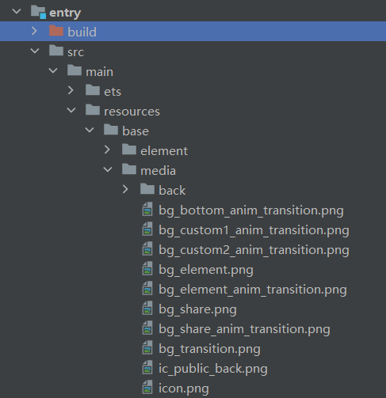

# 转场动画的使用（ArkTs）

## 场景介绍
日常在应用时，经常需要衔接两个场景，或者两个镜头画面之间进行切换，切换时需要呈现一种平滑过渡效果。

本例将为大家介绍下如何通过转场动画实现上述过渡效果。

## 效果呈现
本例最终效果如下：

| 场景                               | 效果图                                                |
| ---------------------------------- | ----------------------------------------------------- |
| 页面间转场--底部滑入转场           |  |
| 页面间转场--自定义1：缩放动画转场  |                      |
| 页面间转场---自定义2：旋转动画转场 |                  |
| 组件内转场                         |                   |
| 共享元素转场                       |                             |


## 运行环境
本例基于以下环境开发，开发者也可以基于其他适配的版本进行开发：
- IDE: DevEco Studio 4.0 Beta1
- SDK: Ohos_sdk_public 4.0.7.5 (API Version 10 Beta1)
## 实现思路
* 构建应用首页，主要由5个相同样式的功能菜单组成，通过添加路由实现主页面与对应功能页面的链接跳转。

* 功能页面的实现

  * 页面间转场

    * 底部滑入转场

      通过给pageTransition()方法定义入场效果PageTransitionEnter以及出场效果PageTransitionExit，同时通过设置slide属性为SlideEffect.Bottom来实现从底部滑入动效。

    * 缩放动画转场

      通过设置pageTransition方法，配置进行配置转场参数。
      
    * 旋转动画转场

      在FullCustomTransition.ets的Column组件中添加TransitionElement组件，并且定义pageTransition方法。给Clomn组件添加opacity、scale、rotate属性，定义变量animValue用来控制Clomn组件的动效，在PageTransitionEnter和PageTransitionExit组件中动态改变myProgress的值，从而控制动画效果。

  * 组件间转场

    * 通过Image、Column、Text、Button等组件构建ComponentTransition.ets页面。

    * 新建一个Image组件，并且添加两个transition属性，分别用于定义组件的插入动效和移除动效，从而实现组件间的转场。

    * 设置变量isShow，用来控制上述步骤中Image组件的添加和移除，同时向Button组件的onClick添加animateTo方法，来使ComponentItem子组件动效生效。
      * isShow默认状态为false，删除隐藏Image组件，同时删除动效生效。

      * 当isShow状态更新为true时，插入Image组件，同时插入动效生效。

  * 共享转场

      通过给两个页面“SharedItem”和“SharePage” 的Image组件设置sharedTransition属性来实现，两个页面的组件配置为同一个id，则转场过程中会执行共享元素转场效果。

## 开发步骤
1. 创建主界面。

    添加媒体资源至resources > base > media目录下。

    

    首页Index.ets引入首页列表常量数据：INDEX_ANIMATION_MODE（imgRes：设置按钮的背景图片，url：设置页面路由的地址），通过ForEach方法循环渲染列表常量数据。
    具体代码如下：

    ```ts
    // entry/src/main/ets/pages/Index.ets       

    // 引入列表常量数据INDEX_ANIMATION_MODE
    export const INDEX_ANIMATION_MODE = [
      { imgRes: $r('app.media.bg_bottom_anim_transition'), url: 'pages/BottomTransition' },
      { imgRes: $r('app.media.bg_custom1_anim_transition'), url: 'pages/CustomTransition' },
      { imgRes: $r('app.media.bg_custom2_anim_transition'), url: 'pages/FullCustomTransition' },
      { imgRes: $r('app.media.bg_element_anim_transition'), url: 'pages/ComponentTransition' },
      { imgRes: $r('app.media.bg_share_anim_transition'), url: 'pages/ShareItem' }
    ];

    ...
    Column() {
      // ForEach循环渲染
      ForEach(INDEX_ANIMATION_MODE, ({ imgRes , url }) => {
        Row()
          .backgroundImage(imgRes)
          .backgroundImageSize(ImageSize.Cover)
          .backgroundColor('#00000000')
          .height(130)
          .margin({ bottom: 30 })
          .width('100%')
          .borderRadius(32)
          .onClick(() => {
            router.pushUrl({ url: url })
          })
      }, item => JSON.stringify(item))
    }
    ```

    添加其它组件，以及样式，完成UI构建。

    具体代码如下：
    ```ts
    // entry/src/main/ets/pages/Index.ets
    import router from '@ohos.router';
    import hilog from '@ohos.hilog';
    @Entry
    @Component
    struct Index {
      build() {
        Column() {
          Text($r('app.string.main_page_title'))
            .fontSize(30)
            .fontWeight(FontWeight.Regular)
            .width('100%')
            .margin({ top: 13, bottom: 27,left: 24})

          Scroll() {
            Column() {
              ForEach(INDEX_ANIMATION_MODE, ({ imgRes , url }) => {
                Row()
                  .backgroundImage(imgRes)
                  .backgroundImageSize(ImageSize.Cover)
                  .backgroundColor('#00000000')
                  .height(130)
                  .margin({ bottom: 30 })
                  .width('100%')
                  .borderRadius(32)
                  .onClick(() => {
                    router.pushUrl({ url: url })
                      .catch(err => {
                        hilog.error(0xff00, '[ReadingRecorder]', `%{public}s, %{public}s`, err);
                      });
                  })
              }, item => JSON.stringify(item))
            }
          }
          .align(Alignment.Top)
          .layoutWeight(1)
          .scrollBar(BarState.Off)
        }
        .height('100%')
        .backgroundColor('#F1F3F5')
        .padding({left:12 , right:12})
      }
    }
    ```

2. 实现页面间转场。
  * 效果1：底部滑入。

    该效果的实现，主要是通过在BottomTransition.ets中设置全局pageTransition()方法，该方法中自定义入场效果PageTransitionEnter以及出场效果PageTransitionExit，同时通过设置slide属性为SlideEffect.Bottom来实现从底部滑入动效。

    具体代码如下：

    ```ts
    // entry/src/main/ets/pages/BottomTransition.ets
    
    @Entry
    @Component
    struct BottomTransition {
      private imgRes: string | Resource = $r('app.media.bg_transition');
      private imgFit: ImageFit = ImageFit.Fill;
    
      build() {
        Column() {
          Image(this.imgRes)
            .objectFit(this.imgFit)
            .width('100%')
            .height('100%')
        }
    
      }
    
      // 页面转场通过全局pageTransition方法进行配置转场参数
      pageTransition() {
        // PageTransitionEnter自定义入场效果：设置slide属性为SlideEffect.Bottom 表示入场时从屏幕下方滑入。
        PageTransitionEnter({ duration: 600, curve: Curve.Smooth }).slide(SlideEffect.Bottom);
        // PageTransitionExit自定义出场效果：设置slide属性为SlideEffect.Bottom 退场时从屏幕下方滑出。
        PageTransitionExit({ duration: 600, curve: Curve.Smooth }).slide(SlideEffect.Bottom);
      }
    }
    
    ```

  * 效果2：页面入场时淡入和放大，退场时从右下角滑出。

    *  在CustomTransition.ets中设置全局pageTransition()方法。
    *  pageTransition方法中自定义入场效果PageTransitionEnter：透明度设置从0.2到1；x、y轴缩放从0变化到1。
    *  pageTransition方法中自定义出场效果PageTransitionExit： x、y轴的偏移量为500。

    具体代码如下：

    ```ts
    // entry/src/main/ets/pages/CustomTransition.ets
    
    @Entry
    @Component
    struct CustomTransition {
      private imgRes: string | Resource = $r('app.media.bg_transition');
      private imgFit: ImageFit = ImageFit.Fill;
    
      build() {
        Column() {
          Image(this.imgRes)
            .objectFit(this.imgFit)
            .width('100%')
            .height('100%')
        }
      }
    
      // 页面转场通过全局pageTransition方法进行配置转场参数
      pageTransition() {
        // 进场时透明度设置从0.2到1；x、y轴缩放从0变化到1
        PageTransitionEnter({ duration: 600, curve: Curve.Smooth }).opacity(0.2).scale({ x: 0, y: 0 })
        // 退场时x、y轴的偏移量为500
        PageTransitionExit({ duration: 600, curve: Curve.Smooth }).translate({ x: 500, y: 500 })
      }
    }
    ```

  * 效果3：页面入场时淡入和放大，同时顺时针旋转；退场时淡出和缩小，同时逆时针旋转。

    * 在FullCustomTransition.ets中添加Column组件。

      * 向Column组件添加属性：opacity、scale、rotate，来控制动效的淡入淡出、缩放以及旋转效果。

      * 定义变量animValue用来,通过animValue值得变化来控制Column组件的动效。
    * 在FullCustomTransition.ets中定义全局pageTransition()方法。
    * pageTransition方法中自定义入场效果PageTransitionEnter。

      ​	animValue值实时变化，0 --> 1，从而渲染 入场时淡入、放大以及顺时针旋转效果。
    * pageTransition方法中自定义出场效果PageTransitionExit。

      ​	animValue值实时变化，1 --> 0，从而渲染 出场时淡出、缩小以及逆时针旋转效果。

    具体代码如下：

    ```ts
    // entry/src/main/ets/pages/FullCustomTransition.ets
    
    @Entry
    @Component
    struct FullCustomTransition {
        @State animValue: number = 1;
        private imgRes: string | Resource = $r('app.media.bg_transition');
        private imgFit: ImageFit = ImageFit.Fill;
    
        build() {
        Column() {
            Image(this.imgRes)
            .objectFit(this.imgFit)
            .width('100%')
            .height('100%')
        }
        // 设置淡入、淡出效果
        .opacity(this.animValue)  
        // 设置缩放
        .scale({ x: this.animValue, y: this.animValue })  
        // 设置旋转角度
        .rotate({
            z: 1,
            angle: 360 * this.animValue
        })
        }
    
        // 页面转场通过全局pageTransition方法进行配置转场参数
        pageTransition() {
        PageTransitionEnter({ duration: 600, curve: Curve.Smooth })
            // 进场过程中会逐帧触发onEnter回调，入参为动效的归一化进度(0 - 1)
            .onEnter((type: RouteType, progress: number) => {
            // 入场动效过程中，实时更新this.animValue的值
            this.animValue = progress
            });
        PageTransitionExit({ duration: 600, curve: Curve.Smooth })
            // 出场过程中会逐帧触发onExit回调，入参为动效的归一化进度(0 - 1)
            .onExit((type: RouteType, progress: number) => {
            // 入场动效过程中，实时更新this.animValue的值
            this.animValue = 1 - progress
            });
        }
    }
    ```


3. 实现组件内转场。

   * 通过Image、Column、Text、Button等组件构建ComponentTransition.ets页面。

     具体代码如下：

     ```ts
     // entry/src/main/ets/pages/ComponentTransition.ets
     
     @Entry
     @Component
     struct ComponentTransition {
     
       build() {
         Column() {
           Row() {
             Image($r('app.media.ic_public_back'))
               .width(20)
               .height(20)
               .responseRegion({width:'100%',height: '100%'})
               .onClick(() => {
                 this.getUIContext().getRouter().back();
               })
     
             Text($r('app.string.Component_transition_header'))
               .fontColor(Color.Black)
               .fontWeight(FontWeight.Regular)
               .fontSize(25)
               .margin({left:18,right:18})
           }
           .height(30)
           .width('100%')
           .margin({ top: 20, bottom: 27,left: 24})
         
               
           Image($r('app.media.bg_element'))
             .objectFit(ImageFit.Fill)
             .borderRadius(20)
             .margin({ bottom: 20 })
             .width('100%')
             .height(300)
     
           Button($r('app.string.Component_transition_toggle'))
             .height(40)
             .width(120)
             .fontColor(Color.White)
             .backgroundColor($r('app.color.light_blue'))
         }
         .padding({left:20,right:20})
         .height('100%')
         .width('100%')
       }
     }
     
     ```

   * 新建一个Image组件，并且添加两个transition属性，分别用于定义组件的插入动效和移除动效，来实现组件转场间。

     具体代码如下：

     ```ts
     //  entry/src/main/ets/pages/ComponentTransition.ets
     ...
     Image($r('app.media.bg_share'))
               .objectFit(ImageFit.Fill)
               .borderRadius(20)
               .margin({ bottom: 20 })
               .height(300)
               .width('100%')
                // 插入动效
               .transition({
                 type: TransitionType.Insert,
                 scale: { x: 0.5, y: 0.5 },
                 opacity: 0
               })
                // 删除隐藏动效
               .transition({
                 type: TransitionType.Delete,
                 rotate: { x: 0, y: 1, z: 0, angle: 360 },
                 opacity: 0
               })
     ```
     

   - 设置变量isShow,用来控制上述步骤中Image组件的添加和移除，同时向Button组件的onClick添加animateTo方法，来使ComponentItem子组件动效生效。

        * isShow默认状态为false，删除隐藏Image组件，同时删除动效生效。

        * 当isShow状态更新为true时，插入Image组件，同时插入动效生效。

          具体代码如下：

          ```ts
          //  entry/src/main/ets/pages/ComponentTransition.ets
           
          ...
          @State isShow: boolean = false;
              ...
              // isShow为True，插入Image组件，同时插入动效生效;isShow为False，删除隐藏Image组件，同时删除动效生效
              if (this.isShow) {
                  Image($r('app.media.bg_share'))
                  .objectFit(ImageFit.Fill)
                  .borderRadius(20)
                  .margin({ bottom: 20 })
                  .height(300)
                  .width('100%')
                      // 插入动效
                  .transition({
                      type: TransitionType.Insert,
                      scale: { x: 0.5, y: 0.5 },
                      opacity: 0
                  })
                      // 删除隐藏动效
                  .transition({
                      type: TransitionType.Delete,
                      rotate: { x: 0, y: 1, z: 0, angle: 360 },
                      opacity: 0
                  })
              }
          	...
          		Button($r('app.string.Component_transition_toggle'))
              	...  
                  .onClick(() => {
                  	animateTo({ duration: 600 }, () => {
                      this.isShow = !this.isShow;
                  	})
                  })
          ```

        ComponentTransition.ets的完整代码如下：

        ```ts
        //  entry/src/main/ets/pages/ComponentTransition.ets        
        @Entry
        @Component
        struct ComponentTransition {
          @State isShow: boolean = false;
        
          build() {
            Column() {
              // 页面title区域，含返回功能以及title显示
              Row() {
                Image($r('app.media.ic_public_back'))
                  .width(20)
                  .height(20)
                  .responseRegion({
                    width:'100%',
                    height: '100%'
                  })
                  .onClick(() => {
                    this.getUIContext().getRouter().back();
                  })
        
                Text($r('app.string.Component_transition_header'))
                  .fontColor(Color.Black)
                  .fontWeight(FontWeight.Regular)
                  .fontSize(25)
                  .height(300)
                  .margin({ left:18, right:18 })
              }
              .height(30)
              .width('100%')
              .margin({ top: 20, bottom: 27,left: 24})
        
              // 页面内容区域
              // isShow为True，插入Image组件，同时插入动效生效;isShow为False，删除隐藏Image组件，同时删除动效生效
              if (this.isShow) {
                Image($r('app.media.bg_share'))
                  .objectFit(ImageFit.Fill)
                  .borderRadius(20)
                  .margin({ bottom: 20 })
                  .height(300)
                  .width('100%')
                    // 插入动效
                  .transition({
                    type: TransitionType.Insert,
                    scale: { x: 0.5, y: 0.5 },
                    opacity: 0
                  })
                    // 删除隐藏动效
                  .transition({
                    type: TransitionType.Delete,
                    rotate: { x: 0, y: 1, z: 0, angle: 360 },
                    opacity: 0
                  })
              }
        
              Image($r('app.media.bg_element'))
                .objectFit(ImageFit.Fill)
                .borderRadius(20)
                .margin({ bottom: 20 })
                .width('100%')
                .height(300)
              Button($r('app.string.Component_transition_toggle'))
                .height(40)
                .width(120)
                .fontColor(Color.White)
                .backgroundColor($r('app.color.light_blue'))
                .onClick(() => {
                  animateTo({ duration: 600 }, () => {
                    console.log('console-- ' +this.isShow)
                    this.isShow = !this.isShow;
                  })
                })
            }
            .padding({
              left:(20),
              right:(20)
            })
            .height('100%')
            .width('100%')
          }
        }
        ```


4. 实现元素共享转场。

   共享元素转场通过给组件设置sharedTransition属性来实现，两个页面的组件配置为同一个id，则转场过程中会执行共享元素转场效果。

   * 通过Image、Column、Text等组件构建ShareItem.ets页面，给内容区域的Image组件设置sharedTransition属性标记该元素为共享元素，组件转场id设置为“shareID”， 同时设置共享元素转场效果。

     具体代码如下：

     ```ts
     // entry/src/main/ets/pages/ShareItem.ets
     
     import hilog from '@ohos.hilog';
     
     @Entry
     @Component
     struct ShareItem {
       // 自定义页面内容区域
       @Builder PreviewArea() {
         Column() {
           Image($r('app.media.bg_transition'))
             .width('100%')
             .height(300)
             .borderRadius(24)
             .margin({ bottom: 12 })
             // 设置sharedTransition属性标记该元素为共享元素,转场id为“shareId”
             .sharedTransition('shareId', {
               duration: 600,
               curve: Curve.Smooth,
               delay: 100
             })
             
             .onClick(() => {
               // 路由切换
               router.pushUrl({ url: 'pages/SharePage' })
                 .catch(err => {
                   hilog.error(0xFF00, '[ReadingRecorder]', `%{public}s, %{public}s`, err);
                 });
             })
           Text($r('app.string.Share_Item_hint'))
             .width('100%')
             .textAlign(TextAlign.Center)
             .fontSize(20)
             .fontWeight(FontWeight.Regular)
             .fontColor($r('app.color.share_item_content_font'))
         }
         .borderRadius(24)
         .backgroundColor(Color.White)
         .width('100%')
         .padding({ top: 13, left: 12, right: 12,bottom:12})
       }
     
       build() {
         Column() {
           // 页面title区域，含返回功能以及title显示
           Row() {
             Image($r('app.media.ic_public_back'))
               .width(20)
               .height(20)
               .responseRegion({
                 width:'100%',
                 height: '100%'
               })
               .onClick(() => {
                 this.getUIContext().getRouter().back();
               })
     
             Text($r('app.string.Share_Item_header'))
               .fontColor(Color.Black)
               .fontWeight(FontWeight.Regular)
               .fontSize(25)
               .margin({ left:18, right:18 })
           }
           .height(30)
           .width('100%')
           .margin({ top: 20, bottom: 27,left: 24})
           this.PreviewArea()
         }
         .width('100%')
         .height('100%')
         .backgroundColor($r('app.color.grey_light'))
         .padding({left:12,right:12})
       }
     }
     ```

   * pages/SharePage.ets页面中，给Image组件设置sharedTransition属性，同时组件转场id设置为“shareID”，从而可以共享上述步骤的转场动效。
   
        具体代码如下：
        ```ts
        // entry/src/main/ets/pages/SharePage.ets     
        @Entry
        @Component
        struct SharePage {
            build() {
                Column() {
                    Image($r('app.media.bg_transition'))
                        .objectFit(ImageFit.Fill)
                        .width('100%')
                        .height('100%')
                        .sharedTransition('shareId', {
                            duration: 600,
                            curve: Curve.Smooth,
                            delay: 100
                        })
                }
            }
        }
        ```
   

## 完整代码
本例完整代码如下：

应用首页： /entry/src/main/ets/pages/Index.ets。

```ts
// entry/src/main/ets/pages/Index.ets
import router from '@ohos.router';
import hilog from '@ohos.hilog';

@Entry
@Component
struct Index {
  build() {
    Column() {
      Text($r('app.string.main_page_title'))
      .fontSize(30)
        .fontWeight(FontWeight.Regular)
        .width('100%')
        .margin({ top: 13, bottom: 27,left: 24})

      Scroll() {
      	Column() {
          ForEach(INDEX_ANIMATION_MODE, ({ imgRes , url }) => {
            Row()
              .backgroundImage(imgRes)
              .backgroundImageSize(ImageSize.Cover)
              .backgroundColor('#00000000')
              .height(130)
              .margin({ bottom: 30 })
              .width('100%')
              .borderRadius(32)
              .onClick(() => {
                router.pushUrl({ url: url })
                  .catch(err => {
                    hilog.error(0xff00, '[ReadingRecorder]', `%{public}s, %{public}s`, err);
                  });
              })
          }, item => JSON.stringify(item))
        }
      }
      .align(Alignment.Top)
      .layoutWeight(1)
      .scrollBar(BarState.Off)
    }
    .height('100%')
    .backgroundColor('#F1F3F5')
    .padding({left:12 , right:12})
  }
}
```

底部滑出页面：/entry/src/main/ets/pages/BottomTransition.ets。

```ts
// entry/src/main/ets/pages/BottomTransition.ets

@Entry
@Component
struct BottomTransition {
  private imgRes: string | Resource = $r('app.media.bg_transition');
  private imgFit: ImageFit = ImageFit.Fill;

  build() {
    Column() {
      Image(this.imgRes)
        .objectFit(this.imgFit)
        .width('100%')
        .height('100%')
    }

  }

  // 页面转场通过全局pageTransition方法进行配置转场参数
  pageTransition() {
    // PageTransitionEnter自定义入场效果：设置slide属性为SlideEffect.Bottom 表示入场时从屏幕下方滑入。
    PageTransitionEnter({ duration: 600, curve: Curve.Smooth }).slide(SlideEffect.Bottom);
    // PageTransitionExit自定义出场效果：设置slide属性为SlideEffect.Bottom 退场时从屏幕下方滑出。
    PageTransitionExit({ duration: 600, curve: Curve.Smooth }).slide(SlideEffect.Bottom);
  }
}
```

自定义1 缩放动画转场页面：/entry/src/main/ets/pages/CustomTransition.ets。

```ts
// entry/src/main/ets/pages/CustomTransition.ets
@Entry
@Component
struct CustomTransition {
  private imgRes: string | Resource = $r('app.media.bg_transition');
  private imgFit: ImageFit = ImageFit.Fill;
  build() {
    Column() {
      Image(this.imgRes)
        .objectFit(this.imgFit)
        .width('100%')
        .height('100%')
    }
  }
  // 页面转场通过全局pageTransition方法进行配置转场参数
  pageTransition() {
    // 进场时透明度设置从0.2到1；x、y轴缩放从0变化到1
    PageTransitionEnter({ duration: 600, curve: Curve.Smooth }).opacity(0.2).scale({ x: 0, y: 0 })
    // 退场时x、y轴的偏移量为500
    PageTransitionExit({ duration: 600, curve: Curve.Smooth }).translate({ x: 500, y: 500 })
  }
}
```

自定义2 旋转动画转场： /entry/src/main/ets/pages/FullCustomTransition.ets。

```ts
@Entry
@Component
struct FullCustomTransition {
  @State animValue: number = 1;
  private imgRes: string | Resource = $r('app.media.bg_transition');
  private imgFit: ImageFit = ImageFit.Fill;
  build() {
    Column() {
      Image(this.imgRes)
        .objectFit(this.imgFit)
        .width('100%')
        .height('100%')
    }
    // 设置淡入、淡出效果
    .opacity(this.animValue)  
    // 设置缩放
    .scale({ x: this.animValue, y: this.animValue })  
    // 设置旋转角度
    .rotate({
      z: 1,
      angle: 360 * this.animValue
    	})
   }
  // 页面转场通过全局pageTransition方法进行配置转场参数
  pageTransition() {
    PageTransitionEnter({ duration: 600, curve: Curve.Smooth })
      // 进场过程中会逐帧触发onEnter回调，入参为动效的归一化进度(0 - 1)
      .onEnter((type: RouteType, progress: number) => {
        // 入场动效过程中，实时更新this.animValue的值
        this.animValue = progress
      });
    PageTransitionExit({ duration: 600, curve: Curve.Smooth })
      // 出场过程中会逐帧触发onExit回调，入参为动效的归一化进度(0 - 1)
      .onExit((type: RouteType, progress: number) => {
        // 入场动效过程中，实时更新this.animValue的值
         this.animValue = 1 - progress
      });
   }
}
```

组件内转场页面： /entry/src/main/ets/pages/ComponentTransition.ets。

```ts
 @Entry
 @Component
 struct ComponentTransition {
      @State isShow: boolean = false;
      build() {
        Column() {
          // 页面title区域，含返回功能以及title显示
          Row() {
            Image($r('app.media.ic_public_back'))
              .width(20)
              .height(20)
              .responseRegion({
                width:'100%',
                height: '100%'
              })
              .onClick(() => {
                this.getUIContext().getRouter().back();
           })
            Text($r('app.string.Component_transition_header'))
              .fontColor(Color.Black)
              .fontWeight(FontWeight.Regular)
              .fontSize(25)
              .margin({left:18, right:18})
          }
          .height(30)
          .width('100%')
          .margin({ top: 20, bottom: 27,left: 24})
            
          // 页面内容区域  
          // isShow为True，插入Image组件，同时插入动效生效;isShow为False，删除隐藏Image组件，同时删除动效生效
          if (this.isShow) {
            Image($r('app.media.bg_share'))
              .objectFit(ImageFit.Fill)
              .borderRadius(20)
           	  .margin({ bottom: 20 })
              .height(300)
              .width('100%')
                // 插入动效
              .transition({
                type: TransitionType.Insert,
                scale: { x: 0.5, y: 0.5 },
                opacity: 0
              })
                // 删除隐藏动效
              .transition({
                type: TransitionType.Delete,
                rotate: { x: 0, y: 1, z: 0, angle: 360 },
                opacity: 0
              })
          }
               
            
            Image($r('app.media.bg_element'))
              .objectFit(ImageFit.Fill)
              .borderRadius(20)
              .margin({ bottom: 20 })
              .width('100%')
              .height(300)
  
             Button($r('app.string.Component_transition_toggle'))
               .height(40)
               .width(120)
               .fontColor(Color.White)
               .backgroundColor($r('app.color.light_blue'))
               .onClick(() => {
                 animateTo({ duration: 600 }, () => {
                   this.isShow = !this.isShow;
                 })
               })
           }
           .padding({left:20,right:20})
           .height('100%')
           .width('100%')
         }
  }
```


共享元素转场部件：/entry/src/main/ets/pages/ShareItem.ets。

```ts
import hilog from '@ohos.hilog';

@Entry
@Component
struct ShareItem {
  // 自定义页面内容区域
  @Builder PreviewArea() {
    Column() {
      Image($r('app.media.bg_transition'))
        .width('100%')
        .height(300)
        .borderRadius(24)
        .margin({ bottom: 12 })
        // 设置sharedTransition属性标记该元素为共享元素,转场id为“shareId”
        .sharedTransition('shareId', {
          duration: 600,
          curve: Curve.Smooth,
          delay: 100
        })
        
        .onClick(() => {
          // 路由切换
          router.pushUrl({ url: 'pages/SharePage' })
            .catch(err => {
              hilog.error(0xFF00, '[ReadingRecorder]', `%{public}s, %{public}s`, err);
            });
        })
      Text($r('app.string.Share_Item_hint'))
        .width('100%')
        .textAlign(TextAlign.Center)
        .fontSize(20)
        .fontWeight(FontWeight.Regular)
        .fontColor($r('app.color.share_item_content_font'))
    }
    .borderRadius(24)
    .backgroundColor(Color.White)
    .width('100%')
    .padding({ top: 13, left: 12, right: 12,bottom:12})
  }

  build() {
    Column() {
      // 页面title区域，含返回功能以及title显示
      Row() {
        Image($r('app.media.ic_public_back'))
          .width(20)
          .height(20)
          .responseRegion({
            width:'100%',
            height: '100%'
          })
          .onClick(() => {
            this.getUIContext().getRouter().back();
          })

        Text($r('app.string.Share_Item_header'))
          .fontColor(Color.Black)
          .fontWeight(FontWeight.Regular)
          .fontSize(25)
          .margin({ left:18, right:18 })
      }
      .height(30)
      .width('100%')
      .margin({ top: 20, bottom: 27,left: 24})
      this.PreviewArea()
    }
    .width('100%')
    .height('100%')
    .backgroundColor($r('app.color.grey_light'))
    .padding({left:12,right:12})
  }
}
```

共享元素转场页面：/entry/src/main/ets/pages/SharePage.ets。

```ts
@Entry
@Component
struct SharePage {
  build() {
    Column() {
      Image($r('app.media.bg_transition'))
        .objectFit(ImageFit.Fill)
        .width('100%')
        .height('100%')
        .sharedTransition('shareId', {
          duration: 600,
          curve: Curve.Smooth,
          delay: 100
        })
    }
  }
}
```

 ##  参考

- [图形变换](../application-dev/reference/apis-arkui/arkui-ts/ts-universal-attributes-transformation.md)

- [页面间转场](../application-dev/reference/apis-arkui/arkui-ts/ts-page-transition-animation.md)

- [组件内转场](../application-dev/ui/arkts-shared-element-transition.md)

- [共享元素转场](../application-dev/reference/apis-arkui/arkui-ts/ts-transition-animation-shared-elements.md)


