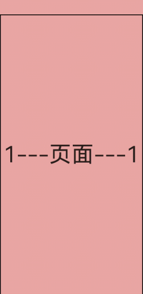

# 左右翻页
## 场景介绍
在众多阅读或者文档应用中，都会涉及到文本翻页、电子书翻页、书籍翻页的场景。本文即为大家介绍左右翻页的开发过程。

## 效果呈现
效果图如下：



## 运行环境
本例基于以下环境开发，开发者也可以基于其他适配的版本进行开发：
- IDE: DevEco Studio 4.0 Release
- SDK: Ohos_sdk_public 4.0.10.13 (API Version 10 Release)

## 实现思路
本例的包含的关键特性及其实现方案如下：
- 页面左右覆盖：通过NavDestination组件实现。
- 小说翻页：通过点击事件（点击不同区域产生不同的交互动作）完成，并对小说首页进行处理。
- 展示文本：通过创建并调用自定义函数novelContent()，最终展示在页面。

## 开发步骤 
本例详细开发步骤如下，开发步骤仅展示关键代码。
1. 构建小说内容：通过创建自定义函数novelContent()。具体代码块如下：
    ```ts
    novelContent(){
      this.content1 = (this.currentPageNum - 1) + "___小说___" + (this.currentPageNum - 1)
      this.content2 = (this.currentPageNum) + "___小说___" + (this.currentPageNum)
      this.content3 = (this.currentPageNum + 1) + "___小说___" + (this.currentPageNum + 1)
      console.log("oh----->currentPage=" + this.currentPageNum)
      console.log("oh----->content1=" + this.content1)
      console.log("oh----->content2=" + this.content2)
      console.log("oh----->content3=" + this.content3);
    }
    ```
2. 展示小说文本：通过NavDestination作为小说文本页面（子页面）的根容器，最后调用自定义组件ReadPage()将小说内容展示到页面上。
    ```ts
    NavDestination(){
      Stack(){
        ReadPage({content:this.content3})
          .backgroundColor(this.bgColor)

        ReadPage({content:this.content2})
          .translate({x:this.offsetX >= 0 ? 0:this.offsetX , y:0 , z:0})
          .backgroundColor(this.bgColor)
          .width(this.screenW)

        ReadPage({content:this.content1})
          .backgroundColor(this.bgColor)
          .translate({
            x:-this.screenW + this.offsetX
          })
      }
    }
    // 自定义组件ReaderPage
    @Component
    struct ReadPage{
      @Prop content:string= ""

      build(){
        Column(){
          Text(this.content)
            .textAlign(TextAlign.Center)
            .width("100%")
            .height("100%")
            .fontSize(50)
        }
        .borderColor(Color.Black)
        .borderWidth(2)
        .width("100%")
        .height("100%")
      }
    }
    ```
3. 通过点击完成翻页以及提示消息完成：首先将点击事件封装clickAnimateTo(),点击不同区域产生不同的交互事件。点击距离屏幕左端1/3（横向）的区域，小说页面跳到上一页（第一页除外）;点击距离屏幕右端1/3（横向）的区域，小说页面跳转到下一页;点击剩余区域出现提示语“打开菜单”。具体代码如下：
    ```ts
    // 封装点击事件clickAnimateTo()
    private clickAnimateTo(isLeft: Boolean){
      animateTo({
        duration:400,
        curve:Curve.EaseOut,
        onFinish:()=>{
          if (this.offsetX > 100){
            this.currentPageNum -= 1
          }else if (this.offsetX < -100){
            this.currentPageNum += 1
            console.log("oh----->当前页变为" + this.currentPageNum)
          }
            this.offsetX = 0
            this.novelContent()
        }
      },()=>{
        if (isLeft){
          this.offsetX = this.screenW
        }else{
          this.offsetX = -this.screenW
        }
      })
    }

    // 点击事件产生的交互动作
    .onClick((event?:ClickEvent)=>{
      if (event){
        console.log("点击位置：" + event.x)
        if (event.x > this.screenW / 3 * 2){
          this.clickAnimateTo(false)
        }else if(event.x > this.screenW /3){
          promptAction.showToast({
            message:"打开菜单",
            duration:300
          })
        }else{
          if (this.currentPageNum == 1){
              promptAction.showToast({
              message:"没有内容！",
              duration:300
              })
          }else{
              this.clickAnimateTo(true)
          }
        } 
      }
    })
    ```
## 完整代码
完整示例代码如下：
```ts
import display from '@ohos.display'
import promptAction from '@ohos.promptAction';
import window from '@ohos.window';
import common from '@ohos.app.ability.common';

@Component
struct ReadPage{
  @Prop content:string= ""

  build(){
    Column(){
      Text(this.content)
        .textAlign(TextAlign.Center)
        .width("100%")
        .height("100%")
        .fontSize(50)
    }
    .borderColor(Color.Black)
    .borderWidth(2)
    .width("100%")
    .height("100%")
  }
}

@Entry
@Component
export struct Reader{
  @State bgColor:string = "#EDA7A7"
  @State content1:string = ""
  @State content2:string = ""
  @State content3:string = ""
  private currentPageNum:number = 1
  @State offsetX:number = 0
  @State curPosition:number = 0
  private panOption:PanGestureOptions = new PanGestureOptions({direction:PanDirection.Left | PanDirection.Right})
  private screenW:number = px2vp(display.getDefaultDisplaySync().width)
  // 沉浸式窗口
  context:common.UIAbilityContext = getContext(this) as common.UIAbilityContext
  async setSystemBar(){
    let windowClass:window.Window = await window.getLastWindow(this.context)
    await windowClass.setWindowSystemBarProperties({
      navigationBarColor:"#EDA7A7",
      statusBarColor:"#EDA7A7",
      navigationBarContentColor:"#EDA7A7",
      statusBarContentColor:"#EDA7A7"
    })
  }

  aboutToAppear(){
    console.info("oh----->内容宽度：" + this.screenW)
    this.novelContent()
    this.setSystemBar()
  }

  /// 构建小说内容
  novelContent(){
    this.content1 = (this.currentPageNum - 1) + "___小说___" + (this.currentPageNum - 1)
    this.content2 = (this.currentPageNum) + "___小说___" + (this.currentPageNum)
    this.content3 = (this.currentPageNum + 1) + "___小说___" + (this.currentPageNum + 1)
    console.log("oh----->currentPage=" + this.currentPageNum)
    console.log("oh----->content1=" + this.content1)
    console.log("oh----->content2=" + this.content2)
    console.log("oh----->content3=" + this.content3);
  }

  private clickAnimateTo(isLeft: Boolean){
    animateTo({
      duration:400,
      curve:Curve.EaseOut,
      onFinish:()=>{
        if (this.offsetX > 100){
          this.currentPageNum -= 1
        }else if (this.offsetX < -100){
          this.currentPageNum += 1
          console.log("oh----->当前页变为" + this.currentPageNum)
        }
        this.offsetX = 0
        this.novelContent()
      }
    },()=>{
      if (isLeft){
        this.offsetX = this.screenW
      }else{
        this.offsetX = -this.screenW
      }
    })
  }

  build(){
    NavDestination(){
      Stack(){
        ReadPage({content:this.content3})
          .backgroundColor(this.bgColor)

        ReadPage({content:this.content2})
          .translate({x:this.offsetX >= 0 ? 0:this.offsetX , y:0 , z:0})
          .backgroundColor(this.bgColor)
          .width(this.screenW)

        ReadPage({content:this.content1})
          .backgroundColor(this.bgColor)
          .translate({
            x:-this.screenW + this.offsetX
          })
      }
      .onClick((event?:ClickEvent)=>{
        if (event){
          console.log("点击位置：" + event.x)
          if (event.x > this.screenW / 3 * 2){
            this.clickAnimateTo(false)
          }else if(event.x > this.screenW /3){
            promptAction.showToast({
              message:"打开菜单",
              duration:300
            })
          }else{
            if (this.currentPageNum == 1){
              promptAction.showToast({
                message:"没有内容！",
                duration:300
              })
            }else{
              this.clickAnimateTo(true)
            }
          }
        }
      })
    }
    .hideTitleBar(true)
    // 可展示标题栏
    // .title("小说阅读器") 
  }
}
```
## 参考 
[NavDestination](../application-dev/reference/apis-arkui/arkui-ts/ts-basic-components-navdestination.md)

[管理应用窗口（Stage模型）](../application-dev/windowmanager/application-window-stage.md)