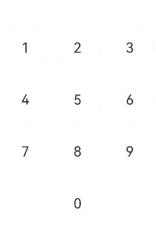

# 水波纹动画开发

## 场景介绍
在日常应用场景中，水波纹的效果比较常见，例如数字键盘按键效果、听歌识曲、附近搜索雷达动效等等，本文就以数字按键为例介绍水波纹动效的实现。

## 效果呈现
本例最终效果图如下：



## 环境要求
本例基于以下环境开发，开发者也可以基于其他适配的版本进行开发：
- IDE: DevEco Studio 3.1 Beta2
- SDK: Ohos_sdk_public 3.2.11.9(API Version 9 Release)
## 实现思路
本实例涉及到的主要特性及其实现方案如下：
* UI框架：使用Grid，GridItem等容器组件组建UI框架。
* 按钮渲染：通过自定义numBtn组件（含Column、Button、Stack、Text等关键组件以及visibility属性），进行数字按钮的渲染。
* 按钮状态变化：设置状态变量unPressed，控制按钮的当前状态，向Column组件添加onTouch事件，监听按钮的当前状态。
  * 默认状态为按钮放开状态（unPressed为true）。
  * 当按钮按下时，更新按钮的状态（unPressed：true -> false）。
  * 当按钮放开时，更新按钮的状态（unPressed：false -> true）。
* 按钮动画展示：使用属性动画以及组件内转场动画绘制按钮不同状态下的动画。
  * 当按钮按下时，使用显式动画（animateTo）加载动画：插入按下时的Row组件，同时加载水波的聚拢效果。
  * 当按钮放开时，使用组件内转场加载动画：插入放开时的Row组件，同时加载水波的扩散效果。
## 开发步骤
针对实现思路中所提到的内容，具体关键开发步骤如下：
1. 先通过Grid，GridItem等容器组件将UI框架搭建起来，在GuidItem中引用步骤2中的自定义数字按钮numBtn构建出数字栅格。

    具体代码如下:

    ```ts
      private numGrid: number[] = [1, 2, 3, 4, 5, 6, 7, 8, 9, -1, 0, -1] 
      ...
        Column() {
          Grid() {
            ForEach(this.numGrid, (item: number, index: number) => {
              GridItem() {
                ...
              }
            }, item => item)
          }
          .columnsTemplate('1fr 1fr 1fr')
          .rowsTemplate('1fr 1fr 1fr 1fr')
          .columnsGap(10)
          .rowsGap(10)
          .width(330)
          .height(440)
        }.width('100%').height('100%')
    ```

2. 通过Column、Button、Stack、Text等关键组件以及visibility属性构建自定义数字按钮numBtn。

    具体代码如下：

    ```ts
    @Component
    struct numBtn {
      ···
      build() {
        Column() {
            Button() {
                stack(){
                    ...
                    Text(`${this.item}`).fontSize(30)
                }
                ...
            }
            .backgroundColor('#ccc') 
            .type(ButtonType.Circle)
            .borderRadius(100)
            .width(100)
            .height(100)   
        }
        .visibility(this.item == -1 ? Visibility.Hidden : Visibility.Visible)
        .borderRadius(100)
      }
    }
    ```

3. 设置状态变量unPressed，监听当前数字按钮的状态，同时向Column组件添加onTouch事件，获取并更新按钮的当前状态，从而可以根据监听到的按钮状态加载对应的动画效果。

    具体代码块如下:

    ```ts
    //状态变量unPressed，用于监听按钮按下和放开的状态
    @State unPressed: boolean = true 
    ...
    // 添加onTouch事件，监听状态
    .onTouch((event: TouchEvent) => {
      // 当按钮按下时，更新按钮的状态（unPressed：true -> false）
      if (event.type == TouchType.Down) {
        animateTo({ duration: 400 }, () => {
          this.unPressed = !this.unPressed
          this.currIndex = this.index
        })
      }
      // 当按钮放开时，更新按钮的状态（unPressed：false -> true）
      if (event.type == TouchType.Up) {
        animateTo({ duration: 400 }, () => {
          this.unPressed = !this.unPressed
        })
      }
    })
    ```

4. 根据按钮组件的按下/放开状态，通过if-else语句选择插入的Row组件，并随之呈现不同的水波动画效果（按下时水波聚拢，放开时水波扩散）。

    具体代码块如下:

    ```ts
    Stack() {
      Row() {
        // 判断当前按钮组件为放开状态
        if (this.unPressed && this.currIndex == this.index) {
          // 插入Row组件，配置过渡效果
          Row()
            .customStyle()
            .backgroundColor('#fff')
              // 水波纹扩散动画：从Row组件的中心点开始放大，scale{0,0}变更scale{1,1}（完整显示）
            .transition({
              type: TransitionType.Insert,
              opacity: 0,
              scale: { x: 0, y: 0, centerY: '50%', centerX: '50%' }
            })
        }
        // 判断当前按钮组件为按下状态
        else if (!this.unPressed && this.currIndex == this.index) {
          // 插入Row组件，配置过渡效果
          Row()
            .customStyle()
            .backgroundColor(this.btnColor)
            .scale(this.btnScale)
            .onAppear(() => {
              // 水波纹聚拢动画：Row组件backgroundColor属性变更（#ccc -> #fff），插入动画过渡效果，scale{1,1}（完整显示）变化为scale{0,0} 
              animateTo({ duration: 300,
                // 聚拢动画播放完成后，需要衔接扩散动画，Row组件backgroundColor属性变更（#fff -> #ccc），插入动画过渡效果，scale{0,0}变化为scale{1,1}（完整显示）
                onFinish: () => {
                  this.btnColor = '#ccc'
                  this.btnScale = { x: 1, y: 1 }
                } },
                () => {
                  this.btnColor = '#fff'
                  this.btnScale = { x: 0, y: 0 }
                })
            })
        }
        // 其他状态
        else {
          Row()
            .customStyle()
            .backgroundColor('#fff')
        }
      }
      .justifyContent(FlexAlign.Center)
      .alignItems(VerticalAlign.Center)
      .borderRadius(100)
      Text(`${this.item}`).fontSize(30)
    }
    .customStyle()
    ```

## 完整代码
示例代码如下：

```ts
@Entry
@Component
export default struct dragFire {
  private numGrid: number[] = [1, 2, 3, 4, 5, 6, 7, 8, 9, -1, 0, -1]

  build() {
    Column() {
      Grid() {
        ForEach(this.numGrid, (item: number, index: number) => {
          GridItem() {
            numBtn({ item: item, index: index })
          }
        }, item => item)
      }
      .columnsTemplate('1fr 1fr 1fr')
      .rowsTemplate('1fr 1fr 1fr 1fr')
      .columnsGap(10)
      .rowsGap(10)
      .width(330)
      .height(440)
    }.width('100%').height('100%')
  }
}


@Component
struct numBtn {
  private currIndex: number = -1
  //状态变量unPressed，用于控制按钮的状态
  @State unPressed: boolean = true
  @State btnColor: string = '#ccc'
  index: number
  item: number
  @State btnScale: {
    x: number,
    y: number
  } = { x: 1, y: 1 }

  @Styles customStyle(){
    .width('100%')
    .height('100%')
    .borderRadius(100)
  }

  build() {
    Column() {
      Button() {
        Stack() {
          Row() {
            // 判断当前组件为放开状态
            if (this.unPressed && this.currIndex == this.index) {
              // 插入Row组件，配置过渡效果
              Row()
                .customStyle()
                .backgroundColor('#fff')
                  // 水波纹扩散动画：Row组件backgroundColor属性变更（#fff -> #ccc），系统插入动画过渡效果，从组建的中心点开始放大，scale{0,0}变更scale{1,1}
                .transition({
                  type: TransitionType.Insert,
                  opacity: 0,
                  scale: { x: 0, y: 0, centerY: '50%', centerX: '50%' }
                })
            }
            // 判断当前组件为按下状态
            else if (!this.unPressed && this.currIndex == this.index) {
              // 插入Row组件，配置过渡效果
              Row()
                .customStyle()
                .backgroundColor(this.btnColor)
                .scale(this.btnScale)
                .onAppear(() => {
                  // 水波纹聚拢动画：Row组件backgroundColor属性变更（#ccc -> #fff），插入动画过渡效果，scale{1,1}变化为scale{0,0}
                  animateTo({ duration: 300,
                    // 聚拢动画播放完成后，需要衔接扩散动画，此时Row组件backgroundColor属性变更（#fff -> #ccc），插入动画过渡效果，scale{0,0}变化为scale{1,1}
                    onFinish: () => {
                      this.btnColor = '#ccc'
                      this.btnScale = { x: 1, y: 1 }
                    } },
                    () => {
                      this.btnColor = '#fff'
                      this.btnScale = { x: 0, y: 0 }
                    })
                })
            }
            // 其他状态
            else {
              Row()
                .customStyle()
                .backgroundColor('#fff')
            }
          }
          .justifyContent(FlexAlign.Center)
          .alignItems(VerticalAlign.Center)
          .borderRadius(100)

          Text(`${this.item}`).fontSize(30)
        }
        .customStyle()
      }
      .stateEffect(false)
      .backgroundColor('#ccc')
      .type(ButtonType.Circle)
      .borderRadius(100)
      .width(100)
      .height(100)
    }
    .visibility(this.item == -1 ? Visibility.Hidden : Visibility.Visible)
    .borderRadius(100)
    // onTouch事件，监听状态
    .onTouch((event: TouchEvent) => {
      // 当按钮按下时，更新按钮的状态（unPressed：true -> false）
      if (event.type == TouchType.Down) {
        animateTo({ duration: 400 }, () => {
          this.unPressed = !this.unPressed
          this.currIndex = this.index
        })
      }
      // 当按钮放开时，更新按钮的状态（unPressed：false -> true）
      if (event.type == TouchType.Up) {
        animateTo({ duration: 400 }, () => {
          this.unPressed = !this.unPressed
        })
      }
    })
  }
}
```
## 参考
[Grid](../application-dev/reference/apis-arkui/arkui-ts/ts-container-grid.md)

[GridItem](../application-dev/reference/apis-arkui/arkui-ts/ts-container-griditem.md)

[显式动画](../application-dev/reference/apis-arkui/arkui-ts/ts-explicit-animation.md)

[组件内转场](../application-dev/reference/apis-arkui/arkui-ts/ts-transition-animation-component.md)

[Stack](../application-dev/reference/apis-arkui/arkui-ts/ts-container-stack.md)