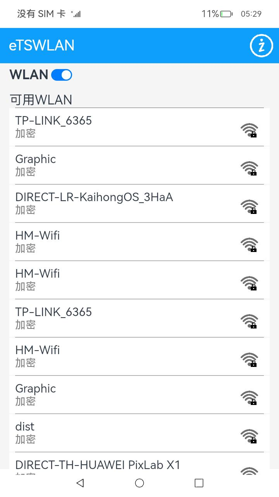
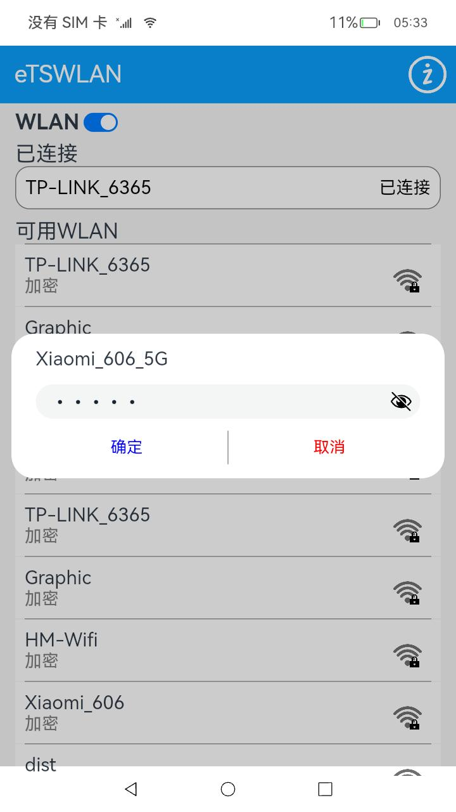

# 如何实现WLAN网络扫描、连接、断开

## 场景说明

对可用的WLAN列表进行扫描，连接、断开WLAN网络是设备常见的功能，本例将为大家介绍如何实现上述功能。

## 效果呈现

本例效果如下：

|                           扫描WLAN                           |                           连接WLAN                           |                           断开WLAN                           |
| :----------------------------------------------------------: | :----------------------------------------------------------: | :----------------------------------------------------------: |
|  |  |  |

## 运行环境

本例基于以下环境开发，开发者也可以基于其他适配的版本进行开发。

- IDE：DevEco Studio 4.0.0.201 Beta1
- SDK：Ohos_sdk_public 4.0.7.5 (API Version 10 Beta1)

## 实现思路

本例主要通过@ohos.wifiManager 相关API实现WLAN激活和关闭、扫描和连接WLAN等功能。

- WLAN功能的激活和关闭：点击首页的切换按钮，如果是打开，使用wifi.enableWifi()开启WLAN功能；如果是关闭，则使用wifi.disconnect()断开WLAN功能， 然后使用wifi.disableWifi()关闭WLAN。
- WLAN的连接：点击WLAN列表中加密的WLAN，并在弹窗中输入密码后，会在AvailableWifi.ets中通过WifiModule.connectNetwork()调用wifi.connectToDevice()连接WLAN。
- WLAN的扫描：进入Index.ets 后就会间歇性的调用wifi.scan()开启扫描，然后通过WifiModel模块中的getScanInfos()调用wifi.getScanResults()来获取扫描的结果.

## 开发步骤

1. 申请所需权限

   在model.json5中添加以下配置：

   ```json
   "requestPermissions": [
     {
       "name": "ohos.permission.GET_WIFI_INFO"//允许应用获取WLAN信息
     },
     {
       "name": "ohos.permission.GET_WIFI_INFO_INTERNAL"//允许应用获取WLAN信息
     },
     {
       "name": "ohos.permission.SET_WIFI_INFO"//允许应用配置WLAN设备
     },
     {
       "name": "ohos.permission.GET_WIFI_PEERS_MAC"//允许应用获取对端WLAN或者蓝牙设备的MAC地址
     },
     {
       "name": "ohos.permission.GET_WIFI_LOCAL_MAC"//允许应用获取本机WLAN或者蓝牙设备的MAC地址
     },
     {
       "name": "ohos.permission.GET_WIFI_CONFIG"//允许应用获取WLAN配置信息
     },
     {
       "name": "ohos.permission.SET_WIFI_CONFIG"//允许应用配置WLAN信息
     },
     {
       "name": "ohos.permission.MANAGE_WIFI_CONNECTION"//允许应用管理WLAN连接
     },
     {
       "name": "ohos.permission.MANAGE_WIFI_HOTSPOT"//允许应用开启或者关闭WLAN热点
     },
     {
       "name": "ohos.permission.LOCATION"//允许应用获取设备位置信息
     },
     {
       "name": "ohos.permission.APPROXIMATELY_LOCATION"//允许应用获取设备模糊位置信息
     }
   ]
   ```

2. 准备工作

   定义boolean变量isSwitchOn作为WLAN开关是否打开的标志。

   ```typescript
   import wifi from '@ohos.wifiManager'
   aboutToAppear() {
       // 如果WLAN是开的，就记录下状态，然后扫描WLAN，并获取连接信息
       if (wifi.isWifiActive()) {//查询WLAN是否已使能
         Logger.log(TAG, 'wifi is active')
         this.isSwitchOn = true//已使能说明WLAN开关已被打开，那么让isSwitchOn为true
         wifi.scan()//@ohos.wifiManager的接口，对WLAN进行扫描
         this.scan()//自定义的scan函数，确保扫描的持续性
         this.getLinkedInfo()
       }
       // 启动监听
       this.addListener()//监听连接状态的变化
     }
   ```

3. 持续地扫描可用WLAN

   scan方法不断地自我调用以实现对WLAN的不停扫描。

   ```typescript
   async getLinkedInfo() {
       try {
         //调用getLinkedInfo接口得到是否已连接WLAN的信息 
         let wifiLinkedInfo = await wifi.getLinkedInfo()
         if (wifiLinkedInfo === null || wifiLinkedInfo.bssid === '') {
             //如果结果为空，则说明未连接
           this.isLinked = false
           this.linkedInfo = null
           return
         }
         this.isLinked = true
         this.linkedInfo = wifiLinkedInfo
       } catch (err) {
         Logger.info(`getLinkedInfo failed err is ${JSON.stringify(err)}`)
       }
     }
   async scan() {
       // 获取有关WLAN连接的信息,存入linkedInfo
       await this.getLinkedInfo()
       // 不停地扫描WLAN
       let result: Array<WifiType> = await this.wifiModel.getScanInfos()//调用model/WifiModel.ets中的getScanInfos得到扫描结果
       if (this.isSwitchOn) {
           //如果WLAN功能已打开，则要进行不停地扫描
         AppStorage.SetOrCreate('wifiList', result)//将扫描结果存至全局
           //每3000毫秒调用一次scan()，实现不停扫描可用WLAN
         setTimeout(async () => {
           await this.scan()
         }, 3000)
       }
     }
   addListener() {
       // WLAN连接状态改变事件发生时，修改连接信息
       wifi.on('wifiConnectionChange', async state => {
         Logger.log(TAG, `wifiConnectionChange: ${state}`)
         await this.getLinkedInfo()//WLAN连接状态改变，重新获取WLAN连接信息
       })
       // WLAN状态改变时，先清空WLAN列表，然后判断是否是开启状态，如果是就扫描
       wifi.on('wifiStateChange', state => {
         Logger.log(TAG, `wifiStateLisener state: ${state}`)
         AppStorage.SetOrCreate('wifiList', [])
         if (state === 1) { // 1: wifi is enable, 0:wifi is disable
           this.scan()
         }
       })
     }
   ...
   //model/WifiModel.ets
   async getScanInfos(): Promise<Array<WifiType>> {
       Logger.log(TAG, 'scanWifi begin')
       let wifiList: Array<WifiType> = []
       let result: Array<wifi.WifiScanInfo> = []
       try {
         result = await wifi.getScanResults()//因为在abouttoappear()中执行了wifi.scan()，所以这里直接调用getScanResults接口得到扫描结果
       } catch (err) {
         Logger.log(TAG, `scan info err: ${JSON.stringify(err)}`)
         return wifiList
       }
       Logger.log(TAG, `scan info call back: ${result.length}`)
       for (var i = 0; i < result.length; ++i) {
         wifiList.push({
           ssid: result[i].ssid,
           bssid: result[i].bssid,
           securityType: result[i].securityType,
           rssi: result[i].rssi,
           band: result[i].band,
           frequency: result[i].frequency,
           timestamp: result[i].timestamp
         })
       }
       return wifiList
     }
   ```

4. 构建UI框架、通过关闭按钮实现断开WLAN连接。

   TitleBar组件呈现了标题框。WLAN开关按钮由一个Toggle组件呈现，其绑定的onChange事件在按钮被打开时开始扫描可用WLAN，在被关闭时断开当前连接WLAN并且关闭WLAN功能。当前已连接的WLAN由两个Text组件分别显示其ssid与连接状态。

   ```typescript
   build() {
       Column() {
         TitleBar()//引入自component/TitleBar.ets，负责标题框的具体呈现
         Row() {
           Text($r('app.string.wlan'))
             .fontSize(22)
             .fontWeight(FontWeight.Bold)
             .height(40)
           Column() {
             Toggle({ type: ToggleType.Switch, isOn: this.isSwitchOn })//切换按钮
               .id('switch')
               .onChange((isOn: boolean) => {
                 Logger.log(`LSQ: wifi swtich is: ${isOn}`)
                 AppStorage.SetOrCreate('wifiList', [])
                 try {
                   // 如果按钮被打开了，记录状态，打开网络，开始扫描可用WLAN
                   if (isOn) {
                     this.isSwitchOn = true
                     wifi.enableWifi()//使WLAN功能可用
                     return
                   } else {
                     // 如果按钮被关闭了记录状态，断开网络禁用网络
                     this.isSwitchOn = false
                     this.isLinked = false
                     wifi.disconnect()//断开当前WLAN连接
                     wifi.disableWifi()//使WLAN功能不可用
                   }
                 } catch (error) {
                   Logger.error(TAG, `failed,code:${JSON.stringify(error.code)},message:${JSON.stringify(error.message)}`)
                 }
               })
           }
         }
         .width('100%')
         .padding({ left: 16, right: 16 })
         if (this.isLinked && this.isSwitchOn) {
             //如果当前按钮处于打开状态，且WLAN是已连接状态
           Column() {
             Text($r('app.string.connected'))
               .fontSize(22)
               .width('100%')
             Row() {
               Text(this.linkedInfo.ssid)//展示当前已连接的WLAN
                 .fontSize(20)
                 .fontColor(Color.Black)
                 .layoutWeight(1)
               Text($r('app.string.connected'))
                 .fontSize(18)
                 .fontColor(Color.Black)
             }
             .width('100%')
             .padding(10)
             .margin({ left: 16, right: 16 })
             .border({ radius: 15, color: Color.Gray, width: 1 })
             .backgroundColor(Color.White)
           }
           .width('100%')
           .padding({ left: 16, right: 16 })
         }
         if (this.isSwitchOn) {
             //如果按钮处于打开状态，展示所有可用WLAN
           AvailableWifi({ linkedInfo: this.linkedInfo })//AvailableWifi引入自component/AvailableWifi.ets
         }
       }
       .width('100%')
       .height('100%')
       .backgroundColor($r('app.color.index_bg'))
     }
   ```

5. 展示可用WLAN列表及WLAN的连接。

   使用List组件呈现可用WLAN列表，ListItem由一个呈现WLANssid的Text组件，一个表示其是否被加密的Text组件和一个展示其加密与否图像的Image组件组成。

   ```typescript
   //component/AvailableWifi.ets
   build() {
       List() {
         ListItem() {
           Row() {
             Text($r('app.string.available_wlan'))
               .fontSize(22)
               .layoutWeight(1)
           }
           .id('validWlan')
           .width('100%')
         }
   		//通过数据懒加载的方式从数据源中每次迭代一个可用WLAN进行展示，可用列表被放置在滚动容器中，被划出可视区域外的资源会被回收
         LazyForEach(this.wifiDataResource, (item, index) => {
           ListItem() {
             WifiView({ wifi: item })//WifiView引入自Component/WifiView.ets，负责可用WLAN信息展示的具体实现
           }
           .id(`Wifi${index}`)
           //对可用WLAN点击时触发事件
           .onClick(() => {
             Logger.info(TAG, 'wifi click')
             this.scanInfo = item
             if (this.linkedInfo !== null && item.ssid === this.linkedInfo.ssid) {
               prompt.showToast({ message: 'this wifi is connected' })//如果当前已连接WLAN并且点击的就是这个WLAN，创建并显示文本提示框
               return
             }
             if (item.securityType === 0 || item.securityType === 1) {
               //如果点击的这个WLAN的加密类型是无效加密类型或者开放加密类型，调用model/Wifimodel.ets中的connectNetwork方法连接此WLAN
               this.wifiModel.connectNetwork(item, '')
               return
             }
             //如果点击的这个WLAN的加密类型是其他加密类型，则需要输入密码，调用component/PswDialog.ets中的方法进行弹窗的生成
             this.pswDialogController.open()
           })
         }, item => JSON.stringify(item))
       }
       .width('100%')
       .height('100%')
       .padding({ left: 16, right: 16 })
       .layoutWeight(1)
       .divider({ strokeWidth: 1, color: Color.Gray, startMargin: 10, endMargin: 10 })
       .margin({ top: 10 })
     }
   //pswDialogController回调的action函数，将传回的WLAN信息与密码传入model/Wifimodel.ets中的connectNetwork方法中
   onAccept(scanInfo, psw) {
       Logger.info(TAG, 'connect wifi')
       self.wifiModel.connectNetwork(scanInfo, psw)
     }
   ...
   //Component/WifiView.ets
   aboutToAppear() {
       Logger.debug(TAG, `aboutToAppear ${JSON.stringify(this.wifi)}`)
       if (this.wifi) {
         if (this.wifi.securityType) {
           if (this.wifi.securityType === 0 || this.wifi.securityType === 1) {
               //WLAN的加密类型是无效加密类型或者开放加密类型
             this.securityString = $r('app.string.open')
             this.isLock = false
           }
         }
       }
     }
   build() {
       Row() {
         Column() {
           if (this.wifi) {
             if (this.wifi.ssid) {
               Text(this.wifi.ssid)
                 .fontSize(20)
                 .width('100%')
             }
           }
             //如果WLAN的加密类型是无效加密类型或者开放加密类型，显示“开放”，反之显示“加密”
           Text(this.securityString)
             .fontSize(18)
             .fontColor(Color.Gray)
             .width('100%')
         }
         .layoutWeight(1)
   
         Stack({ alignContent: Alignment.BottomEnd }) {
             //如果WLAN的加密类型是无效加密类型或者开放加密类型，显示不带锁的图标，反之显示带锁的图标
           Image($r('app.media.wifi'))
             .height(30)
             .width(30)
             .objectFit(ImageFit.Contain)
           if (this.isLock) {
             Image($r('app.media.lock'))
               .objectFit(ImageFit.Contain)
               .width(15)
               .height(15)
           }
         }
         .width(40)
         .height(40)
         .margin({ right: 10 })
       }
       .backgroundColor(Color.White)
       .width('100%')
       .padding(10)
     }
   }
   ...
   //model/Wifimodel.ets
   connectNetwork(scanInfo: wifi.WifiScanInfo, psw) {
       prompt.showToast({ message: 'connecting', duration: 5000 })
       Logger.debug(TAG, `connectNetwork bssid=${scanInfo.bssid}`)
       // 这里因为api问题，需要声明为any，已提单
       let deviceConfig: any = {
         ssid: scanInfo.ssid,
         bssid: scanInfo.bssid,
         preSharedKey: psw,
         isHiddenSsid: false,
         securityType: scanInfo.securityType
       }
       try {
         wifi.connectToDevice(deviceConfig)//连接到指定网络
         Logger.debug(TAG, `connectToDevice success`)
       } catch (err) {
         Logger.debug(TAG, `connectToDevice fail err is ${JSON.stringify(err)}`)
       }
       try {
         wifi.addDeviceConfig(deviceConfig)//添加网络配置
       } catch (err) {
         Logger.debug(TAG, `addDeviceConfig fail err is ${JSON.stringify(err)}`)
       }
     }
   ...
   //component/PswDialog.ets
    build() {
       Column() {
         Text(this.scanInfo.ssid)
           .fontSize(20)
           .width('95%')
   
         TextInput({ placeholder: 'input password' })//密码的输入框
           .id('input')
           .type(InputType.Password)
           .placeholderColor(Color.Gray)
           .fontSize(19)
           .margin({ top: 15 })
           .width('95%')
           .height(36)
           //每当输入框中的内容变化，它就赋值给psw
           .onChange((value: string) => {
             this.psw = value
           })
   
         Row() {
            //确认按钮
           Button() {
             Text($r('app.string.sure'))
               .fontColor(Color.Blue)
               .fontSize(17)
           }
           .id('sure')
           .layoutWeight(7)
           .backgroundColor(Color.White)
           .margin(5)
           .onClick(() => {
             this.controller.close()
             this.action(this.scanInfo, this.psw)
           })
   
           Text()
             .width(1)
             .height(35)
             .backgroundColor($r('app.color.text_color'))
   		//取消按钮
           Button() {
             Text($r('app.string.cancel'))
               .fontColor(Color.Red)
               .fontSize(17)
           }
           .layoutWeight(7)
           .backgroundColor(Color.White)
           .margin(5)
           .onClick(() => {
             this.controller.close()
           })
         }
         .width('100%')
         .margin({ top: '3%' })
       }
       .padding(15)
     }
   ```

## 全部代码

本例完整代码sample示例链接：[WLAN](https://gitee.com/openharmony/applications_app_samples/tree/master/code/SystemFeature/Connectivity/Wlan)

## 参考

- [权限列表](https://gitee.com/openharmony/docs/blob/master/zh-cn/application-dev/security/AccessToken/permissions-for-all.md#ohospermissiondistributed_datasync)
- [@ohos.wifiManager](../application-dev/reference/apis-connectivity-kit/js-apis-wifiManager.md)

