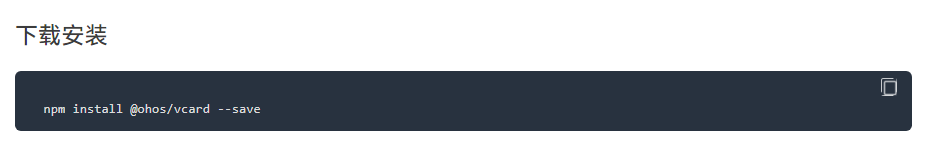
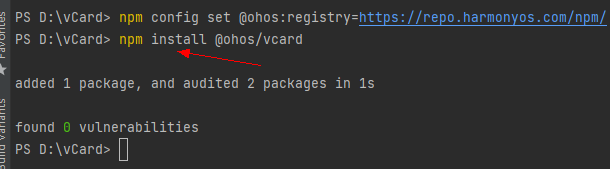
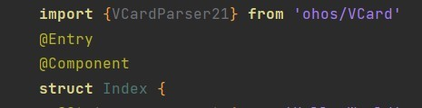

# OpenHarmony JS/TS三方组件使用指导
## OpenHarmony JS/TS三方组件介绍

OpenHarmony JS/TS三方组件是以OpenHarmony npm包的形式，在传统的npm三方组件的基础上，定义了OpenHarmony npm共享包特定的工程结构和配置文件，支持OpenHarmony页面组件相关API、资源的调用。通过OpenHarmony npm包，您可以实现多个模块或者多个工程共享OpenHarmony页面、资源等相关代码。前往[npm官方文档](https://docs.npmjs.com/about-npm)，您可以了解和掌握npm的基础功能和机制。


## 查找OpenHarmony JS/TS三方组件

a.关注Gitee官网OpenHarmony-TPC[三方组件资源汇总](https://gitee.com/openharmony-tpc/tpc_resource)项目，根据目录索引即可找到对应分类下的具体组件。


b.访问[OpenHarmony官网](https://www.openharmony.cn/mainPlay/tpc)，通过类型，分类，以及关键字搜索需要的三方组件。


## 安装并使用OpenHarmony JS/TS语言的三方组件

在应用开发的过程中，JS/TS语言的三方组件，通常以源码或OpenHarmony npm包的方式被引入使用。您可以按照以下步骤将OpenHarmony npm包引入应用并使用，源码的具体引入及使用请参考各三方组件README.md指导介绍。

1. 配置OpenHarmony npm环境，详情请参考安装教程 [如何安装OpenHarmony npm包](https://gitee.com/openharmony-tpc/docs/blob/master/OpenHarmony_npm_usage.md)。

2. 在Terminal项目终端中，进入entry目录，并执行目标组件命令进行安装。具体的下载命令详见OpenHarmony官网该三方组件的“下载安装“模块。



   以安装vcard三方组件为例，依赖包会存储在工程的node_modules目录下@ohos\vcard下。

```
npm install @ohos/vcard
```



3. 下载完成后在项目文件下自动生成node_modules文件，下载的三方库就在node_modules文件夹下。


4. 在package.json中会自动添加如下依赖：

```
"dependencies": {
  "@ohos/vcard": "^2.0.5"
}
```

5. 在需要使用该组件的文件中导入组件。



6. 导入组件后直接使用方法即可。

